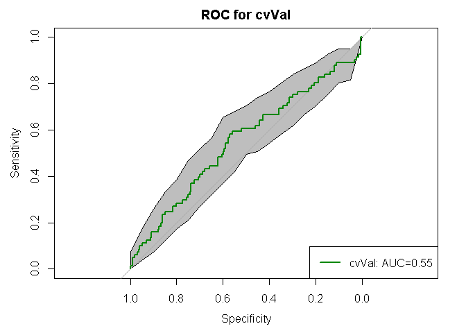

## Functions
The following functions are included to creating an MLP-stdalone classifier with subset_select and parameter search for "# hidden layers" and "# of nodes in hidden layers" and 5f-cv resampling:
* cvfold_partition
* kparti_sample
* subset_select
* calcAUC_plot
* surface_forestperfm


## Creating an MLP-stdalone classifier to compare with MLP + DEC unsupervised learning

```r
# Read CSV into R
library(neuralnet)
library(pROC)
setwd("Z:/Cristina/Section3/paper_notes/comparison_traditionalCAD")
source('functionsCAD.R')
pdatalabels <- read.csv(file="input/pdatalabels.csv", header=TRUE, sep=",")
dyn_roi <- read.csv(file="input/dyn_roi_records_allNMEs_descStats.csv", header=TRUE, sep=",")
morpho_roi <- read.csv(file="input/morpho_roi_records_allNMEs_descStats.csv", header=TRUE, sep=",")
text_roi <- read.csv(file="input/text_roi_records_allNMEs_descStats.csv", header=TRUE, sep=",")
stage1_roi <- read.csv(file="input/stage1_roi_records_allNMEs_descStats.csv", header=TRUE, sep=",")

# append all with lables
allfeatures = data.frame(cbind(pdatalabels,
                               dyn_roi[2:ncol(dyn_roi)],
                               morpho_roi[2:ncol(morpho_roi)],
                               text_roi[2:ncol(text_roi)],
                               stage1_roi[2:ncol(stage1_roi)]))

# print summary labesl
summary(allfeatures$labels)
```

```
##   B   K   M 
## 267 415 110
```

```r
# remove unlabeled or 'K'
onlylab = subset(allfeatures, labels!='K')
onlylab$labels = factor(onlylab$labels)
summary(onlylab$labels)
```

```
##   B   M 
## 267 110
```

```r
## normalize data before training a neural network on it
onlylab$dce2SE19[is.na(onlylab$dce2SE19)] <- summary(onlylab$dce2SE19)[[4]]
onlylab$dce3SE19[is.na(onlylab$dce3SE19)] <- summary(onlylab$dce3SE19)[[4]]
onlylab$earlySE19[is.na(onlylab$earlySE19)] <- summary(onlylab$earlySE19)[[4]]

## normalize data before training a neural network on it
maxs <- apply(onlylab[c(2:ncol(onlylab))], 2, max)
mins <- apply(onlylab[c(2:ncol(onlylab))], 2, min)

Xscaled <- as.data.frame(scale(onlylab[c(2:ncol(onlylab))], center = mins, scale = maxs - mins))
data = cbind(Xscaled,labels=ifelse(onlylab$labels=='M',1,0))

## split in 90%/10% train/test 
sep = round(nrow(allfeatures)*0.10)
X_test = data[1:sep,]
y_test = X_test$labels
init_indTrain = sep+1
X_train = data[init_indTrain:nrow(data),]
y_train = X_train$labels

###################################################
### Train a CAD classifier using traditional CAD features (only supervised features)
###################################################
## create stratified kfolds
cvK = 5
particvfoldK = cvfold_partition(X_train, cvK)

###################################################
# create grid of evaluation points
gh1 = c(128,64) 
gh2 = c(0,32) 
grd1 <- expand.grid(h1 = gh1, h2 = gh2)
gh3 = c(48,24) 
gh4 = c(0,10)
grd2 <- expand.grid(h1 = gh3, h2 = gh4)
grd = rbind(grd1,grd2)

###################################################
# initialize grid search metrics
grdperf = data.frame(grd)
grdperf$avaucTrain =0
grdperf$stdTrain =0
grdperf$avaucVal =0
grdperf$stdVal =0

for(k in 1:nrow(grd)){
  # get grid search cell
  H = c(grd[k,][[1]],grd[k,][[2]])
  # Build in l
  cat("#h1: ", H[1], "#h2: ", H[2], "\n")
  cvAUC_train = c()
  cvAUC_val = c()
  for(r in 1:cvK){
    ## pick one of cvfold for held-out test, train on the rest
    kparti_setdata = kparti_sample(X_train, particvfoldK, cvK, r)
    
    # Boruta on $cvTrainsetD
    selfeatures_kfold = subset_select(kparti_setdata$cvTrainsetD)
    names(selfeatures_kfold)
    
    # train classifier in train with featset in train
    TrainsetD <-  kparti_setdata$cvTrainsetD[c(names(selfeatures_kfold))]
    ValsetD <-  kparti_setdata$cvValsetD[c(names(selfeatures_kfold))]
    
    # CREATE FORMULA  for grid search parameters train
    feats <- names(selfeatures_kfold[,!(names(selfeatures_kfold) %in% "labels")])
    # Concatenate strings
    f <- paste(feats,collapse=' + ')
    f <- paste('labels ~',f)
    # Convert to formula
    f <- as.formula(f)
    print(f)
    
    #install.packages('neuralnet')
    nn <- neuralnet(f, TrainsetD, hidden=c(H[H!=0]), linear.output=FALSE)
    
    # Compute Predictions off Test Set
    train.nn.values <- compute(nn, TrainsetD[,!(names(TrainsetD) %in% "labels")])
    valid.nn.values <- compute(nn, ValsetD[ , !(names(ValsetD) %in% "labels")])

    # have results between 0 and 1 that are more like probabilities of belonging to each class. We'll use sapply() to round these off to either 0 or 1 class so we can evaluate them against the test labels.
    train.nn.values$round.result <- sapply(train.nn.values$net.result,round,digits=0)
    valid.nn.values$round.result <- sapply(valid.nn.values$net.result,round,digits=0)
    
    # for train
    ROC_train <- roc(TrainsetD$labels, train.nn.values$net.result, plot=FALSE)
    ROC_val <- roc(ValsetD$labels, valid.nn.values$net.result, plot=FALSE)
    print(paste0("ROC_train$auc = ",ROC_train$auc))
    print(paste0("ROC_val$auc = ",ROC_val$auc))
    # appends
    cvAUC_train = c(cvAUC_train, ROC_train$auc)
    cvAUC_val = c(cvAUC_val, ROC_val$auc)
  }
  
  # collect data
  grdperf$avaucTrain[k] = mean(cvAUC_train)
  grdperf$stdTrain[k] = sd(cvAUC_train)
  grdperf$avaucVal[k] = mean(cvAUC_val)
  grdperf$stdVal[k] = sd(cvAUC_val)
}
```

```
## #h1:  128 #h2:  0 
## Boruta performed 99 iterations in 15.40652 secs.
##  7 attributes confirmed important: earlySE15, earlySE17, earlySE3,
## irregularity, labels and 2 more.
##  173 attributes confirmed unimportant: A_inside, alpha_countor,
## alpha_inside, beta_countor, beta_inside and 168 more.
##  17 tentative attributes left: dce2SE17, dce2SE6, dce3SE6,
## earlySE16, earlySE6 and 12 more.
## labels ~ A_countor + A_inside + irregularity + texture_sumentropy_nondir_post2 + 
##     texture_variance_nondir_post1 + earlySE15 + earlySE17 + earlySE3 + 
##     texture_diffvariance_nondir_post1 + texture_entropy_nondir_post1 + 
##     texture_sumentropy_nondir_post1 + texture_sumvariance_nondir_post1 + 
##     texture_variance_nondir_post2 + V12 + V15 + V4 + V5 + V8 + 
##     dce2SE17 + dce2SE6 + dce3SE6 + earlySE16 + earlySE6 + lateSE16 + 
##     lateSE18
## [1] "ROC_train$auc = 0.642690373563218"
## [1] "ROC_val$auc = 0.656634746922025"
## Boruta performed 99 iterations in 18.128654 secs.
##  15 attributes confirmed important: earlySE17, earlySE6, labels,
## max_F_r_i, mean_F_r_i and 10 more.
##  162 attributes confirmed unimportant: A_inside, beta_countor,
## beta_inside, dce2SE0, dce2SE1 and 157 more.
##  20 tentative attributes left: alpha_countor, alpha_inside,
## circularity, earlySE15, irregularity and 15 more.
## labels ~ A_countor + A_inside + max_F_r_i + mean_F_r_i + var_F_r_i + 
##     texture_contrast_nondir_post1 + texture_diffvariance_nondir_post1 + 
##     texture_entropy_nondir_post1 + texture_sumaverage_nondir_post3 + 
##     texture_sumentropy_nondir_post1 + texture_sumvariance_nondir_post1 + 
##     texture_sumvariance_nondir_post2 + texture_variance_nondir_post1 + 
##     texture_variance_nondir_post2 + earlySE17 + earlySE6 + SER_countor + 
##     SER_inside + Slope_ini_countor + alpha_countor + alpha_inside + 
##     circularity + irregularity + k_Max_Margin_Grad + texture_diffentropy_nondir_post1 + 
##     texture_diffvariance_nondir_post4 + texture_energy_nondir_post1 + 
##     texture_entropy_nondir_post2 + texture_entropy_nondir_post4 + 
##     texture_sumaverage_nondir_post1 + texture_sumaverage_nondir_post2 + 
##     texture_sumentropy_nondir_post2 + texture_sumentropy_nondir_post4 + 
##     texture_sumvariance_nondir_post3 + texture_variance_nondir_post4 + 
##     earlySE15
## [1] "ROC_train$auc = 0.631518675123326"
## [1] "ROC_val$auc = 0.614814814814815"
## Boruta performed 99 iterations in 17.21495199 secs.
##  10 attributes confirmed important: earlySE17, labels, max_F_r_i,
## texture_diffvariance_nondir_post1, texture_sumentropy_nondir_post1
## and 5 more.
##  167 attributes confirmed unimportant: A_inside, alpha_countor,
## alpha_inside, beta_countor, beta_inside and 162 more.
##  20 tentative attributes left: dce3SE12, earlySE12, earlySE15,
## earlySE16, earlySE3 and 15 more.
## labels ~ A_countor + A_inside + max_F_r_i + texture_diffvariance_nondir_post1 + 
##     texture_sumentropy_nondir_post1 + texture_sumentropy_nondir_post2 + 
##     texture_sumvariance_nondir_post1 + texture_sumvariance_nondir_post2 + 
##     texture_variance_nondir_post1 + texture_variance_nondir_post2 + 
##     earlySE17 + Vr_post_1_countor + irregularity + mean_F_r_i + 
##     var_F_r_i + texture_contrast_nondir_post1 + texture_diffentropy_nondir_post1 + 
##     texture_energy_nondir_post1 + texture_energy_nondir_post4 + 
##     texture_entropy_nondir_post1 + texture_entropy_nondir_post2 + 
##     texture_entropy_nondir_post4 + texture_sumentropy_nondir_post4 + 
##     texture_sumvariance_nondir_post3 + texture_variance_nondir_post3 + 
##     dce3SE12 + earlySE12 + earlySE15 + earlySE16 + earlySE3 + 
##     earlySE6
## [1] "ROC_train$auc = 0.957602339181287"
## [1] "ROC_val$auc = 0.498327759197324"
## Boruta performed 99 iterations in 17.39472914 secs.
##  14 attributes confirmed important: alpha_inside, edge_sharp_std,
## irregularity, labels, max_F_r_i and 9 more.
##  166 attributes confirmed unimportant: A_inside, beta_countor,
## beta_inside, dce2SE0, dce2SE1 and 161 more.
##  17 tentative attributes left: alpha_countor, circularity,
## earlySE16, earlySE17, earlySE3 and 12 more.
## labels ~ A_countor + A_inside + SER_inside + Slope_ini_inside + 
##     alpha_inside + edge_sharp_std + irregularity + max_F_r_i + 
##     mean_F_r_i + var_F_r_i + texture_sumentropy_nondir_post1 + 
##     texture_sumentropy_nondir_post2 + texture_sumentropy_nondir_post4 + 
##     texture_sumvariance_nondir_post1 + texture_variance_nondir_post1 + 
##     alpha_countor + circularity + k_Max_Margin_Grad + texture_entropy_nondir_post1 + 
##     texture_entropy_nondir_post2 + texture_entropy_nondir_post3 + 
##     texture_entropy_nondir_post4 + texture_sumentropy_nondir_post3 + 
##     texture_sumvariance_nondir_post2 + texture_sumvariance_nondir_post3 + 
##     V11 + V14 + V15 + earlySE16 + earlySE17 + earlySE3 + earlySE6
## [1] "ROC_train$auc = 0.632859486057955"
## [1] "ROC_val$auc = 0.605263157894737"
## Boruta performed 99 iterations in 15.76819396 secs.
##  12 attributes confirmed important: alpha_countor, earlySE6,
## edge_sharp_std, irregularity, labels and 7 more.
##  172 attributes confirmed unimportant: A_inside, beta_countor,
## beta_inside, circularity, dce2SE0 and 167 more.
##  13 tentative attributes left: alpha_inside, dce2SE6, earlySE15,
## earlySE3, SER_countor and 8 more.
## labels ~ A_countor + A_inside + SER_inside + alpha_countor + 
##     edge_sharp_std + irregularity + texture_sumentropy_nondir_post1 + 
##     texture_sumentropy_nondir_post2 + texture_sumentropy_nondir_post4 + 
##     texture_sumvariance_nondir_post1 + texture_sumvariance_nondir_post2 + 
##     texture_variance_nondir_post1 + earlySE6 + SER_countor + 
##     Vr_post_1_countor + alpha_inside + texture_sumaverage_nondir_post4 + 
##     texture_sumvariance_nondir_post3 + texture_variance_nondir_post2 + 
##     texture_variance_nondir_post4 + V12 + V19 + V3 + dce2SE6 + 
##     earlySE15 + earlySE3
## [1] "ROC_train$auc = 0.658943965517241"
## [1] "ROC_val$auc = 0.734610123119015"
## #h1:  64 #h2:  0 
## Boruta performed 99 iterations in 16.68646812 secs.
##  6 attributes confirmed important: earlySE15, earlySE17, earlySE3,
## irregularity, labels and 1 more.
##  170 attributes confirmed unimportant: A_inside, alpha_countor,
## alpha_inside, beta_countor, beta_inside and 165 more.
##  21 tentative attributes left: dce2SE3, dce2SE6, dce3SE3,
## earlySE14, earlySE16 and 16 more.
## labels ~ A_countor + A_inside + irregularity + texture_sumentropy_nondir_post2 + 
##     earlySE15 + earlySE17 + earlySE3 + Vr_post_1_countor + max_F_r_i + 
##     texture_diffvariance_nondir_post1 + texture_entropy_nondir_post1 + 
##     texture_sumentropy_nondir_post1 + texture_sumvariance_nondir_post1 + 
##     texture_sumvariance_nondir_post3 + texture_variance_nondir_post1 + 
##     V11 + V13 + V14 + V2 + V4 + V5 + V8 + dce2SE3 + dce2SE6 + 
##     dce3SE3 + earlySE14 + earlySE16 + earlySE6
## [1] "ROC_train$auc = 0.621677442528736"
## [1] "ROC_val$auc = 0.807113543091655"
## Boruta performed 99 iterations in 18.68504906 secs.
##  17 attributes confirmed important: alpha_countor, earlySE17,
## irregularity, labels, max_F_r_i and 12 more.
##  160 attributes confirmed unimportant: A_inside, beta_countor,
## beta_inside, circularity, dce2SE0 and 155 more.
##  20 tentative attributes left: alpha_inside, earlySE15, earlySE16,
## earlySE3, earlySE6 and 15 more.
## labels ~ A_countor + A_inside + alpha_countor + irregularity + 
##     max_F_r_i + mean_F_r_i + var_F_r_i + texture_contrast_nondir_post1 + 
##     texture_diffvariance_nondir_post1 + texture_entropy_nondir_post1 + 
##     texture_sumaverage_nondir_post1 + texture_sumaverage_nondir_post3 + 
##     texture_sumentropy_nondir_post1 + texture_sumvariance_nondir_post1 + 
##     texture_sumvariance_nondir_post2 + texture_variance_nondir_post1 + 
##     texture_variance_nondir_post2 + earlySE17 + SER_inside + 
##     Slope_ini_countor + alpha_inside + k_Max_Margin_Grad + texture_diffentropy_nondir_post1 + 
##     texture_diffvariance_nondir_post2 + texture_diffvariance_nondir_post4 + 
##     texture_energy_nondir_post1 + texture_sumaverage_nondir_post2 + 
##     texture_sumentropy_nondir_post2 + texture_sumentropy_nondir_post3 + 
##     texture_sumentropy_nondir_post4 + texture_sumvariance_nondir_post3 + 
##     texture_sumvariance_nondir_post4 + texture_variance_nondir_post4 + 
##     V15 + earlySE15 + earlySE16 + earlySE3 + earlySE6
## [1] "ROC_train$auc = 0.977977448907681"
## [1] "ROC_val$auc = 0.577777777777778"
## Boruta performed 99 iterations in 16.25290203 secs.
##  13 attributes confirmed important: earlySE17, labels, max_F_r_i,
## texture_diffvariance_nondir_post1, texture_entropy_nondir_post1
## and 8 more.
##  171 attributes confirmed unimportant: A_inside, alpha_countor,
## alpha_inside, beta_countor, beta_inside and 166 more.
##  13 tentative attributes left: earlySE15, earlySE3,
## texture_contrast_nondir_post1, texture_diffentropy_nondir_post1,
## texture_energy_nondir_post1 and 8 more.
## labels ~ A_countor + A_inside + Vr_post_1_countor + max_F_r_i + 
##     var_F_r_i + texture_diffvariance_nondir_post1 + texture_entropy_nondir_post1 + 
##     texture_sumentropy_nondir_post1 + texture_sumentropy_nondir_post2 + 
##     texture_sumvariance_nondir_post1 + texture_sumvariance_nondir_post2 + 
##     texture_variance_nondir_post1 + texture_variance_nondir_post2 + 
##     earlySE17 + texture_contrast_nondir_post1 + texture_diffentropy_nondir_post1 + 
##     texture_energy_nondir_post1 + texture_entropy_nondir_post2 + 
##     texture_entropy_nondir_post3 + texture_entropy_nondir_post4 + 
##     texture_sumentropy_nondir_post3 + texture_sumentropy_nondir_post4 + 
##     texture_sumvariance_nondir_post3 + texture_variance_nondir_post3 + 
##     texture_variance_nondir_post4 + earlySE15 + earlySE3
## [1] "ROC_train$auc = 0.49922600619195"
## [1] "ROC_val$auc = 0.508361204013378"
## Boruta performed 99 iterations in 17.01339006 secs.
##  13 attributes confirmed important: alpha_inside, edge_sharp_std,
## irregularity, labels, max_F_r_i and 8 more.
##  167 attributes confirmed unimportant: A_inside, beta_countor,
## beta_inside, dce2SE0, dce2SE1 and 162 more.
##  17 tentative attributes left: alpha_countor, circularity,
## earlySE3, k_Max_Margin_Grad, Slope_ini_inside and 12 more.
## labels ~ A_countor + A_inside + SER_inside + alpha_inside + edge_sharp_std + 
##     irregularity + max_F_r_i + mean_F_r_i + var_F_r_i + texture_sumentropy_nondir_post2 + 
##     texture_sumentropy_nondir_post4 + texture_sumvariance_nondir_post1 + 
##     texture_sumvariance_nondir_post2 + texture_variance_nondir_post1 + 
##     Slope_ini_inside + alpha_countor + circularity + k_Max_Margin_Grad + 
##     texture_energy_nondir_post2 + texture_entropy_nondir_post1 + 
##     texture_sumentropy_nondir_post1 + texture_sumentropy_nondir_post3 + 
##     texture_sumvariance_nondir_post3 + texture_variance_nondir_post2 + 
##     texture_variance_nondir_post3 + V11 + V14 + V15 + V4 + V5 + 
##     earlySE3
## [1] "ROC_train$auc = 0.975487515946783"
## [1] "ROC_val$auc = 0.538157894736842"
## Boruta performed 99 iterations in 16.70715594 secs.
##  12 attributes confirmed important: alpha_inside, earlySE6,
## edge_sharp_std, irregularity, labels and 7 more.
##  166 attributes confirmed unimportant: A_inside, beta_countor,
## beta_inside, circularity, dce2SE0 and 161 more.
##  19 tentative attributes left: alpha_countor, dce2SE6, earlySE12,
## earlySE15, ivVariance and 14 more.
## labels ~ A_countor + A_inside + SER_inside + alpha_inside + edge_sharp_std + 
##     irregularity + texture_sumentropy_nondir_post1 + texture_sumentropy_nondir_post2 + 
##     texture_sumentropy_nondir_post4 + texture_sumvariance_nondir_post1 + 
##     texture_sumvariance_nondir_post2 + texture_variance_nondir_post1 + 
##     earlySE6 + SER_countor + Slope_ini_countor + Slope_ini_inside + 
##     Vr_post_1_countor + alpha_countor + ivVariance + var_F_r_i + 
##     texture_entropy_nondir_post1 + texture_entropy_nondir_post4 + 
##     texture_sumvariance_nondir_post3 + texture_variance_nondir_post2 + 
##     V12 + V18 + V19 + V3 + dce2SE6 + earlySE12 + earlySE15 + 
##     lateSE18
## [1] "ROC_train$auc = 0.970007183908046"
## [1] "ROC_val$auc = 0.638850889192886"
## #h1:  128 #h2:  32 
## Boruta performed 99 iterations in 15.01333189 secs.
##  6 attributes confirmed important: earlySE15, earlySE17, earlySE3,
## irregularity, labels and 1 more.
##  175 attributes confirmed unimportant: A_inside, alpha_countor,
## alpha_inside, beta_countor, beta_inside and 170 more.
##  16 tentative attributes left: earlySE16, earlySE6,
## edge_sharp_std, lateSE18, mean_F_r_i and 11 more.
## labels ~ A_countor + A_inside + irregularity + texture_sumentropy_nondir_post2 + 
##     earlySE15 + earlySE17 + earlySE3 + edge_sharp_std + mean_F_r_i + 
##     texture_energy_nondir_post2 + texture_sumentropy_nondir_post1 + 
##     texture_sumvariance_nondir_post1 + texture_variance_nondir_post1 + 
##     V12 + V15 + V17 + V18 + V2 + V5 + V8 + earlySE16 + earlySE6 + 
##     lateSE18
## [1] "ROC_train$auc = 1"
## [1] "ROC_val$auc = 0.528043775649795"
## Boruta performed 99 iterations in 17.92297816 secs.
##  15 attributes confirmed important: earlySE17, earlySE6, labels,
## max_F_r_i, mean_F_r_i and 10 more.
##  163 attributes confirmed unimportant: A_inside, beta_countor,
## beta_inside, circularity, dce2SE0 and 158 more.
##  19 tentative attributes left: alpha_countor, alpha_inside,
## earlySE15, earlySE3, irregularity and 14 more.
## labels ~ A_countor + A_inside + max_F_r_i + mean_F_r_i + var_F_r_i + 
##     texture_contrast_nondir_post1 + texture_diffvariance_nondir_post1 + 
##     texture_entropy_nondir_post1 + texture_sumaverage_nondir_post3 + 
##     texture_sumentropy_nondir_post1 + texture_sumvariance_nondir_post1 + 
##     texture_sumvariance_nondir_post2 + texture_variance_nondir_post1 + 
##     texture_variance_nondir_post2 + earlySE17 + earlySE6 + SER_inside + 
##     alpha_countor + alpha_inside + irregularity + k_Max_Margin_Grad + 
##     texture_diffentropy_nondir_post1 + texture_diffvariance_nondir_post4 + 
##     texture_energy_nondir_post1 + texture_entropy_nondir_post2 + 
##     texture_entropy_nondir_post4 + texture_sumaverage_nondir_post1 + 
##     texture_sumaverage_nondir_post4 + texture_sumentropy_nondir_post2 + 
##     texture_sumentropy_nondir_post4 + texture_sumvariance_nondir_post3 + 
##     texture_variance_nondir_post4 + V15 + earlySE15 + earlySE3
## [1] "ROC_train$auc = 0.667195207892882"
## [1] "ROC_val$auc = 0.524444444444444"
## Boruta performed 99 iterations in 16.31424904 secs.
##  11 attributes confirmed important: earlySE15, earlySE17, labels,
## max_F_r_i, texture_diffvariance_nondir_post1 and 6 more.
##  167 attributes confirmed unimportant: A_inside, alpha_countor,
## alpha_inside, beta_countor, beta_inside and 162 more.
##  19 tentative attributes left: dce2SE6, earlySE16, earlySE3,
## earlySE6, texture_contrast_nondir_post1 and 14 more.
## labels ~ A_countor + A_inside + max_F_r_i + texture_diffvariance_nondir_post1 + 
##     texture_sumentropy_nondir_post1 + texture_sumentropy_nondir_post2 + 
##     texture_sumvariance_nondir_post1 + texture_sumvariance_nondir_post2 + 
##     texture_variance_nondir_post1 + texture_variance_nondir_post2 + 
##     earlySE15 + earlySE17 + Vr_post_1_countor + var_F_r_i + texture_contrast_nondir_post1 + 
##     texture_diffentropy_nondir_post1 + texture_energy_nondir_post1 + 
##     texture_energy_nondir_post2 + texture_entropy_nondir_post1 + 
##     texture_entropy_nondir_post2 + texture_entropy_nondir_post3 + 
##     texture_entropy_nondir_post4 + texture_sumentropy_nondir_post3 + 
##     texture_sumentropy_nondir_post4 + texture_sumvariance_nondir_post3 + 
##     texture_variance_nondir_post4 + V5 + dce2SE6 + earlySE16 + 
##     earlySE3 + earlySE6
## [1] "ROC_train$auc = 0.529755761953904"
## [1] "ROC_val$auc = 0.578595317725753"
## Boruta performed 99 iterations in 16.52339292 secs.
##  15 attributes confirmed important: alpha_inside, edge_sharp_std,
## irregularity, labels, max_F_r_i and 10 more.
##  167 attributes confirmed unimportant: A_inside, beta_countor,
## beta_inside, dce2SE0, dce2SE1 and 162 more.
##  15 tentative attributes left: alpha_countor, circularity,
## earlySE15, earlySE16, earlySE17 and 10 more.
## labels ~ A_countor + A_inside + SER_inside + Slope_ini_inside + 
##     alpha_inside + edge_sharp_std + irregularity + max_F_r_i + 
##     mean_F_r_i + var_F_r_i + texture_sumentropy_nondir_post1 + 
##     texture_sumentropy_nondir_post2 + texture_sumentropy_nondir_post4 + 
##     texture_sumvariance_nondir_post1 + texture_sumvariance_nondir_post3 + 
##     texture_variance_nondir_post1 + alpha_countor + circularity + 
##     texture_entropy_nondir_post1 + texture_entropy_nondir_post2 + 
##     texture_entropy_nondir_post3 + texture_sumvariance_nondir_post2 + 
##     V11 + V15 + V4 + V5 + earlySE15 + earlySE16 + earlySE17 + 
##     earlySE3 + earlySE6
## [1] "ROC_train$auc = 1"
## [1] "ROC_val$auc = 0.564473684210526"
## Boruta performed 99 iterations in 15.53786206 secs.
##  13 attributes confirmed important: alpha_countor, alpha_inside,
## earlySE6, edge_sharp_std, irregularity and 8 more.
##  170 attributes confirmed unimportant: A_inside, beta_countor,
## beta_inside, circularity, dce2SE0 and 165 more.
##  14 tentative attributes left: dce2SE6, earlySE12, earlySE15,
## ivVariance, max_F_r_i and 9 more.
## labels ~ A_countor + A_inside + SER_inside + alpha_countor + 
##     alpha_inside + edge_sharp_std + irregularity + texture_sumentropy_nondir_post1 + 
##     texture_sumentropy_nondir_post2 + texture_sumentropy_nondir_post4 + 
##     texture_sumvariance_nondir_post1 + texture_sumvariance_nondir_post2 + 
##     texture_variance_nondir_post1 + earlySE6 + SER_countor + 
##     Slope_ini_countor + Slope_ini_inside + Vr_post_1_countor + 
##     ivVariance + max_F_r_i + texture_variance_nondir_post2 + 
##     V12 + V18 + V19 + V3 + dce2SE6 + earlySE12 + earlySE15
## [1] "ROC_train$auc = 0.561961206896552"
## [1] "ROC_val$auc = 0.575923392612859"
## #h1:  64 #h2:  32 
## Boruta performed 99 iterations in 16.05141807 secs.
##  8 attributes confirmed important: earlySE15, earlySE17, earlySE3,
## irregularity, labels and 3 more.
##  171 attributes confirmed unimportant: A_inside, alpha_countor,
## alpha_inside, beta_countor, beta_inside and 166 more.
##  18 tentative attributes left: dce3SE3, earlySE6, lateSE18,
## lateSE6, max_F_r_i and 13 more.
## labels ~ A_countor + A_inside + irregularity + texture_sumentropy_nondir_post2 + 
##     texture_sumvariance_nondir_post1 + texture_variance_nondir_post1 + 
##     earlySE15 + earlySE17 + earlySE3 + max_F_r_i + texture_diffvariance_nondir_post1 + 
##     texture_entropy_nondir_post1 + texture_sumentropy_nondir_post1 + 
##     V11 + V12 + V14 + V15 + V17 + V18 + V2 + V4 + V5 + V8 + dce3SE3 + 
##     earlySE6 + lateSE18 + lateSE6
## [1] "ROC_train$auc = 0.991828304597701"
## [1] "ROC_val$auc = 0.638850889192886"
## Boruta performed 99 iterations in 17.31022596 secs.
##  16 attributes confirmed important: earlySE17, earlySE3, earlySE6,
## labels, max_F_r_i and 11 more.
##  165 attributes confirmed unimportant: A_inside, alpha_inside,
## beta_countor, beta_inside, circularity and 160 more.
##  16 tentative attributes left: alpha_countor, earlySE15,
## irregularity, SER_inside, Slope_ini_countor and 11 more.
## labels ~ A_countor + A_inside + max_F_r_i + mean_F_r_i + var_F_r_i + 
##     texture_contrast_nondir_post1 + texture_diffvariance_nondir_post1 + 
##     texture_entropy_nondir_post1 + texture_sumaverage_nondir_post3 + 
##     texture_sumentropy_nondir_post1 + texture_sumvariance_nondir_post1 + 
##     texture_sumvariance_nondir_post2 + texture_variance_nondir_post1 + 
##     texture_variance_nondir_post2 + earlySE17 + earlySE3 + earlySE6 + 
##     SER_inside + Slope_ini_countor + alpha_countor + irregularity + 
##     texture_diffentropy_nondir_post1 + texture_diffvariance_nondir_post4 + 
##     texture_energy_nondir_post1 + texture_entropy_nondir_post4 + 
##     texture_sumaverage_nondir_post1 + texture_sumaverage_nondir_post2 + 
##     texture_sumentropy_nondir_post2 + texture_sumentropy_nondir_post4 + 
##     texture_sumvariance_nondir_post3 + texture_sumvariance_nondir_post4 + 
##     texture_variance_nondir_post4 + earlySE15
## [1] "ROC_train$auc = 0.974806201550388"
## [1] "ROC_val$auc = 0.604444444444444"
## Boruta performed 99 iterations in 16.41180396 secs.
##  12 attributes confirmed important: labels, max_F_r_i,
## texture_diffvariance_nondir_post1, texture_entropy_nondir_post1,
## texture_sumentropy_nondir_post1 and 7 more.
##  168 attributes confirmed unimportant: A_inside, alpha_countor,
## alpha_inside, beta_countor, beta_inside and 163 more.
##  17 tentative attributes left: earlySE15, earlySE16, earlySE17,
## earlySE3, earlySE6 and 12 more.
## labels ~ A_countor + A_inside + Vr_post_1_countor + max_F_r_i + 
##     var_F_r_i + texture_diffvariance_nondir_post1 + texture_entropy_nondir_post1 + 
##     texture_sumentropy_nondir_post1 + texture_sumentropy_nondir_post2 + 
##     texture_sumvariance_nondir_post1 + texture_sumvariance_nondir_post2 + 
##     texture_variance_nondir_post1 + texture_variance_nondir_post2 + 
##     irregularity + texture_contrast_nondir_post1 + texture_diffentropy_nondir_post1 + 
##     texture_energy_nondir_post1 + texture_energy_nondir_post2 + 
##     texture_entropy_nondir_post2 + texture_entropy_nondir_post3 + 
##     texture_entropy_nondir_post4 + texture_sumentropy_nondir_post3 + 
##     texture_sumentropy_nondir_post4 + texture_sumvariance_nondir_post3 + 
##     texture_variance_nondir_post3 + earlySE15 + earlySE16 + earlySE17 + 
##     earlySE3 + earlySE6
## [1] "ROC_train$auc = 1"
## [1] "ROC_val$auc = 0.548494983277592"
## Boruta performed 99 iterations in 15.40811205 secs.
##  15 attributes confirmed important: alpha_inside, edge_sharp_std,
## irregularity, labels, max_F_r_i and 10 more.
##  170 attributes confirmed unimportant: A_inside, beta_countor,
## beta_inside, dce2SE0, dce2SE1 and 165 more.
##  12 tentative attributes left: alpha_countor, circularity,
## earlySE16, earlySE6, texture_contrast_nondir_post1 and 7 more.
## labels ~ A_countor + A_inside + SER_inside + Slope_ini_inside + 
##     alpha_inside + edge_sharp_std + irregularity + max_F_r_i + 
##     mean_F_r_i + var_F_r_i + texture_sumentropy_nondir_post1 + 
##     texture_sumentropy_nondir_post2 + texture_sumentropy_nondir_post4 + 
##     texture_sumvariance_nondir_post1 + texture_variance_nondir_post1 + 
##     V15 + alpha_countor + circularity + texture_contrast_nondir_post1 + 
##     texture_entropy_nondir_post1 + texture_entropy_nondir_post3 + 
##     texture_sumvariance_nondir_post2 + texture_sumvariance_nondir_post3 + 
##     texture_sumvariance_nondir_post4 + V11 + V5 + earlySE16 + 
##     earlySE6
## [1] "ROC_train$auc = 0.985237834882449"
## [1] "ROC_val$auc = 0.503947368421053"
## Boruta performed 99 iterations in 15.72873592 secs.
##  14 attributes confirmed important: alpha_inside, earlySE6,
## edge_sharp_std, irregularity, labels and 9 more.
##  169 attributes confirmed unimportant: A_inside, beta_countor,
## beta_inside, dce2SE0, dce2SE1 and 164 more.
##  14 tentative attributes left: alpha_countor, circularity,
## dce2SE6, earlySE12, earlySE15 and 9 more.
## labels ~ A_countor + A_inside + SER_inside + alpha_inside + edge_sharp_std + 
##     irregularity + texture_sumentropy_nondir_post1 + texture_sumentropy_nondir_post2 + 
##     texture_sumentropy_nondir_post4 + texture_sumvariance_nondir_post1 + 
##     texture_sumvariance_nondir_post2 + texture_variance_nondir_post1 + 
##     texture_variance_nondir_post2 + V12 + earlySE6 + SER_countor + 
##     Vr_post_1_countor + alpha_countor + circularity + ivVariance + 
##     texture_entropy_nondir_post1 + texture_sumentropy_nondir_post3 + 
##     texture_variance_nondir_post4 + V18 + V19 + V3 + dce2SE6 + 
##     earlySE12 + earlySE15
## [1] "ROC_train$auc = 0.939834770114943"
## [1] "ROC_val$auc = 0.697674418604651"
## #h1:  48 #h2:  0 
## Boruta performed 99 iterations in 15.20221305 secs.
##  8 attributes confirmed important: earlySE15, earlySE17, earlySE3,
## irregularity, labels and 3 more.
##  174 attributes confirmed unimportant: A_inside, alpha_countor,
## alpha_inside, beta_countor, beta_inside and 169 more.
##  15 tentative attributes left: earlySE16, earlySE6, max_F_r_i,
## mean_F_r_i, texture_diffvariance_nondir_post1 and 10 more.
## labels ~ A_countor + A_inside + irregularity + texture_entropy_nondir_post1 + 
##     texture_sumentropy_nondir_post2 + texture_variance_nondir_post1 + 
##     earlySE15 + earlySE17 + earlySE3 + max_F_r_i + mean_F_r_i + 
##     var_F_r_i + texture_diffvariance_nondir_post1 + texture_entropy_nondir_post2 + 
##     texture_sumentropy_nondir_post1 + texture_sumentropy_nondir_post4 + 
##     texture_sumvariance_nondir_post1 + V12 + V15 + V19 + V4 + 
##     V5 + earlySE16 + earlySE6
## [1] "ROC_train$auc = 0.967941810344828"
## [1] "ROC_val$auc = 0.601915184678523"
## Boruta performed 99 iterations in 18.39931297 secs.
##  18 attributes confirmed important: alpha_countor, earlySE17,
## earlySE6, irregularity, k_Max_Margin_Grad and 13 more.
##  161 attributes confirmed unimportant: A_inside, beta_countor,
## beta_inside, circularity, dce2SE0 and 156 more.
##  18 tentative attributes left: alpha_inside, earlySE15, earlySE3,
## earlySE8, SER_inside and 13 more.
## labels ~ A_countor + A_inside + alpha_countor + irregularity + 
##     k_Max_Margin_Grad + max_F_r_i + mean_F_r_i + var_F_r_i + 
##     texture_contrast_nondir_post1 + texture_diffvariance_nondir_post1 + 
##     texture_entropy_nondir_post1 + texture_sumaverage_nondir_post3 + 
##     texture_sumentropy_nondir_post1 + texture_sumvariance_nondir_post1 + 
##     texture_sumvariance_nondir_post2 + texture_variance_nondir_post1 + 
##     texture_variance_nondir_post2 + earlySE17 + earlySE6 + SER_inside + 
##     Slope_ini_countor + alpha_inside + texture_diffentropy_nondir_post1 + 
##     texture_diffvariance_nondir_post4 + texture_energy_nondir_post1 + 
##     texture_entropy_nondir_post4 + texture_sumaverage_nondir_post1 + 
##     texture_sumaverage_nondir_post2 + texture_sumentropy_nondir_post2 + 
##     texture_sumentropy_nondir_post3 + texture_sumvariance_nondir_post3 + 
##     texture_sumvariance_nondir_post4 + texture_variance_nondir_post4 + 
##     V15 + earlySE15 + earlySE3 + earlySE8
## [1] "ROC_train$auc = 0.954633544749824"
## [1] "ROC_val$auc = 0.644444444444444"
## Boruta performed 99 iterations in 16.23536897 secs.
##  10 attributes confirmed important: earlySE17, labels, max_F_r_i,
## texture_diffvariance_nondir_post1, texture_sumentropy_nondir_post1
## and 5 more.
##  170 attributes confirmed unimportant: A_inside, alpha_countor,
## alpha_inside, beta_countor, beta_inside and 165 more.
##  17 tentative attributes left: earlySE15, earlySE16, earlySE3,
## earlySE6, texture_contrast_nondir_post1 and 12 more.
## labels ~ A_countor + A_inside + max_F_r_i + texture_diffvariance_nondir_post1 + 
##     texture_sumentropy_nondir_post1 + texture_sumentropy_nondir_post2 + 
##     texture_sumvariance_nondir_post1 + texture_sumvariance_nondir_post2 + 
##     texture_variance_nondir_post1 + texture_variance_nondir_post2 + 
##     earlySE17 + Vr_post_1_countor + var_F_r_i + texture_contrast_nondir_post1 + 
##     texture_diffentropy_nondir_post1 + texture_energy_nondir_post1 + 
##     texture_energy_nondir_post2 + texture_entropy_nondir_post1 + 
##     texture_entropy_nondir_post2 + texture_entropy_nondir_post3 + 
##     texture_entropy_nondir_post4 + texture_sumentropy_nondir_post3 + 
##     texture_sumentropy_nondir_post4 + texture_sumvariance_nondir_post3 + 
##     earlySE15 + earlySE16 + earlySE3 + earlySE6
## [1] "ROC_train$auc = 0.987788097695218"
## [1] "ROC_val$auc = 0.615384615384615"
## Boruta performed 99 iterations in 16.25092292 secs.
##  12 attributes confirmed important: alpha_inside, edge_sharp_std,
## irregularity, labels, max_F_r_i and 7 more.
##  167 attributes confirmed unimportant: A_inside, beta_countor,
## beta_inside, dce2SE0, dce2SE1 and 162 more.
##  18 tentative attributes left: alpha_countor, circularity,
## earlySE16, earlySE3, earlySE6 and 13 more.
## labels ~ A_countor + A_inside + SER_inside + alpha_inside + edge_sharp_std + 
##     irregularity + max_F_r_i + mean_F_r_i + var_F_r_i + texture_sumentropy_nondir_post2 + 
##     texture_sumentropy_nondir_post4 + texture_sumvariance_nondir_post1 + 
##     texture_variance_nondir_post1 + Slope_ini_inside + alpha_countor + 
##     circularity + k_Max_Margin_Grad + texture_diffvariance_nondir_post1 + 
##     texture_entropy_nondir_post1 + texture_entropy_nondir_post2 + 
##     texture_sumentropy_nondir_post1 + texture_sumentropy_nondir_post3 + 
##     texture_sumvariance_nondir_post2 + texture_sumvariance_nondir_post3 + 
##     V11 + V14 + V15 + V5 + earlySE16 + earlySE3 + earlySE6
## [1] "ROC_train$auc = 0.986422453070895"
## [1] "ROC_val$auc = 0.509210526315789"
## Boruta performed 99 iterations in 15.30823994 secs.
##  10 attributes confirmed important: earlySE6, edge_sharp_std,
## irregularity, labels, SER_inside and 5 more.
##  172 attributes confirmed unimportant: A_inside, beta_countor,
## beta_inside, dce2SE0, dce2SE1 and 167 more.
##  15 tentative attributes left: alpha_countor, alpha_inside,
## circularity, earlySE15, earlySE3 and 10 more.
## labels ~ A_countor + A_inside + SER_inside + edge_sharp_std + 
##     irregularity + texture_sumentropy_nondir_post1 + texture_sumentropy_nondir_post2 + 
##     texture_sumentropy_nondir_post4 + texture_sumvariance_nondir_post1 + 
##     texture_variance_nondir_post1 + earlySE6 + SER_countor + 
##     Vr_post_1_countor + alpha_countor + alpha_inside + circularity + 
##     max_F_r_i + texture_entropy_nondir_post1 + texture_sumvariance_nondir_post2 + 
##     texture_sumvariance_nondir_post3 + texture_variance_nondir_post2 + 
##     V12 + V18 + V19 + earlySE15 + earlySE3
## [1] "ROC_train$auc = 0.964439655172414"
## [1] "ROC_val$auc = 0.708618331053352"
## #h1:  24 #h2:  0 
## Boruta performed 99 iterations in 15.61998892 secs.
##  8 attributes confirmed important: earlySE15, earlySE17, earlySE3,
## irregularity, labels and 3 more.
##  171 attributes confirmed unimportant: A_inside, alpha_countor,
## alpha_inside, beta_countor, beta_inside and 166 more.
##  18 tentative attributes left: dce2SE6, dce3SE3, earlySE19,
## earlySE6, lateSE16 and 13 more.
## labels ~ A_countor + A_inside + irregularity + texture_sumentropy_nondir_post2 + 
##     texture_sumvariance_nondir_post1 + texture_variance_nondir_post1 + 
##     earlySE15 + earlySE17 + earlySE3 + max_F_r_i + texture_diffvariance_nondir_post1 + 
##     texture_entropy_nondir_post1 + texture_sumentropy_nondir_post1 + 
##     texture_sumvariance_nondir_post2 + V12 + V13 + V14 + V15 + 
##     V18 + V4 + V5 + dce2SE6 + dce3SE3 + earlySE19 + earlySE6 + 
##     lateSE16 + lateSE18
## [1] "ROC_train$auc = 0.958153735632184"
## [1] "ROC_val$auc = 0.599179206566347"
## Boruta performed 99 iterations in 16.54319501 secs.
##  15 attributes confirmed important: earlySE17, earlySE6, labels,
## max_F_r_i, mean_F_r_i and 10 more.
##  166 attributes confirmed unimportant: A_inside, alpha_inside,
## beta_countor, beta_inside, circularity and 161 more.
##  16 tentative attributes left: alpha_countor, earlySE15, earlySE3,
## irregularity, Slope_ini_countor and 11 more.
## labels ~ A_countor + A_inside + max_F_r_i + mean_F_r_i + var_F_r_i + 
##     texture_contrast_nondir_post1 + texture_diffvariance_nondir_post1 + 
##     texture_entropy_nondir_post1 + texture_sumaverage_nondir_post3 + 
##     texture_sumentropy_nondir_post1 + texture_sumvariance_nondir_post1 + 
##     texture_sumvariance_nondir_post2 + texture_variance_nondir_post1 + 
##     texture_variance_nondir_post2 + earlySE17 + earlySE6 + Slope_ini_countor + 
##     alpha_countor + irregularity + texture_diffentropy_nondir_post1 + 
##     texture_energy_nondir_post1 + texture_entropy_nondir_post4 + 
##     texture_sumaverage_nondir_post1 + texture_sumaverage_nondir_post2 + 
##     texture_sumaverage_nondir_post4 + texture_sumentropy_nondir_post2 + 
##     texture_sumvariance_nondir_post3 + texture_sumvariance_nondir_post4 + 
##     texture_variance_nondir_post4 + V15 + earlySE15 + earlySE3
## [1] "ROC_train$auc = 0.960887949260042"
## [1] "ROC_val$auc = 0.508148148148148"
## Boruta performed 99 iterations in 16.78551698 secs.
##  11 attributes confirmed important: earlySE3, labels, max_F_r_i,
## texture_diffvariance_nondir_post1, texture_entropy_nondir_post1
## and 6 more.
##  166 attributes confirmed unimportant: A_inside, alpha_countor,
## alpha_inside, beta_countor, beta_inside and 161 more.
##  20 tentative attributes left: dce2SE6, earlySE15, earlySE17,
## earlySE6, edge_sharp_std and 15 more.
## labels ~ A_countor + A_inside + max_F_r_i + texture_diffvariance_nondir_post1 + 
##     texture_entropy_nondir_post1 + texture_sumentropy_nondir_post1 + 
##     texture_sumentropy_nondir_post2 + texture_sumvariance_nondir_post1 + 
##     texture_sumvariance_nondir_post2 + texture_variance_nondir_post1 + 
##     texture_variance_nondir_post2 + earlySE3 + Vr_post_1_countor + 
##     edge_sharp_std + irregularity + mean_F_r_i + var_F_r_i + 
##     texture_contrast_nondir_post1 + texture_diffentropy_nondir_post1 + 
##     texture_energy_nondir_post1 + texture_entropy_nondir_post2 + 
##     texture_entropy_nondir_post3 + texture_entropy_nondir_post4 + 
##     texture_sumentropy_nondir_post3 + texture_sumentropy_nondir_post4 + 
##     texture_sumvariance_nondir_post3 + texture_variance_nondir_post3 + 
##     texture_variance_nondir_post4 + dce2SE6 + earlySE15 + earlySE17 + 
##     earlySE6
## [1] "ROC_train$auc = 0.986498108015136"
## [1] "ROC_val$auc = 0.62876254180602"
## Boruta performed 99 iterations in 15.69790292 secs.
##  12 attributes confirmed important: alpha_inside, edge_sharp_std,
## irregularity, labels, max_F_r_i and 7 more.
##  170 attributes confirmed unimportant: A_inside, alpha_countor,
## beta_countor, beta_inside, dce2SE0 and 165 more.
##  15 tentative attributes left: circularity, earlySE16,
## k_Max_Margin_Grad, Slope_ini_inside, texture_contrast_nondir_post1
## and 10 more.
## labels ~ A_countor + A_inside + SER_inside + alpha_inside + edge_sharp_std + 
##     irregularity + max_F_r_i + mean_F_r_i + var_F_r_i + texture_sumentropy_nondir_post2 + 
##     texture_sumentropy_nondir_post4 + texture_sumvariance_nondir_post1 + 
##     texture_variance_nondir_post1 + Slope_ini_inside + circularity + 
##     k_Max_Margin_Grad + texture_contrast_nondir_post1 + texture_diffvariance_nondir_post1 + 
##     texture_entropy_nondir_post1 + texture_sumentropy_nondir_post1 + 
##     texture_sumentropy_nondir_post3 + texture_sumvariance_nondir_post2 + 
##     texture_sumvariance_nondir_post3 + V14 + V15 + V4 + V5 + 
##     earlySE16
## [1] "ROC_train$auc = 0.928831784217241"
## [1] "ROC_val$auc = 0.501315789473684"
## Boruta performed 99 iterations in 15.81117916 secs.
##  14 attributes confirmed important: alpha_countor, alpha_inside,
## earlySE6, edge_sharp_std, irregularity and 9 more.
##  170 attributes confirmed unimportant: A_inside, beta_countor,
## beta_inside, circularity, dce2SE0 and 165 more.
##  13 tentative attributes left: dce2SE6, earlySE12, earlySE15,
## lateSE18, SER_countor and 8 more.
## labels ~ A_countor + A_inside + SER_inside + alpha_countor + 
##     alpha_inside + edge_sharp_std + irregularity + texture_sumentropy_nondir_post1 + 
##     texture_sumentropy_nondir_post2 + texture_sumentropy_nondir_post4 + 
##     texture_sumvariance_nondir_post1 + texture_sumvariance_nondir_post2 + 
##     texture_variance_nondir_post1 + V12 + earlySE6 + SER_countor + 
##     Slope_ini_inside + Vr_post_1_countor + texture_entropy_nondir_post1 + 
##     texture_sumaverage_nondir_post4 + texture_sumvariance_nondir_post3 + 
##     texture_variance_nondir_post2 + V18 + V19 + dce2SE6 + earlySE12 + 
##     earlySE15 + lateSE18
## [1] "ROC_train$auc = 0.962194683908046"
## [1] "ROC_val$auc = 0.662106703146375"
## #h1:  48 #h2:  10 
## Boruta performed 99 iterations in 15.55320716 secs.
##  8 attributes confirmed important: dce2SE6, earlySE15, earlySE17,
## earlySE3, irregularity and 3 more.
##  172 attributes confirmed unimportant: A_inside, alpha_countor,
## alpha_inside, beta_countor, beta_inside and 167 more.
##  17 tentative attributes left: dce2SE17, dce3SE10, dce3SE3,
## earlySE16, earlySE6 and 12 more.
## labels ~ A_countor + A_inside + irregularity + texture_sumentropy_nondir_post2 + 
##     texture_variance_nondir_post1 + dce2SE6 + earlySE15 + earlySE17 + 
##     earlySE3 + texture_diffvariance_nondir_post1 + texture_sumentropy_nondir_post1 + 
##     texture_sumvariance_nondir_post1 + texture_sumvariance_nondir_post3 + 
##     V12 + V13 + V15 + V18 + V4 + V5 + V8 + dce2SE17 + dce3SE10 + 
##     dce3SE3 + earlySE16 + earlySE6 + earlySE7
## [1] "ROC_train$auc = 1"
## [1] "ROC_val$auc = 0.601915184678523"
## Boruta performed 99 iterations in 15.98098707 secs.
##  17 attributes confirmed important: earlySE17, earlySE3, earlySE6,
## irregularity, labels and 12 more.
##  168 attributes confirmed unimportant: A_inside, beta_countor,
## beta_inside, circularity, dce2SE0 and 163 more.
##  12 tentative attributes left: alpha_countor, alpha_inside,
## earlySE15, earlySE8, SER_inside and 7 more.
## labels ~ A_countor + A_inside + irregularity + max_F_r_i + mean_F_r_i + 
##     var_F_r_i + texture_contrast_nondir_post1 + texture_diffvariance_nondir_post1 + 
##     texture_entropy_nondir_post1 + texture_sumaverage_nondir_post3 + 
##     texture_sumentropy_nondir_post1 + texture_sumvariance_nondir_post1 + 
##     texture_sumvariance_nondir_post2 + texture_variance_nondir_post1 + 
##     texture_variance_nondir_post2 + earlySE17 + earlySE3 + earlySE6 + 
##     SER_inside + alpha_countor + alpha_inside + texture_diffentropy_nondir_post1 + 
##     texture_energy_nondir_post1 + texture_sumaverage_nondir_post1 + 
##     texture_sumentropy_nondir_post2 + texture_sumentropy_nondir_post4 + 
##     texture_sumvariance_nondir_post3 + texture_variance_nondir_post4 + 
##     earlySE15 + earlySE8
## [1] "ROC_train$auc = 0.987755461592671"
## [1] "ROC_val$auc = 0.537777777777778"
## Boruta performed 99 iterations in 14.89708614 secs.
##  10 attributes confirmed important: labels, max_F_r_i,
## texture_diffvariance_nondir_post1, texture_entropy_nondir_post1,
## texture_sumentropy_nondir_post1 and 5 more.
##  173 attributes confirmed unimportant: A_inside, alpha_countor,
## alpha_inside, beta_countor, beta_inside and 168 more.
##  14 tentative attributes left: earlySE15, earlySE16, earlySE17,
## earlySE3, texture_diffentropy_nondir_post1 and 9 more.
## labels ~ A_countor + A_inside + max_F_r_i + texture_diffvariance_nondir_post1 + 
##     texture_entropy_nondir_post1 + texture_sumentropy_nondir_post1 + 
##     texture_sumentropy_nondir_post2 + texture_sumvariance_nondir_post1 + 
##     texture_sumvariance_nondir_post2 + texture_variance_nondir_post1 + 
##     texture_variance_nondir_post2 + Vr_post_1_countor + var_F_r_i + 
##     texture_diffentropy_nondir_post1 + texture_entropy_nondir_post2 + 
##     texture_entropy_nondir_post3 + texture_sumentropy_nondir_post3 + 
##     texture_sumentropy_nondir_post4 + texture_sumvariance_nondir_post3 + 
##     texture_variance_nondir_post3 + texture_variance_nondir_post4 + 
##     earlySE15 + earlySE16 + earlySE17 + earlySE3
## [1] "ROC_train$auc = 0.97265221878225"
## [1] "ROC_val$auc = 0.675585284280936"
## Boruta performed 99 iterations in 16.2021482 secs.
##  14 attributes confirmed important: alpha_inside, edge_sharp_std,
## irregularity, labels, max_F_r_i and 9 more.
##  169 attributes confirmed unimportant: A_inside, alpha_countor,
## beta_countor, beta_inside, dce2SE0 and 164 more.
##  14 tentative attributes left: circularity, earlySE16, earlySE17,
## earlySE3, earlySE6 and 9 more.
## labels ~ A_countor + A_inside + SER_inside + Slope_ini_inside + 
##     alpha_inside + edge_sharp_std + irregularity + max_F_r_i + 
##     mean_F_r_i + var_F_r_i + texture_sumentropy_nondir_post1 + 
##     texture_sumentropy_nondir_post2 + texture_sumentropy_nondir_post4 + 
##     texture_sumvariance_nondir_post1 + texture_variance_nondir_post1 + 
##     circularity + texture_contrast_nondir_post1 + texture_diffvariance_nondir_post1 + 
##     texture_energy_nondir_post2 + texture_entropy_nondir_post1 + 
##     texture_sumentropy_nondir_post3 + texture_sumvariance_nondir_post2 + 
##     texture_sumvariance_nondir_post3 + V14 + V15 + earlySE16 + 
##     earlySE17 + earlySE3 + earlySE6
## [1] "ROC_train$auc = 0.973027155093858"
## [1] "ROC_val$auc = 0.642105263157895"
## Boruta performed 99 iterations in 14.94386911 secs.
##  13 attributes confirmed important: alpha_countor, alpha_inside,
## earlySE6, edge_sharp_std, irregularity and 8 more.
##  172 attributes confirmed unimportant: A_inside, beta_countor,
## beta_inside, circularity, dce2SE0 and 167 more.
##  12 tentative attributes left: earlySE3, ivVariance, max_F_r_i,
## SER_countor, texture_entropy_nondir_post1 and 7 more.
## labels ~ A_countor + A_inside + SER_inside + alpha_countor + 
##     alpha_inside + edge_sharp_std + irregularity + texture_sumentropy_nondir_post1 + 
##     texture_sumentropy_nondir_post2 + texture_sumentropy_nondir_post4 + 
##     texture_sumvariance_nondir_post1 + texture_sumvariance_nondir_post2 + 
##     texture_variance_nondir_post1 + earlySE6 + SER_countor + 
##     Vr_post_1_countor + ivVariance + max_F_r_i + var_F_r_i + 
##     texture_entropy_nondir_post1 + texture_sumaverage_nondir_post4 + 
##     texture_variance_nondir_post2 + V12 + V19 + V3 + earlySE3
## [1] "ROC_train$auc = 1"
## [1] "ROC_val$auc = 0.625170998632011"
## #h1:  24 #h2:  10 
## Boruta performed 99 iterations in 15.32013893 secs.
##  8 attributes confirmed important: earlySE15, earlySE17, earlySE3,
## irregularity, labels and 3 more.
##  173 attributes confirmed unimportant: A_inside, alpha_countor,
## alpha_inside, beta_countor, beta_inside and 168 more.
##  16 tentative attributes left: dce2SE3, dce2SE6, dce3SE16,
## earlySE6, lateSE18 and 11 more.
## labels ~ A_countor + A_inside + irregularity + texture_sumentropy_nondir_post2 + 
##     texture_sumvariance_nondir_post1 + texture_variance_nondir_post1 + 
##     earlySE15 + earlySE17 + earlySE3 + max_F_r_i + var_F_r_i + 
##     texture_sumentropy_nondir_post1 + texture_sumvariance_nondir_post2 + 
##     texture_sumvariance_nondir_post3 + texture_variance_nondir_post4 + 
##     V11 + V12 + V18 + V4 + V8 + dce2SE3 + dce2SE6 + dce3SE16 + 
##     earlySE6 + lateSE18
## [1] "ROC_train$auc = 0.924658764367816"
## [1] "ROC_val$auc = 0.692202462380301"
## Boruta performed 99 iterations in 16.95666409 secs.
##  20 attributes confirmed important: alpha_countor, earlySE15,
## earlySE17, earlySE6, k_Max_Margin_Grad and 15 more.
##  165 attributes confirmed unimportant: A_inside, alpha_inside,
## beta_countor, beta_inside, circularity and 160 more.
##  12 tentative attributes left: earlySE8, irregularity,
## Slope_ini_countor, texture_diffentropy_nondir_post1,
## texture_entropy_nondir_post4 and 7 more.
## labels ~ A_countor + A_inside + alpha_countor + k_Max_Margin_Grad + 
##     max_F_r_i + mean_F_r_i + var_F_r_i + texture_contrast_nondir_post1 + 
##     texture_diffvariance_nondir_post1 + texture_energy_nondir_post1 + 
##     texture_entropy_nondir_post1 + texture_sumaverage_nondir_post1 + 
##     texture_sumaverage_nondir_post3 + texture_sumentropy_nondir_post1 + 
##     texture_sumvariance_nondir_post1 + texture_sumvariance_nondir_post2 + 
##     texture_variance_nondir_post1 + texture_variance_nondir_post2 + 
##     earlySE15 + earlySE17 + earlySE6 + Slope_ini_countor + irregularity + 
##     texture_diffentropy_nondir_post1 + texture_entropy_nondir_post4 + 
##     texture_sumaverage_nondir_post2 + texture_sumentropy_nondir_post2 + 
##     texture_sumentropy_nondir_post3 + texture_sumentropy_nondir_post4 + 
##     texture_sumvariance_nondir_post3 + texture_variance_nondir_post4 + 
##     V15 + earlySE8
## [1] "ROC_train$auc = 0.94291754756871"
## [1] "ROC_val$auc = 0.628148148148148"
## Boruta performed 99 iterations in 16.36416006 secs.
##  12 attributes confirmed important: earlySE17, labels, max_F_r_i,
## texture_diffvariance_nondir_post1, texture_entropy_nondir_post1
## and 7 more.
##  170 attributes confirmed unimportant: A_inside, alpha_countor,
## alpha_inside, beta_countor, beta_inside and 165 more.
##  15 tentative attributes left: earlySE12, earlySE15, earlySE3,
## mean_F_r_i, texture_contrast_nondir_post1 and 10 more.
## labels ~ A_countor + A_inside + Vr_post_1_countor + max_F_r_i + 
##     texture_diffvariance_nondir_post1 + texture_entropy_nondir_post1 + 
##     texture_sumentropy_nondir_post1 + texture_sumentropy_nondir_post2 + 
##     texture_sumvariance_nondir_post1 + texture_sumvariance_nondir_post2 + 
##     texture_variance_nondir_post1 + texture_variance_nondir_post2 + 
##     earlySE17 + mean_F_r_i + var_F_r_i + texture_contrast_nondir_post1 + 
##     texture_contrast_nondir_post4 + texture_diffentropy_nondir_post1 + 
##     texture_entropy_nondir_post2 + texture_entropy_nondir_post3 + 
##     texture_entropy_nondir_post4 + texture_sumentropy_nondir_post3 + 
##     texture_sumentropy_nondir_post4 + texture_sumvariance_nondir_post3 + 
##     V5 + earlySE12 + earlySE15 + earlySE3
## [1] "ROC_train$auc = 0.961472308221534"
## [1] "ROC_val$auc = 0.638795986622074"
## Boruta performed 99 iterations in 16.44079685 secs.
##  16 attributes confirmed important: alpha_inside, earlySE16,
## edge_sharp_std, irregularity, labels and 11 more.
##  170 attributes confirmed unimportant: A_inside, alpha_countor,
## beta_countor, beta_inside, dce2SE0 and 165 more.
##  11 tentative attributes left: circularity, earlySE17, earlySE6,
## earlySE7, texture_diffvariance_nondir_post1 and 6 more.
## labels ~ A_countor + A_inside + SER_inside + Slope_ini_inside + 
##     alpha_inside + edge_sharp_std + irregularity + max_F_r_i + 
##     mean_F_r_i + var_F_r_i + texture_sumentropy_nondir_post1 + 
##     texture_sumentropy_nondir_post2 + texture_sumentropy_nondir_post4 + 
##     texture_sumvariance_nondir_post1 + texture_sumvariance_nondir_post3 + 
##     texture_variance_nondir_post1 + earlySE16 + circularity + 
##     texture_diffvariance_nondir_post1 + texture_energy_nondir_post3 + 
##     texture_entropy_nondir_post1 + texture_sumentropy_nondir_post3 + 
##     V15 + V4 + V5 + earlySE17 + earlySE6 + earlySE7
## [1] "ROC_train$auc = 0.962092217969747"
## [1] "ROC_val$auc = 0.623684210526316"
## Boruta performed 99 iterations in 16.52922988 secs.
##  15 attributes confirmed important: alpha_countor, alpha_inside,
## earlySE6, edge_sharp_std, irregularity and 10 more.
##  167 attributes confirmed unimportant: A_inside, beta_countor,
## beta_inside, dce2SE0, dce2SE1 and 162 more.
##  15 tentative attributes left: circularity, dce2SE6, earlySE12,
## earlySE15, earlySE3 and 10 more.
## labels ~ A_countor + A_inside + SER_inside + alpha_countor + 
##     alpha_inside + edge_sharp_std + irregularity + texture_sumentropy_nondir_post1 + 
##     texture_sumentropy_nondir_post2 + texture_sumentropy_nondir_post4 + 
##     texture_sumvariance_nondir_post1 + texture_sumvariance_nondir_post2 + 
##     texture_variance_nondir_post1 + V12 + V19 + earlySE6 + SER_countor + 
##     Slope_ini_inside + Vr_post_1_countor + circularity + ivVariance + 
##     texture_entropy_nondir_post4 + texture_sumentropy_nondir_post3 + 
##     texture_sumvariance_nondir_post3 + texture_variance_nondir_post2 + 
##     V3 + dce2SE6 + earlySE12 + earlySE15 + earlySE3 + lateSE18
## [1] "ROC_train$auc = 0.975215517241379"
## [1] "ROC_val$auc = 0.600547195622435"
```

```r
print(grdperf)
```

```
##    h1 h2   avaucTrain      stdTrain     avaucVal        stdVal
## 1 128  0 0.7047229679 0.14178766232 0.6219301204 0.08588823118
## 2  64  0 0.8088751195 0.23089195215 0.6140522618 0.11846309878
## 3 128 32 0.7517824353 0.23222126320 0.5542961229 0.02618244097
## 4  64 32 0.9783414222 0.02341906561 0.5986824208 0.07572917442
## 5  48  0 0.9722451122 0.01442387142 0.6159146204 0.07243955692
## 6  24  0 0.9593132522 0.02049550606 0.5799024778 0.07218203412
## 7  48 10 0.9866869671 0.01359393242 0.6165109017 0.05155528841
## 8  24 10 0.9532712711 0.01970083237 0.6366756007 0.03403852128
```

```r
################
# select best grid parameters
index = which(grdperf$avaucVal == max(grdperf$avaucVal), arr.ind = TRUE)[1]
h1 = grdperf$h1[index]
h2 = grdperf$h2[index]
print(grdperf[index,])
```

```
##   h1 h2   avaucTrain      stdTrain     avaucVal        stdVal
## 8 24 10 0.9532712711 0.01970083237 0.6366756007 0.03403852128
```

```r
# # predict and evaluate performance
# assess on held out test
################
# to pool data
train_pr=data.frame()
val_pr=data.frame()
for(r in 1:cvK){
  ## pick one of cvfold for held-out test, train on the rest
  kparti_setdata = kparti_sample(X_train, particvfoldK, cvK, r)
  
  # Boruta on $cvTrainsetD
  selfeatures = subset_select(kparti_setdata$cvTrainsetD)
  names(selfeatures)
  
  # train classifier in train with featset in train
  TrainsetD <-  kparti_setdata$cvTrainsetD[c(names(selfeatures))]
  ValsetD <-  kparti_setdata$cvValsetD[c(names(selfeatures))]
  
  # CREATE FORMULA  for grid search parameters train
  feats <- names(selfeatures[,!(names(selfeatures) %in% "labels")])
  # Concatenate strings
  f <- paste(feats,collapse=' + ')
  f <- paste('labels ~',f)
  # Convert to formula
  f <- as.formula(f)
  print(f)
  
  #install.packages('neuralnet')
  H = c(h1,h2)
  nn <- neuralnet(f, TrainsetD, hidden=c(H[H!=0]), linear.output=FALSE)

  # Compute Predictions off Test Set
  train.nn.values <- compute(nn, TrainsetD[,!(names(TrainsetD) %in% "labels")])
  val.nn.values <- compute(nn, ValsetD[ , !(names(ValsetD) %in% "labels")])
  
  # have results between 0 and 1 that are more like probabilities of belonging to each class. We'll use sapply() to round these off to either 0 or 1 class so we can evaluate them against the test labels.
  train.nn.values$round.result <- sapply(train.nn.values$net.result,round,digits=0)
  val.nn.values$round.result <- sapply(val.nn.values$net.result,round,digits=0)
  
  ## Now let's create a simple confusion matrix:
  table(TrainsetD$labels,train.nn.values$round.result)
  table(ValsetD$labels,val.nn.values$round.result)
  
  # for train
  ROC_train <- roc(TrainsetD$labels, train.nn.values$net.result, plot=FALSE)
  ROC_test <- roc(ValsetD$labels, val.nn.values$net.result, plot=FALSE)
  print(paste0("ROC_train$auc = ",ROC_train$auc))
  print(paste0("ROC_test$auc = ",ROC_test$auc))
  # append
  trainprob = cbind(TrainsetD$labels,train.nn.values$net.result)
  valprob = cbind(ValsetD$labels,val.nn.values$net.result)
  train_pr = rbind(train_pr, trainprob)
  val_pr = rbind(val_pr, valprob)
}
```

```
## Boruta performed 99 iterations in 15.40513897 secs.
##  6 attributes confirmed important: earlySE15, earlySE17, earlySE3,
## irregularity, labels and 1 more.
##  173 attributes confirmed unimportant: A_inside, alpha_countor,
## alpha_inside, beta_countor, beta_inside and 168 more.
##  18 tentative attributes left: dce3SE3, earlySE16, edge_sharp_std,
## lateSE18, max_F_r_i and 13 more.
## labels ~ A_countor + A_inside + irregularity + texture_sumentropy_nondir_post2 + 
##     earlySE15 + earlySE17 + earlySE3 + edge_sharp_std + max_F_r_i + 
##     mean_F_r_i + texture_diffvariance_nondir_post1 + texture_entropy_nondir_post1 + 
##     texture_sumentropy_nondir_post1 + texture_sumentropy_nondir_post4 + 
##     texture_sumvariance_nondir_post1 + texture_variance_nondir_post1 + 
##     V11 + V12 + V13 + V14 + V18 + V5 + dce3SE3 + earlySE16 + 
##     lateSE18
## [1] "ROC_train$auc = 0.957614942528736"
## [1] "ROC_test$auc = 0.507523939808482"
## Boruta performed 99 iterations in 18.37305617 secs.
##  16 attributes confirmed important: earlySE17, earlySE6,
## irregularity, labels, max_F_r_i and 11 more.
##  163 attributes confirmed unimportant: A_inside, beta_countor,
## beta_inside, circularity, dce2SE0 and 158 more.
##  18 tentative attributes left: alpha_countor, alpha_inside,
## earlySE15, earlySE3, earlySE8 and 13 more.
## labels ~ A_countor + A_inside + irregularity + max_F_r_i + mean_F_r_i + 
##     var_F_r_i + texture_contrast_nondir_post1 + texture_diffvariance_nondir_post1 + 
##     texture_entropy_nondir_post1 + texture_sumaverage_nondir_post3 + 
##     texture_sumentropy_nondir_post1 + texture_sumvariance_nondir_post1 + 
##     texture_sumvariance_nondir_post2 + texture_variance_nondir_post1 + 
##     texture_variance_nondir_post2 + earlySE17 + earlySE6 + SER_inside + 
##     Slope_ini_countor + alpha_countor + alpha_inside + k_Max_Margin_Grad + 
##     texture_diffentropy_nondir_post1 + texture_energy_nondir_post1 + 
##     texture_entropy_nondir_post2 + texture_entropy_nondir_post4 + 
##     texture_sumaverage_nondir_post1 + texture_sumaverage_nondir_post4 + 
##     texture_sumentropy_nondir_post2 + texture_sumentropy_nondir_post4 + 
##     texture_sumvariance_nondir_post3 + V15 + earlySE15 + earlySE3 + 
##     earlySE8
## [1] "ROC_train$auc = 0.936575052854123"
## [1] "ROC_test$auc = 0.619259259259259"
## Boruta performed 99 iterations in 16.31277013 secs.
##  12 attributes confirmed important: earlySE15, earlySE17, labels,
## max_F_r_i, texture_diffvariance_nondir_post1 and 7 more.
##  170 attributes confirmed unimportant: A_inside, alpha_countor,
## alpha_inside, beta_countor, beta_inside and 165 more.
##  15 tentative attributes left: dce3SE3, earlySE3, earlySE6,
## irregularity, mean_F_r_i and 10 more.
## labels ~ A_countor + A_inside + max_F_r_i + texture_diffvariance_nondir_post1 + 
##     texture_entropy_nondir_post1 + texture_sumentropy_nondir_post1 + 
##     texture_sumentropy_nondir_post2 + texture_sumvariance_nondir_post1 + 
##     texture_sumvariance_nondir_post2 + texture_variance_nondir_post1 + 
##     texture_variance_nondir_post2 + earlySE15 + earlySE17 + Vr_post_1_countor + 
##     irregularity + mean_F_r_i + var_F_r_i + texture_contrast_nondir_post1 + 
##     texture_entropy_nondir_post2 + texture_entropy_nondir_post3 + 
##     texture_entropy_nondir_post4 + texture_sumentropy_nondir_post3 + 
##     texture_sumentropy_nondir_post4 + texture_sumvariance_nondir_post3 + 
##     texture_variance_nondir_post4 + dce3SE3 + earlySE3 + earlySE6
## [1] "ROC_train$auc = 0.9812521499828"
## [1] "ROC_test$auc = 0.548494983277592"
## Boruta performed 99 iterations in 14.8697331 secs.
##  13 attributes confirmed important: alpha_inside, edge_sharp_std,
## irregularity, labels, max_F_r_i and 8 more.
##  173 attributes confirmed unimportant: A_inside, beta_countor,
## beta_inside, circularity, dce2SE0 and 168 more.
##  11 tentative attributes left: alpha_countor, earlySE16,
## k_Max_Margin_Grad, texture_entropy_nondir_post1,
## texture_entropy_nondir_post3 and 6 more.
## labels ~ A_countor + A_inside + Slope_ini_inside + alpha_inside + 
##     edge_sharp_std + irregularity + max_F_r_i + mean_F_r_i + 
##     var_F_r_i + texture_sumentropy_nondir_post2 + texture_sumentropy_nondir_post4 + 
##     texture_sumvariance_nondir_post1 + texture_sumvariance_nondir_post3 + 
##     texture_variance_nondir_post1 + alpha_countor + k_Max_Margin_Grad + 
##     texture_entropy_nondir_post1 + texture_entropy_nondir_post3 + 
##     texture_sumentropy_nondir_post1 + texture_sumentropy_nondir_post3 + 
##     texture_sumvariance_nondir_post2 + V15 + V4 + V5 + earlySE16
## [1] "ROC_train$auc = 0.989338436303991"
## [1] "ROC_test$auc = 0.577631578947368"
## Boruta performed 99 iterations in 13.53256202 secs.
##  15 attributes confirmed important: alpha_countor, alpha_inside,
## earlySE6, edge_sharp_std, irregularity and 10 more.
##  178 attributes confirmed unimportant: A_inside, beta_countor,
## beta_inside, circularity, dce2SE0 and 173 more.
##  4 tentative attributes left: Slope_ini_countor,
## texture_entropy_nondir_post1, texture_variance_nondir_post2, V19.
## labels ~ A_countor + A_inside + SER_inside + Vr_post_1_countor + 
##     alpha_countor + alpha_inside + edge_sharp_std + irregularity + 
##     texture_sumentropy_nondir_post1 + texture_sumentropy_nondir_post2 + 
##     texture_sumentropy_nondir_post4 + texture_sumvariance_nondir_post1 + 
##     texture_sumvariance_nondir_post2 + texture_variance_nondir_post1 + 
##     V12 + earlySE6 + Slope_ini_countor + texture_entropy_nondir_post1 + 
##     texture_variance_nondir_post2 + V19
## [1] "ROC_train$auc = 0.955639367816092"
## [1] "ROC_test$auc = 0.667578659370725"
```

```r
## plot ROC 
plot.new()
ROCcv_train <- plot.roc(train_pr$V1, train_pr$V2, col="#000086", lty=1)
ciobj <- ci.se(ROCcv_train, specificities=seq(0, 1, 0.05)) 
par(new=TRUE)
plot(ciobj, type="shape", col="grey") # plot as a blue shape
par(new=TRUE)
ROCcv_train <- plot.roc(train_pr$V1, train_pr$V2, col="#000086", lty=1, main="ROC for cvTrain")
legend("bottomright", 
       legend = c(paste0("cvTrain: AUC=", formatC(ROCcv_train$auc,digits=2, format="f"))), 
       col = c("#000086"),lwd = 2, lty = c(1))
```

<!-- -->

```r
plot.new()
ROCcv_val <- plot.roc(val_pr$V1, val_pr$V2, col="#008600", lty=1)
ciobj <- ci.se(ROCcv_val, specificities=seq(0, 1, 0.05)) 
par(new=TRUE)
plot(ciobj, type="shape", col="grey") # plot as a blue shape
par(new=TRUE)
ROCcv_val <- plot.roc(val_pr$V1, val_pr$V2, col="#008600", lty=1, main="ROC for cvVal")
legend("bottomright", 
       legend = c(paste0("cvVal: AUC=", formatC(ROCcv_val$auc,digits=2, format="f"))), 
       col = c("#008600"),lwd = 2, lty = c(1))
```

<!-- -->

```r
# # predict and evaluate performance
# assess on held out test by training in all train data
# Boruta on $cvTrainsetD
selfeatures = subset_select(X_train)
```

```
## Boruta performed 99 iterations in 22.79501605 secs.
##  16 attributes confirmed important: earlySE17, earlySE3, earlySE6,
## irregularity, labels and 11 more.
##  164 attributes confirmed unimportant: A_inside, alpha_countor,
## beta_countor, beta_inside, circularity and 159 more.
##  17 tentative attributes left: alpha_inside, dce2SE6, earlySE15,
## earlySE16, edge_sharp_std and 12 more.
```

```r
names(selfeatures)
```

```
##  [1] "A_countor"                        
##  [2] "A_inside"                         
##  [3] "SER_inside"                       
##  [4] "irregularity"                     
##  [5] "max_F_r_i"                        
##  [6] "var_F_r_i"                        
##  [7] "texture_diffvariance_nondir_post1"
##  [8] "texture_entropy_nondir_post1"     
##  [9] "texture_sumentropy_nondir_post1"  
## [10] "texture_sumentropy_nondir_post2"  
## [11] "texture_sumentropy_nondir_post4"  
## [12] "texture_sumvariance_nondir_post1" 
## [13] "texture_sumvariance_nondir_post2" 
## [14] "texture_variance_nondir_post1"    
## [15] "earlySE17"                        
## [16] "earlySE3"                         
## [17] "earlySE6"                         
## [18] "labels"                           
## [19] "Vr_post_1_countor"                
## [20] "alpha_inside"                     
## [21] "edge_sharp_std"                   
## [22] "mean_F_r_i"                       
## [23] "texture_energy_nondir_post1"      
## [24] "texture_energy_nondir_post2"      
## [25] "texture_entropy_nondir_post2"     
## [26] "texture_entropy_nondir_post3"     
## [27] "texture_entropy_nondir_post4"     
## [28] "texture_sumentropy_nondir_post3"  
## [29] "texture_sumvariance_nondir_post3" 
## [30] "texture_sumvariance_nondir_post4" 
## [31] "texture_variance_nondir_post2"    
## [32] "V4"                               
## [33] "dce2SE6"                          
## [34] "earlySE15"                        
## [35] "earlySE16"
```

```r
# train classifier in train with featset in train
TrainsetD <-  X_train[c(names(selfeatures))]
TestsetD <-  X_test[c(names(selfeatures))]

# CREATE FORMULA  for grid search parameters train
feats <- names(selfeatures[,!(names(selfeatures) %in% "labels")])
# Concatenate strings
f <- paste(feats,collapse=' + ')
f <- paste('labels ~',f)
# Convert to formula
f <- as.formula(f)
print(f)
```

```
## labels ~ A_countor + A_inside + SER_inside + irregularity + max_F_r_i + 
##     var_F_r_i + texture_diffvariance_nondir_post1 + texture_entropy_nondir_post1 + 
##     texture_sumentropy_nondir_post1 + texture_sumentropy_nondir_post2 + 
##     texture_sumentropy_nondir_post4 + texture_sumvariance_nondir_post1 + 
##     texture_sumvariance_nondir_post2 + texture_variance_nondir_post1 + 
##     earlySE17 + earlySE3 + earlySE6 + Vr_post_1_countor + alpha_inside + 
##     edge_sharp_std + mean_F_r_i + texture_energy_nondir_post1 + 
##     texture_energy_nondir_post2 + texture_entropy_nondir_post2 + 
##     texture_entropy_nondir_post3 + texture_entropy_nondir_post4 + 
##     texture_sumentropy_nondir_post3 + texture_sumvariance_nondir_post3 + 
##     texture_sumvariance_nondir_post4 + texture_variance_nondir_post2 + 
##     V4 + dce2SE6 + earlySE15 + earlySE16
```

```r
H = c(h1,h2)
nn <- neuralnet(f, TrainsetD, hidden=c(H[H!=0]), linear.output=FALSE)

# Compute Predictions off Test Set
train.nn.values <- compute(nn, TrainsetD[,!(names(TrainsetD) %in% "labels")])
test.nn.values <- compute(nn, TestsetD[ , !(names(TestsetD) %in% "labels")])

# have results between 0 and 1 that are more like probabilities of belonging to each class. We'll use sapply() to round these off to either 0 or 1 class so we can evaluate them against the test labels.
train.nn.values$round.result <- sapply(train.nn.values$net.result,round,digits=0)
test.nn.values$round.result <- sapply(test.nn.values$net.result,round,digits=0)

plot.new()
ROC_test <- plot.roc(TestsetD$labels, test.nn.values$round.result, col="#860000", lty=1, main="ROC for held-out test")
legend("bottomright", 
       legend = c(paste0("Test: AUC=", formatC(ROC_test$auc,digits=2, format="f"))), 
       col = c("#860000"),lwd = 2, lty = c(1))
```

<!-- -->

```r
print(ROCcv_train$auc)
```

```
## Area under the curve: 0.964972
```

```r
print(ROCcv_val$auc)
```

```
## Area under the curve: 0.5498663
```

```r
print(ROC_test$auc)
```

```
## Area under the curve: 0.7431034
```

```r
## significance testing between AUCs
roc.test(ROCcv_train,ROCcv_val,method="bootstrap",boot.stratified = TRUE, alternative="greater")
```

```
## 
## 	Bootstrap test for two ROC curves
## 
## data:  ROCcv_train and ROCcv_val
## D = 10.446897, boot.n = 2000, boot.stratified = 1, p-value <
## 0.00000000000000022204
## alternative hypothesis: true difference in AUC is greater than 0
## sample estimates:
##  AUC of roc1  AUC of roc2 
## 0.9649719804 0.5498663026
```

```r
roc.test(ROCcv_val,ROC_test,method="bootstrap",boot.stratified = TRUE, alternative="two.sided")
```

```
## 
## 	Bootstrap test for two ROC curves
## 
## data:  ROCcv_val and ROC_test
## D = -3.0785291, boot.n = 2000, boot.stratified = 1, p-value =
## 0.002080252
## alternative hypothesis: true difference in AUC is not equal to 0
## sample estimates:
##  AUC of roc1  AUC of roc2 
## 0.5498663026 0.7431034483
```

```r
###############################
###############################
### now with DEC +MLP classifier
pdZ_grdperf <- read.csv(file="input/pdAUC_Zlatent.csv", header=TRUE, sep=",")
print(pdZ_grdperf)
```

```
##    Zspace_cvAUC_train Zspace_cvAUC_valid num_clusters spaceD_Redx
## 1        0.8016156760       0.8119875223            3           2
## 2        0.7785173854       0.7865790256            4           2
## 3        0.7585907148       0.7672162805            5           2
## 4        0.7615646853       0.7691919192            6           2
## 5        0.7945405983       0.7999257279            7           2
## 6        0.7966054779       0.7991607249            8           2
## 7        0.7763107032       0.7814171123            9           2
## 8        0.7739568765       0.7777777778           10           2
## 9        0.7809663947       0.7843434343           11           2
## 10       0.7783590715       0.7849153298           12           2
## 11       0.7821377234       0.7787878788            3           5
## 12       0.7873489705       0.7844028521            4           5
## 13       0.7594638695       0.7629530600            5           5
## 14       0.7836528749       0.7837269756            6           5
## 15       0.7717521368       0.7702243018            7           5
## 16       0.7846925991       0.7864527629            8           5
## 17       0.7666603535       0.7693924540            9           5
## 18       0.7787276612       0.7857397504           10           5
## 19       0.7719293901       0.7733511586           11           5
## 20       0.7533168221       0.7584893048           12           5
## 21       0.7938850039       0.7905154486            3          10
## 22       0.7611844406       0.7684863339            4          10
## 23       0.7988626651       0.7992647059            5          10
## 24       0.7766054779       0.7772355912            6          10
## 25       0.7832128982       0.7824792038            7          10
## 26       0.7730735237       0.7690582294            8          10
## 27       0.7865370047       0.7783051099            9          10
## 28       0.7790457459       0.7772133096           10          10
## 29       0.7820877040       0.7786244801           11          10
## 30       0.7827782634       0.7827614379           12          10
## 31       0.7739583333       0.7788101604            3          15
## 32       0.7614151127       0.7640968509            4          15
## 33       0.7463704498       0.7494429590            5          15
## 34       0.8165981935       0.8123885918            6          15
## 35       0.7811693862       0.7757278669            7          15
## 36       0.7887859363       0.7866458705            8          15
## 37       0.7736387918       0.7757650030            9          15
## 38       0.7798246892       0.7850713012           10          15
## 39       0.7528627622       0.7564839572           11          15
## 40       0.8028986985       0.8059566251           12          15
```

```r
################
# plot learning surface of ensemble parameters
# assumes the first two columns are AUCtrain, AUCtest
surface_forestperfm(pdZ_grdperf, 2, "spaceD_Redx", "num_clusters")
```

<!-- -->

```r
pdZ_pooled_pred_train <- read.csv(file="input/pooled_pred_train.csv", header=TRUE, sep=",")
pdZ_pooled_pred_val <- read.csv(file="input/pooled_pred_val.csv", header=TRUE, sep=",")
pdZ_test <- read.csv(file="input/pdZ_test.csv", header=TRUE, sep=",")
pdZ_pooled_pred_train$labels = factor(ifelse(pdZ_pooled_pred_train$labels==1,"M","B"))
pdZ_pooled_pred_val$labels = factor(ifelse(pdZ_pooled_pred_val$labels==1,"M","B"))
pdZ_test$labels = factor(ifelse(pdZ_test$labels==1,"M","B"))

## plot ROC 
plot.new()
Z_ROCcv_train <- plot.roc(pdZ_pooled_pred_train$labels, pdZ_pooled_pred_train$probC, col="#000086", lty=1)
ciobj <- ci.se(Z_ROCcv_train, specificities=seq(0, 1, 0.05)) 
par(new=TRUE)
plot(ciobj, type="shape", col="grey") # plot as a blue shape
par(new=TRUE)
Z_ROCcv_train <- plot.roc(pdZ_pooled_pred_train$labels, pdZ_pooled_pred_train$probC, col="#000086", lty=1, main="ROC for cvTrain")
legend("bottomright", 
       legend = c(paste0("cvTrain: AUC=", formatC(Z_ROCcv_train$auc,digits=2, format="f"))), 
       col = c("#000086"),lwd = 2, lty = c(1))
```

<!-- -->

```r
plot.new()
Z_ROCcv_val <- plot.roc(pdZ_pooled_pred_val$labels, pdZ_pooled_pred_val$probC, col="#008600", lty=1)
ciobj <- ci.se(Z_ROCcv_val, specificities=seq(0, 1, 0.05)) 
par(new=TRUE)
plot(ciobj, type="shape", col="grey") # plot as a blue shape
par(new=TRUE)
Z_ROCcv_val <- plot.roc(pdZ_pooled_pred_val$labels, pdZ_pooled_pred_val$probC, col="#008600", lty=1, main="ROC for cvVal")
legend("bottomright", 
       legend = c(paste0("cvVal: AUC=", formatC(Z_ROCcv_val$auc,digits=2, format="f"))), 
       col = c("#008600"),lwd = 2, lty = c(1))
```

<!-- -->

```r
plot.new()
Z_ROCtest <- plot.roc(pdZ_test$labels, pdZ_test$probC, col="#860000", lty=1, main="ROC for held-out")
legend("bottomright", 
       legend = c(paste0("Test: AUC=", formatC(Z_ROCtest$auc,digits=2, format="f"))), 
       col = c("#860000"),lwd = 2, lty = c(1))
```

<!-- -->

```r
print(Z_ROCcv_train$auc)
```

```
## Area under the curve: 0.802014
```

```r
print(Z_ROCcv_val$auc)
```

```
## Area under the curve: 0.802014
```

```r
print(Z_ROCtest$auc)
```

```
## Area under the curve: 0.7751724
```

```r
## significance testing between AUCs
roc.test(Z_ROCcv_train, Z_ROCcv_val, method="bootstrap",boot.stratified = TRUE, alternative="greater")
```

```
## 
## 	Bootstrap test for two ROC curves
## 
## data:  Z_ROCcv_train and Z_ROCcv_val
## D = 0, boot.n = 2000, boot.stratified = 1, p-value = 0.5
## alternative hypothesis: true difference in AUC is greater than 0
## sample estimates:
##  AUC of roc1  AUC of roc2 
## 0.8020139956 0.8020139956
```

```r
roc.test(Z_ROCcv_train, Z_ROCtest, method="bootstrap",boot.stratified = TRUE, alternative="greater")
```

```
## 
## 	Bootstrap test for two ROC curves
## 
## data:  Z_ROCcv_train and Z_ROCtest
## D = 0.48723009, boot.n = 2000, boot.stratified = 1, p-value =
## 0.3130476
## alternative hypothesis: true difference in AUC is greater than 0
## sample estimates:
##  AUC of roc1  AUC of roc2 
## 0.8020139956 0.7751724138
```

```r
# compare two methods on pooled predictions from all data
roc.test(ROCcv_val, Z_ROCcv_val, method="bootstrap",boot.stratified = TRUE, alternative="less")
```

```
## 
## 	Bootstrap test for two ROC curves
## 
## data:  ROCcv_val and Z_ROCcv_val
## D = -4.9294965, boot.n = 2000, boot.stratified = 1, p-value =
## 0.0000004122092
## alternative hypothesis: true difference in AUC is less than 0
## sample estimates:
##  AUC of roc1  AUC of roc2 
## 0.5498663026 0.8020139956
```

```r
save.image("Z:/Cristina/Section3/paper_notes/comparison_traditionalCAD/traditional_MLP_CADperf.RData")
```

