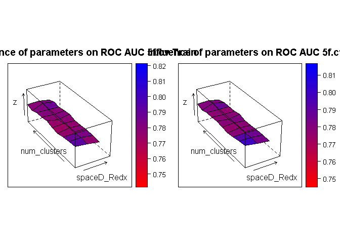

## Functions
The following functions are included to creating an MLP-stdalone classifier with subset_select and parameter search for "# hidden layers" and "# of nodes in hidden layers" and 5f-cv resampling:
* cvfold_partition
* kparti_sample
* subset_select
* calcAUC_plot
* surface_forestperfm


## Creating an MLP-stdalone classifier to compare with MLP + DEC unsupervised learning

```r
# Read CSV into R
library(neuralnet)
library(pROC)
setwd("Z:/Cristina/Section3/paper_notes/comparison_traditionalCAD")
source('functionsCAD.R')
pdatalabels <- read.csv(file="input/pdatalabels.csv", header=TRUE, sep=",")
dyn_roi <- read.csv(file="input/dyn_roi_records_allNMEs_descStats.csv", header=TRUE, sep=",")
morpho_roi <- read.csv(file="input/morpho_roi_records_allNMEs_descStats.csv", header=TRUE, sep=",")
text_roi <- read.csv(file="input/text_roi_records_allNMEs_descStats.csv", header=TRUE, sep=",")
stage1_roi <- read.csv(file="input/stage1_roi_records_allNMEs_descStats.csv", header=TRUE, sep=",")

nxGnorm <- read.csv(file="input/nxGnormfeatures_allNMEs_descStats.csv", header=FALSE, sep=",")
colnames(nxGnorm) <- paste("nxg", c(1:ncol(nxGnorm)),  sep ="")

# append all with lables
allfeatures = data.frame(cbind(pdatalabels,
                               dyn_roi[2:ncol(dyn_roi)],
                               morpho_roi[2:ncol(morpho_roi)],
                               text_roi[2:ncol(text_roi)],
                               stage1_roi[2:ncol(stage1_roi)]))

# print summary labesl
summary(allfeatures$labels)
```

```
##   B   K   M 
## 267 415 110
```

```r
# remove unlabeled or 'K'
# print summary of lesions in dataset:
onlylab_nxG =  cbind(allfeatures[allfeatures$labels!='K',], nxGnorm[allfeatures$labels!='K',])
onlylab_nxG$labels = factor(onlylab_nxG$labels)
summary(onlylab_nxG$labels)
```

```
##   B   M 
## 267 110
```

```r
## normalize data before training a neural network on it
onlylab_nxG$dce2SE19[is.na(onlylab_nxG$dce2SE19)] <- summary(onlylab_nxG$dce2SE19)[[4]]
onlylab_nxG$dce3SE19[is.na(onlylab_nxG$dce3SE19)] <- summary(onlylab_nxG$dce3SE19)[[4]]
onlylab_nxG$earlySE19[is.na(onlylab_nxG$earlySE19)] <- summary(onlylab_nxG$earlySE19)[[4]]

## normalize data before training a neural network on it
maxs <- apply(onlylab_nxG[c(2:ncol(onlylab_nxG))], 2, max)
mins <- apply(onlylab_nxG[c(2:ncol(onlylab_nxG))], 2, min)

Xscaled <- as.data.frame(scale(onlylab_nxG[c(2:ncol(onlylab_nxG))], center = mins, scale = maxs - mins))
data = cbind(Xscaled,labels=ifelse(onlylab_nxG$labels=='M',1,0))

## split in 90%/10% train/test 
sep = round(nrow(allfeatures)*0.10)
X_test = data[1:sep,]
y_test = X_test$labels
init_indTrain = sep+1
X_train = data[init_indTrain:nrow(data),]
y_train = X_train$labels

###################################################
### Train a CAD classifier using traditional CAD features (only supervised features)
###################################################
## create stratified kfolds
cvK = 5
particvfoldK = cvfold_partition(X_train, cvK)

###################################################
# create grid of evaluation points
gh1 = c(128,64) 
gh2 = c(0,32) 
grd1 <- expand.grid(h1 = gh1, h2 = gh2)
gh3 = c(48,24) 
gh4 = c(0,10)
grd2 <- expand.grid(h1 = gh3, h2 = gh4)
grd = rbind(grd1,grd2)

###################################################
# initialize grid search metrics
grdperf = data.frame(grd)
grdperf$avaucTrain =0
grdperf$stdTrain =0
grdperf$avaucVal =0
grdperf$stdVal =0

for(k in 1:nrow(grd)){
  # get grid search cell
  H = c(grd[k,][[1]],grd[k,][[2]])
  # Build in l
  cat("#h1: ", H[1], "#h2: ", H[2], "\n")
  cvAUC_train = c()
  cvAUC_val = c()
  for(r in 1:cvK){
    ## pick one of cvfold for held-out test, train on the rest
    kparti_setdata = kparti_sample(X_train, particvfoldK, cvK, r)
    
    # Boruta on $cvTrainsetD
    selfeatures_kfold = subset_select(kparti_setdata$cvTrainsetD)
    names(selfeatures_kfold)
    
    # train classifier in train with featset in train
    TrainsetD <-  kparti_setdata$cvTrainsetD[c(names(selfeatures_kfold))]
    ValsetD <-  kparti_setdata$cvValsetD[c(names(selfeatures_kfold))]
    
    # CREATE FORMULA  for grid search parameters train
    feats <- names(selfeatures_kfold[,!(names(selfeatures_kfold) %in% "labels")])
    # Concatenate strings
    f <- paste(feats,collapse=' + ')
    f <- paste('labels ~',f)
    # Convert to formula
    f <- as.formula(f)
    print(f)
    
    #install.packages('neuralnet')
    nn <- neuralnet(f, TrainsetD, hidden=c(H[H!=0]), linear.output=FALSE)
    
    # Compute Predictions off Test Set
    train.nn.values <- compute(nn, TrainsetD[,!(names(TrainsetD) %in% "labels")])
    valid.nn.values <- compute(nn, ValsetD[ , !(names(ValsetD) %in% "labels")])

    # have results between 0 and 1 that are more like probabilities of belonging to each class. We'll use sapply() to round these off to either 0 or 1 class so we can evaluate them against the test labels.
    train.nn.values$round.result <- sapply(train.nn.values$net.result,round,digits=0)
    valid.nn.values$round.result <- sapply(valid.nn.values$net.result,round,digits=0)
    
    # for train
    ROC_train <- roc(TrainsetD$labels, train.nn.values$net.result, plot=FALSE)
    ROC_val <- roc(ValsetD$labels, valid.nn.values$net.result, plot=FALSE)
    print(paste0("ROC_train$auc = ",ROC_train$auc))
    print(paste0("ROC_val$auc = ",ROC_val$auc))
    # appends
    cvAUC_train = c(cvAUC_train, ROC_train$auc)
    cvAUC_val = c(cvAUC_val, ROC_val$auc)
  }
  
  # collect data
  grdperf$avaucTrain[k] = mean(cvAUC_train)
  grdperf$stdTrain[k] = sd(cvAUC_train)
  grdperf$avaucVal[k] = mean(cvAUC_val)
  grdperf$stdVal[k] = sd(cvAUC_val)
}
```

```
## #h1:  128 #h2:  0 
## Boruta performed 99 iterations in 25.16249 secs.
##  6 attributes confirmed important: earlySE17, earlySE3, labels,
## lateSE17, nxg126 and 1 more.
##  514 attributes confirmed unimportant: A_inside, alpha_countor,
## alpha_inside, beta_countor, beta_inside and 509 more.
##  3 tentative attributes left: lateSE16, nxg248,
## texture_sumvariance_nondir_post1.
## labels ~ A_countor + A_inside + earlySE17 + earlySE3 + lateSE17 + 
##     nxg96 + nxg126 + texture_sumvariance_nondir_post1 + lateSE16 + 
##     nxg248
## [1] "ROC_train$auc = 0.605555555555556"
## [1] "ROC_val$auc = 0.648648648648649"
## Boruta performed 99 iterations in 32.59930897 secs.
##  19 attributes confirmed important: earlySE17, earlySE3, labels,
## max_F_r_i, nxg113 and 14 more.
##  479 attributes confirmed unimportant: A_inside, alpha_inside,
## beta_countor, beta_inside, circularity and 474 more.
##  25 tentative attributes left: alpha_countor, dce2SE16, earlySE14,
## earlySE15, earlySE16 and 20 more.
## labels ~ A_countor + A_inside + SER_inside + Slope_ini_inside + 
##     max_F_r_i + texture_sumentropy_nondir_post2 + texture_sumvariance_nondir_post1 + 
##     texture_sumvariance_nondir_post2 + texture_variance_nondir_post1 + 
##     earlySE17 + earlySE3 + nxg76 + nxg113 + nxg114 + nxg126 + 
##     nxg197 + nxg236 + nxg237 + nxg248 + nxg256 + Slope_ini_countor + 
##     Vr_post_1_countor + alpha_countor + edge_sharp_std + mean_F_r_i + 
##     var_F_r_i + texture_diffvariance_nondir_post1 + texture_entropy_nondir_post1 + 
##     texture_entropy_nondir_post4 + texture_sumentropy_nondir_post1 + 
##     texture_sumentropy_nondir_post4 + texture_sumvariance_nondir_post3 + 
##     texture_variance_nondir_post2 + texture_variance_nondir_post4 + 
##     dce2SE16 + earlySE14 + earlySE15 + earlySE16 + lateSE16 + 
##     lateSE18 + nxg47 + nxg205 + nxg224 + nxg286 + nxg324
## [1] "ROC_train$auc = 0.615606179628175"
## [1] "ROC_val$auc = 0.619565217391304"
## Boruta performed 99 iterations in 28.24076986 secs.
##  13 attributes confirmed important: labels, max_F_r_i, nxg114,
## nxg248, nxg255 and 8 more.
##  499 attributes confirmed unimportant: A_inside, alpha_countor,
## beta_countor, beta_inside, circularity and 494 more.
##  11 tentative attributes left: alpha_inside, earlySE17, earlySE6,
## edge_sharp_std, irregularity and 6 more.
## labels ~ A_countor + A_inside + max_F_r_i + var_F_r_i + texture_entropy_nondir_post1 + 
##     texture_entropy_nondir_post2 + texture_sumentropy_nondir_post1 + 
##     texture_sumentropy_nondir_post2 + texture_sumvariance_nondir_post1 + 
##     texture_variance_nondir_post1 + nxg114 + nxg248 + nxg255 + 
##     nxg256 + alpha_inside + edge_sharp_std + irregularity + texture_diffvariance_nondir_post1 + 
##     texture_energy_nondir_post1 + texture_sumvariance_nondir_post2 + 
##     texture_sumvariance_nondir_post3 + texture_variance_nondir_post2 + 
##     earlySE17 + earlySE6 + nxg148
## [1] "ROC_train$auc = 0.55606936416185"
## [1] "ROC_val$auc = 0.586647727272727"
## Boruta performed 99 iterations in 27.97214508 secs.
##  15 attributes confirmed important: earlySE6, labels, max_F_r_i,
## SER_inside, texture_entropy_nondir_post1 and 10 more.
##  502 attributes confirmed unimportant: A_inside, alpha_inside,
## beta_countor, beta_inside, circularity and 497 more.
##  6 tentative attributes left: alpha_countor, earlySE16,
## iAUC1_inside, Slope_ini_inside, texture_diffentropy_nondir_post2
## and 1 more.
## labels ~ A_countor + A_inside + SER_inside + max_F_r_i + texture_entropy_nondir_post1 + 
##     texture_entropy_nondir_post3 + texture_sumentropy_nondir_post1 + 
##     texture_sumentropy_nondir_post2 + texture_sumentropy_nondir_post3 + 
##     texture_sumentropy_nondir_post4 + texture_sumvariance_nondir_post1 + 
##     texture_sumvariance_nondir_post2 + texture_sumvariance_nondir_post3 + 
##     texture_variance_nondir_post1 + texture_variance_nondir_post2 + 
##     earlySE6 + Slope_ini_inside + alpha_countor + iAUC1_inside + 
##     texture_diffentropy_nondir_post2 + V2 + earlySE16
## [1] "ROC_train$auc = 0.671446608946609"
## [1] "ROC_val$auc = 0.642276422764228"
## Boruta performed 99 iterations in 30.38820601 secs.
##  11 attributes confirmed important: irregularity, labels, nxg114,
## nxg248, nxg256 and 6 more.
##  490 attributes confirmed unimportant: A_inside, alpha_countor,
## alpha_inside, beta_countor, beta_inside and 485 more.
##  22 tentative attributes left: earlySE3, earlySE6, edge_sharp_std,
## k_Max_Margin_Grad, lateSE16 and 17 more.
## labels ~ A_countor + A_inside + irregularity + var_F_r_i + texture_sumentropy_nondir_post1 + 
##     texture_sumentropy_nondir_post2 + texture_sumvariance_nondir_post1 + 
##     texture_sumvariance_nondir_post2 + texture_variance_nondir_post1 + 
##     nxg114 + nxg248 + nxg256 + SER_inside + Slope_ini_inside + 
##     Vr_post_1_countor + edge_sharp_std + k_Max_Margin_Grad + 
##     texture_diffvariance_nondir_post1 + texture_entropy_nondir_post1 + 
##     texture_entropy_nondir_post2 + texture_entropy_nondir_post4 + 
##     texture_sumentropy_nondir_post3 + texture_sumentropy_nondir_post4 + 
##     texture_sumvariance_nondir_post3 + texture_sumvariance_nondir_post4 + 
##     texture_variance_nondir_post2 + V15 + earlySE3 + earlySE6 + 
##     lateSE16 + nxg113 + nxg184 + nxg236 + nxg255
## [1] "ROC_train$auc = 0.569302721088435"
## [1] "ROC_val$auc = 0.441558441558442"
## #h1:  64 #h2:  0 
## Boruta performed 99 iterations in 26.68600512 secs.
##  7 attributes confirmed important: earlySE16, earlySE6, labels,
## lateSE17, texture_diffvariance_nondir_post1 and 2 more.
##  508 attributes confirmed unimportant: A_inside, alpha_countor,
## alpha_inside, beta_countor, beta_inside and 503 more.
##  8 tentative attributes left: dce2SE14, dce2SE17, earlySE11,
## nxg113, nxg114 and 3 more.
## labels ~ A_countor + A_inside + texture_diffvariance_nondir_post1 + 
##     texture_sumvariance_nondir_post1 + texture_variance_nondir_post1 + 
##     earlySE16 + earlySE6 + lateSE17 + texture_sumvariance_nondir_post2 + 
##     V15 + dce2SE14 + dce2SE17 + earlySE11 + nxg95 + nxg113 + 
##     nxg114
## [1] "ROC_train$auc = 0.937853107344633"
## [1] "ROC_val$auc = 0.641277641277641"
## Boruta performed 99 iterations in 31.20785809 secs.
##  23 attributes confirmed important: earlySE16, earlySE17,
## earlySE3, irregularity, labels and 18 more.
##  484 attributes confirmed unimportant: A_inside, beta_countor,
## beta_inside, circularity, dce2SE0 and 479 more.
##  16 tentative attributes left: alpha_countor, alpha_inside,
## dce3SE18, earlySE10, earlySE12 and 11 more.
## labels ~ A_countor + A_inside + SER_inside + Slope_ini_inside + 
##     irregularity + max_F_r_i + var_F_r_i + texture_diffvariance_nondir_post1 + 
##     texture_sumentropy_nondir_post2 + texture_sumvariance_nondir_post1 + 
##     texture_sumvariance_nondir_post2 + texture_variance_nondir_post1 + 
##     earlySE16 + earlySE17 + earlySE3 + nxg8 + nxg113 + nxg114 + 
##     nxg126 + nxg197 + nxg236 + nxg237 + nxg248 + nxg256 + alpha_countor + 
##     alpha_inside + mean_F_r_i + texture_entropy_nondir_post1 + 
##     texture_entropy_nondir_post2 + texture_sumentropy_nondir_post1 + 
##     texture_sumentropy_nondir_post4 + texture_sumvariance_nondir_post3 + 
##     texture_variance_nondir_post2 + texture_variance_nondir_post4 + 
##     dce3SE18 + earlySE10 + earlySE12 + earlySE14 + earlySE15 + 
##     nxg76
## [1] "ROC_train$auc = 0.982019725931745"
## [1] "ROC_val$auc = 0.5"
## Boruta performed 99 iterations in 29.36930799 secs.
##  18 attributes confirmed important: earlySE6, labels, max_F_r_i,
## nxg113, nxg114 and 13 more.
##  495 attributes confirmed unimportant: A_inside, alpha_countor,
## alpha_inside, beta_countor, beta_inside and 490 more.
##  10 tentative attributes left: earlySE15, earlySE17, earlySE5,
## irregularity, mean_F_r_i and 5 more.
## labels ~ A_countor + A_inside + SER_inside + max_F_r_i + var_F_r_i + 
##     texture_entropy_nondir_post1 + texture_entropy_nondir_post2 + 
##     texture_sumentropy_nondir_post1 + texture_sumentropy_nondir_post2 + 
##     texture_sumvariance_nondir_post1 + texture_variance_nondir_post1 + 
##     earlySE6 + nxg113 + nxg114 + nxg236 + nxg237 + nxg248 + nxg255 + 
##     nxg256 + Vr_post_1_countor + irregularity + mean_F_r_i + 
##     texture_energy_nondir_post1 + V15 + earlySE15 + earlySE17 + 
##     earlySE5 + nxg144 + nxg317
## [1] "ROC_train$auc = 0.949933303690529"
## [1] "ROC_val$auc = 0.693181818181818"
## Boruta performed 99 iterations in 26.51736307 secs.
##  11 attributes confirmed important: labels,
## texture_diffvariance_nondir_post1, texture_entropy_nondir_post1,
## texture_entropy_nondir_post3, texture_sumentropy_nondir_post1 and
## 6 more.
##  509 attributes confirmed unimportant: A_inside, alpha_countor,
## alpha_inside, beta_countor, beta_inside and 504 more.
##  3 tentative attributes left: earlySE6,
## texture_diffentropy_nondir_post1, texture_sumentropy_nondir_post3.
## labels ~ A_countor + A_inside + texture_diffvariance_nondir_post1 + 
##     texture_entropy_nondir_post1 + texture_entropy_nondir_post3 + 
##     texture_sumentropy_nondir_post1 + texture_sumentropy_nondir_post2 + 
##     texture_sumvariance_nondir_post1 + texture_sumvariance_nondir_post2 + 
##     texture_sumvariance_nondir_post3 + texture_variance_nondir_post1 + 
##     texture_variance_nondir_post2 + texture_diffentropy_nondir_post1 + 
##     texture_sumentropy_nondir_post3 + earlySE6
## [1] "ROC_train$auc = 0.9629329004329"
## [1] "ROC_val$auc = 0.671409214092141"
## Boruta performed 99 iterations in 31.2122612 secs.
##  11 attributes confirmed important: irregularity, labels, nxg114,
## nxg237, nxg248 and 6 more.
##  489 attributes confirmed unimportant: A_inside, alpha_countor,
## alpha_inside, beta_countor, beta_inside and 484 more.
##  23 tentative attributes left: dce2SE16, earlySE16, earlySE3,
## earlySE6, lateSE16 and 18 more.
## labels ~ A_countor + A_inside + irregularity + texture_sumentropy_nondir_post1 + 
##     texture_sumentropy_nondir_post2 + texture_sumvariance_nondir_post1 + 
##     texture_sumvariance_nondir_post2 + texture_variance_nondir_post1 + 
##     nxg114 + nxg237 + nxg248 + nxg256 + SER_inside + Slope_ini_inside + 
##     Vr_post_1_countor + max_F_r_i + mean_F_r_i + var_F_r_i + 
##     texture_diffvariance_nondir_post1 + texture_entropy_nondir_post1 + 
##     texture_entropy_nondir_post4 + texture_sumentropy_nondir_post3 + 
##     texture_sumentropy_nondir_post4 + texture_sumvariance_nondir_post3 + 
##     texture_sumvariance_nondir_post4 + texture_variance_nondir_post2 + 
##     V15 + dce2SE16 + earlySE16 + earlySE3 + earlySE6 + lateSE16 + 
##     nxg113 + nxg236 + nxg323
## [1] "ROC_train$auc = 0.959268707482993"
## [1] "ROC_val$auc = 0.506493506493506"
## #h1:  128 #h2:  32 
## Boruta performed 92 iterations in 24.6052351 secs.
##  8 attributes confirmed important: earlySE15, earlySE17, earlySE3,
## earlySE6, labels and 3 more.
##  515 attributes confirmed unimportant: A_inside, alpha_countor,
## alpha_inside, beta_countor, beta_inside and 510 more.
## labels ~ A_countor + A_inside + earlySE15 + earlySE17 + earlySE3 + 
##     earlySE6 + nxg126 + nxg255 + nxg256
## [1] "ROC_train$auc = 0.977495291902072"
## [1] "ROC_val$auc = 0.707616707616708"
## Boruta performed 99 iterations in 33.51350689 secs.
##  18 attributes confirmed important: earlySE17, earlySE3,
## irregularity, labels, max_F_r_i and 13 more.
##  479 attributes confirmed unimportant: A_inside, alpha_inside,
## beta_countor, beta_inside, circularity and 474 more.
##  26 tentative attributes left: alpha_countor, dce2SE16, earlySE10,
## earlySE14, earlySE15 and 21 more.
## labels ~ A_countor + A_inside + SER_inside + Slope_ini_inside + 
##     irregularity + max_F_r_i + texture_diffvariance_nondir_post1 + 
##     texture_sumentropy_nondir_post2 + texture_sumvariance_nondir_post1 + 
##     texture_sumvariance_nondir_post2 + texture_variance_nondir_post1 + 
##     earlySE17 + earlySE3 + nxg8 + nxg114 + nxg126 + nxg202 + 
##     nxg248 + nxg256 + Slope_ini_countor + Vr_post_1_countor + 
##     alpha_countor + edge_sharp_std + mean_F_r_i + var_F_r_i + 
##     texture_entropy_nondir_post1 + texture_entropy_nondir_post3 + 
##     texture_entropy_nondir_post4 + texture_sumentropy_nondir_post1 + 
##     texture_sumentropy_nondir_post4 + texture_sumvariance_nondir_post3 + 
##     texture_variance_nondir_post2 + texture_variance_nondir_post4 + 
##     dce2SE16 + earlySE10 + earlySE14 + earlySE15 + earlySE16 + 
##     earlySE5 + lateSE18 + nxg38 + nxg47 + nxg76 + nxg200 + nxg205
## [1] "ROC_train$auc = 0.532687439993017"
## [1] "ROC_val$auc = 0.610248447204969"
## Boruta performed 99 iterations in 28.22714281 secs.
##  14 attributes confirmed important: earlySE6, labels, max_F_r_i,
## nxg248, nxg255 and 9 more.
##  500 attributes confirmed unimportant: A_inside, alpha_inside,
## beta_countor, beta_inside, circularity and 495 more.
##  9 tentative attributes left: alpha_countor, earlySE1, earlySE15,
## earlySE3, earlySE5 and 4 more.
## labels ~ A_countor + A_inside + max_F_r_i + var_F_r_i + texture_energy_nondir_post2 + 
##     texture_entropy_nondir_post1 + texture_entropy_nondir_post2 + 
##     texture_sumentropy_nondir_post1 + texture_sumentropy_nondir_post2 + 
##     texture_sumvariance_nondir_post1 + texture_variance_nondir_post1 + 
##     earlySE6 + nxg248 + nxg255 + nxg256 + alpha_countor + texture_diffvariance_nondir_post1 + 
##     texture_sumvariance_nondir_post2 + texture_sumvariance_nondir_post3 + 
##     texture_variance_nondir_post2 + earlySE1 + earlySE15 + earlySE3 + 
##     earlySE5
## [1] "ROC_train$auc = 0.982836816362828"
## [1] "ROC_val$auc = 0.740056818181818"
## Boruta performed 99 iterations in 26.12415814 secs.
##  11 attributes confirmed important: labels, nxg255,
## texture_entropy_nondir_post1, texture_sumentropy_nondir_post1,
## texture_sumentropy_nondir_post2 and 6 more.
##  511 attributes confirmed unimportant: A_inside, alpha_countor,
## beta_countor, beta_inside, circularity and 506 more.
##  1 tentative attributes left: alpha_inside.
## labels ~ A_countor + A_inside + texture_entropy_nondir_post1 + 
##     texture_sumentropy_nondir_post1 + texture_sumentropy_nondir_post2 + 
##     texture_sumentropy_nondir_post3 + texture_sumvariance_nondir_post1 + 
##     texture_sumvariance_nondir_post2 + texture_sumvariance_nondir_post3 + 
##     texture_variance_nondir_post1 + texture_variance_nondir_post2 + 
##     nxg255 + alpha_inside
## [1] "ROC_train$auc = 0.969155844155844"
## [1] "ROC_val$auc = 0.559620596205962"
## Boruta performed 99 iterations in 28.56713104 secs.
##  13 attributes confirmed important: earlySE3, irregularity,
## labels, nxg237, nxg248 and 8 more.
##  500 attributes confirmed unimportant: A_inside, alpha_countor,
## alpha_inside, beta_countor, beta_inside and 495 more.
##  10 tentative attributes left: earlySE17, edge_sharp_std, nxg255,
## texture_sumvariance_nondir_post3, texture_sumvariance_nondir_post4
## and 5 more.
## labels ~ A_countor + A_inside + irregularity + var_F_r_i + texture_sumentropy_nondir_post1 + 
##     texture_sumentropy_nondir_post2 + texture_sumentropy_nondir_post4 + 
##     texture_sumvariance_nondir_post1 + texture_sumvariance_nondir_post2 + 
##     texture_variance_nondir_post1 + earlySE3 + nxg237 + nxg248 + 
##     nxg256 + Vr_post_1_countor + edge_sharp_std + texture_sumvariance_nondir_post3 + 
##     texture_sumvariance_nondir_post4 + texture_variance_nondir_post2 + 
##     texture_variance_nondir_post4 + V15 + V4 + earlySE17 + nxg255
## [1] "ROC_train$auc = 0.995408163265306"
## [1] "ROC_val$auc = 0.61595547309833"
## #h1:  64 #h2:  32 
## Boruta performed 99 iterations in 26.4744699 secs.
##  8 attributes confirmed important: earlySE3, earlySE6, labels,
## lateSE17, nxg126 and 3 more.
##  511 attributes confirmed unimportant: A_inside, alpha_countor,
## alpha_inside, beta_countor, beta_inside and 506 more.
##  4 tentative attributes left: mean_F_r_i, nxg318, nxg94, nxg96.
## labels ~ A_countor + A_inside + texture_sumvariance_nondir_post1 + 
##     texture_variance_nondir_post1 + earlySE3 + earlySE6 + lateSE17 + 
##     nxg126 + nxg248 + mean_F_r_i + nxg94 + nxg96 + nxg318
## [1] "ROC_train$auc = 0.942655367231638"
## [1] "ROC_val$auc = 0.641277641277641"
## Boruta performed 99 iterations in 30.55268288 secs.
##  22 attributes confirmed important: earlySE15, earlySE17,
## earlySE3, irregularity, labels and 17 more.
##  490 attributes confirmed unimportant: A_inside, alpha_inside,
## beta_countor, beta_inside, circularity and 485 more.
##  11 tentative attributes left: alpha_countor, dce2SE16, earlySE16,
## earlySE19, Slope_ini_countor and 6 more.
## labels ~ A_countor + A_inside + SER_inside + Slope_ini_inside + 
##     irregularity + max_F_r_i + var_F_r_i + texture_diffvariance_nondir_post1 + 
##     texture_sumentropy_nondir_post2 + texture_sumvariance_nondir_post1 + 
##     texture_sumvariance_nondir_post2 + texture_variance_nondir_post1 + 
##     earlySE15 + earlySE17 + earlySE3 + nxg8 + nxg76 + nxg113 + 
##     nxg114 + nxg126 + nxg200 + nxg248 + nxg256 + Slope_ini_countor + 
##     alpha_countor + texture_entropy_nondir_post1 + texture_sumentropy_nondir_post1 + 
##     texture_sumentropy_nondir_post4 + texture_sumvariance_nondir_post3 + 
##     texture_sumvariance_nondir_post4 + texture_variance_nondir_post2 + 
##     dce2SE16 + earlySE16 + earlySE19
## [1] "ROC_train$auc = 0.987431264728987"
## [1] "ROC_val$auc = 0.478260869565217"
## Boruta performed 99 iterations in 25.98859 secs.
##  12 attributes confirmed important: labels, nxg248, nxg255,
## nxg256, texture_entropy_nondir_post1 and 7 more.
##  510 attributes confirmed unimportant: A_inside, alpha_countor,
## alpha_inside, beta_countor, beta_inside and 505 more.
##  1 tentative attributes left: Vr_post_1_countor.
## labels ~ A_countor + A_inside + var_F_r_i + texture_entropy_nondir_post1 + 
##     texture_entropy_nondir_post2 + texture_sumentropy_nondir_post1 + 
##     texture_sumentropy_nondir_post2 + texture_sumvariance_nondir_post1 + 
##     texture_sumvariance_nondir_post3 + texture_variance_nondir_post1 + 
##     nxg248 + nxg255 + nxg256 + Vr_post_1_countor
## [1] "ROC_train$auc = 0.96674077367719"
## [1] "ROC_val$auc = 0.596590909090909"
## Boruta performed 99 iterations in 27.91865802 secs.
##  11 attributes confirmed important: labels, nxg323,
## texture_entropy_nondir_post1, texture_sumentropy_nondir_post1,
## texture_sumentropy_nondir_post2 and 6 more.
##  505 attributes confirmed unimportant: A_inside, alpha_countor,
## alpha_inside, beta_countor, beta_inside and 500 more.
##  7 tentative attributes left: earlySE16, earlySE6, SER_inside,
## texture_contrast_nondir_post1, texture_diffvariance_nondir_post1
## and 2 more.
## labels ~ A_countor + A_inside + texture_entropy_nondir_post1 + 
##     texture_sumentropy_nondir_post1 + texture_sumentropy_nondir_post2 + 
##     texture_sumentropy_nondir_post3 + texture_sumvariance_nondir_post1 + 
##     texture_sumvariance_nondir_post2 + texture_sumvariance_nondir_post3 + 
##     texture_variance_nondir_post1 + texture_variance_nondir_post2 + 
##     nxg323 + SER_inside + texture_contrast_nondir_post1 + texture_diffvariance_nondir_post1 + 
##     texture_entropy_nondir_post2 + texture_variance_nondir_post4 + 
##     earlySE16 + earlySE6
## [1] "ROC_train$auc = 0.988906926406926"
## [1] "ROC_val$auc = 0.668021680216802"
## Boruta performed 99 iterations in 27.72224402 secs.
##  12 attributes confirmed important: labels, nxg248, nxg256,
## texture_entropy_nondir_post1, texture_sumentropy_nondir_post1 and
## 7 more.
##  504 attributes confirmed unimportant: A_inside, alpha_countor,
## alpha_inside, beta_countor, beta_inside and 499 more.
##  7 tentative attributes left: lateSE18, max_F_r_i,
## texture_contrast_nondir_post1, texture_sumvariance_nondir_post3,
## texture_sumvariance_nondir_post4 and 2 more.
## labels ~ A_countor + A_inside + Vr_post_1_countor + var_F_r_i + 
##     texture_entropy_nondir_post1 + texture_sumentropy_nondir_post1 + 
##     texture_sumentropy_nondir_post2 + texture_sumentropy_nondir_post4 + 
##     texture_sumvariance_nondir_post1 + texture_sumvariance_nondir_post2 + 
##     texture_variance_nondir_post1 + nxg248 + nxg256 + max_F_r_i + 
##     texture_contrast_nondir_post1 + texture_sumvariance_nondir_post3 + 
##     texture_sumvariance_nondir_post4 + texture_variance_nondir_post2 + 
##     texture_variance_nondir_post4 + lateSE18
## [1] "ROC_train$auc = 0.974149659863946"
## [1] "ROC_val$auc = 0.682745825602968"
## #h1:  48 #h2:  0 
## Boruta performed 99 iterations in 26.11140418 secs.
##  8 attributes confirmed important: earlySE3, labels, nxg237,
## nxg248, nxg256 and 3 more.
##  512 attributes confirmed unimportant: A_inside, alpha_countor,
## alpha_inside, beta_countor, beta_inside and 507 more.
##  3 tentative attributes left: earlySE16, nxg102, nxg221.
## labels ~ A_countor + A_inside + texture_sumentropy_nondir_post2 + 
##     texture_sumvariance_nondir_post1 + texture_variance_nondir_post1 + 
##     earlySE3 + nxg237 + nxg248 + nxg256 + earlySE16 + nxg102 + 
##     nxg221
## [1] "ROC_train$auc = 0.947551789077213"
## [1] "ROC_val$auc = 0.684275184275184"
## Boruta performed 99 iterations in 32.36067915 secs.
##  26 attributes confirmed important: alpha_countor, earlySE14,
## earlySE16, earlySE17, earlySE3 and 21 more.
##  485 attributes confirmed unimportant: A_inside, beta_countor,
## beta_inside, circularity, dce2SE0 and 480 more.
##  12 tentative attributes left: alpha_inside, dce2SE16, earlySE15,
## lateSE16, mean_F_r_i and 7 more.
## labels ~ A_countor + A_inside + SER_inside + Slope_ini_inside + 
##     alpha_countor + irregularity + max_F_r_i + var_F_r_i + texture_diffvariance_nondir_post1 + 
##     texture_sumentropy_nondir_post1 + texture_sumentropy_nondir_post2 + 
##     texture_sumvariance_nondir_post1 + texture_sumvariance_nondir_post2 + 
##     texture_sumvariance_nondir_post3 + texture_variance_nondir_post1 + 
##     earlySE14 + earlySE16 + earlySE17 + earlySE3 + nxg76 + nxg113 + 
##     nxg114 + nxg126 + nxg236 + nxg237 + nxg248 + nxg256 + alpha_inside + 
##     mean_F_r_i + texture_entropy_nondir_post1 + texture_entropy_nondir_post2 + 
##     texture_sumentropy_nondir_post4 + texture_variance_nondir_post2 + 
##     texture_variance_nondir_post4 + dce2SE16 + earlySE15 + lateSE16 + 
##     nxg111 + nxg267
## [1] "ROC_train$auc = 0.948328532774723"
## [1] "ROC_val$auc = 0.501552795031056"
## Boruta performed 99 iterations in 29.68374395 secs.
##  13 attributes confirmed important: labels, max_F_r_i, nxg236,
## nxg237, nxg248 and 8 more.
##  497 attributes confirmed unimportant: A_inside, alpha_countor,
## alpha_inside, beta_countor, beta_inside and 492 more.
##  13 tentative attributes left: earlySE15, earlySE5, earlySE6,
## nxg148, nxg318 and 8 more.
## labels ~ A_countor + A_inside + max_F_r_i + var_F_r_i + texture_entropy_nondir_post1 + 
##     texture_sumentropy_nondir_post1 + texture_sumentropy_nondir_post2 + 
##     texture_sumvariance_nondir_post1 + texture_variance_nondir_post1 + 
##     nxg236 + nxg237 + nxg248 + nxg255 + nxg256 + texture_diffvariance_nondir_post1 + 
##     texture_energy_nondir_post1 + texture_energy_nondir_post2 + 
##     texture_entropy_nondir_post2 + texture_sumvariance_nondir_post2 + 
##     texture_sumvariance_nondir_post3 + V15 + V5 + earlySE15 + 
##     earlySE5 + earlySE6 + nxg148 + nxg318
## [1] "ROC_train$auc = 0.982570031124944"
## [1] "ROC_val$auc = 0.704545454545455"
## Boruta performed 99 iterations in 27.77601695 secs.
##  10 attributes confirmed important: labels, nxg255,
## texture_entropy_nondir_post1, texture_sumentropy_nondir_post1,
## texture_sumentropy_nondir_post2 and 5 more.
##  507 attributes confirmed unimportant: A_inside, alpha_countor,
## alpha_inside, beta_countor, beta_inside and 502 more.
##  6 tentative attributes left: earlySE15,
## texture_diffvariance_nondir_post1, texture_entropy_nondir_post3,
## texture_sumentropy_nondir_post3, texture_sumentropy_nondir_post4
## and 1 more.
## labels ~ A_countor + A_inside + texture_entropy_nondir_post1 + 
##     texture_sumentropy_nondir_post1 + texture_sumentropy_nondir_post2 + 
##     texture_sumvariance_nondir_post1 + texture_sumvariance_nondir_post2 + 
##     texture_sumvariance_nondir_post3 + texture_variance_nondir_post1 + 
##     texture_variance_nondir_post2 + nxg255 + var_F_r_i + texture_diffvariance_nondir_post1 + 
##     texture_entropy_nondir_post3 + texture_sumentropy_nondir_post3 + 
##     texture_sumentropy_nondir_post4 + earlySE15
## [1] "ROC_train$auc = 0.986562049062049"
## [1] "ROC_val$auc = 0.548780487804878"
## Boruta performed 99 iterations in 30.11400509 secs.
##  10 attributes confirmed important: irregularity, labels, nxg248,
## nxg256, texture_sumentropy_nondir_post1 and 5 more.
##  495 attributes confirmed unimportant: A_inside, alpha_countor,
## alpha_inside, beta_countor, beta_inside and 490 more.
##  18 tentative attributes left: dce2SE16, earlySE16, earlySE3,
## edge_sharp_std, lateSE18 and 13 more.
## labels ~ A_countor + A_inside + irregularity + var_F_r_i + texture_sumentropy_nondir_post1 + 
##     texture_sumentropy_nondir_post2 + texture_sumvariance_nondir_post1 + 
##     texture_sumvariance_nondir_post2 + texture_variance_nondir_post1 + 
##     nxg248 + nxg256 + Vr_post_1_countor + edge_sharp_std + texture_diffvariance_nondir_post1 + 
##     texture_entropy_nondir_post1 + texture_entropy_nondir_post4 + 
##     texture_sumentropy_nondir_post3 + texture_sumentropy_nondir_post4 + 
##     texture_sumvariance_nondir_post3 + texture_sumvariance_nondir_post4 + 
##     texture_variance_nondir_post2 + texture_variance_nondir_post4 + 
##     V15 + dce2SE16 + earlySE16 + earlySE3 + lateSE18 + nxg113 + 
##     nxg255
## [1] "ROC_train$auc = 0.989285714285714"
## [1] "ROC_val$auc = 0.641929499072356"
## #h1:  24 #h2:  0 
## Boruta performed 99 iterations in 27.30865812 secs.
##  8 attributes confirmed important: earlySE16, labels, nxg126,
## nxg248, nxg256 and 3 more.
##  508 attributes confirmed unimportant: A_inside, alpha_countor,
## alpha_inside, beta_countor, beta_inside and 503 more.
##  7 tentative attributes left: dce2SE16, dce2SE9, nxg138, nxg144,
## nxg148 and 2 more.
## labels ~ A_countor + A_inside + texture_sumentropy_nondir_post2 + 
##     texture_sumvariance_nondir_post1 + texture_variance_nondir_post1 + 
##     earlySE16 + nxg126 + nxg248 + nxg256 + dce2SE16 + dce2SE9 + 
##     nxg42 + nxg96 + nxg138 + nxg144 + nxg148
## [1] "ROC_train$auc = 0.951412429378531"
## [1] "ROC_val$auc = 0.71007371007371"
## Boruta performed 99 iterations in 32.32769299 secs.
##  14 attributes confirmed important: earlySE17, earlySE3, labels,
## max_F_r_i, nxg126 and 9 more.
##  484 attributes confirmed unimportant: A_inside, alpha_inside,
## beta_countor, beta_inside, circularity and 479 more.
##  25 tentative attributes left: alpha_countor, dce2SE1, dce2SE16,
## earlySE14, earlySE15 and 20 more.
## labels ~ A_countor + A_inside + SER_inside + max_F_r_i + texture_sumentropy_nondir_post2 + 
##     texture_sumvariance_nondir_post1 + texture_sumvariance_nondir_post2 + 
##     texture_variance_nondir_post1 + earlySE17 + earlySE3 + nxg126 + 
##     nxg236 + nxg237 + nxg248 + nxg256 + Slope_ini_countor + Slope_ini_inside + 
##     alpha_countor + edge_sharp_std + mean_F_r_i + var_F_r_i + 
##     texture_diffvariance_nondir_post1 + texture_entropy_nondir_post1 + 
##     texture_entropy_nondir_post2 + texture_sumentropy_nondir_post1 + 
##     texture_sumentropy_nondir_post4 + texture_sumvariance_nondir_post3 + 
##     texture_sumvariance_nondir_post4 + texture_variance_nondir_post2 + 
##     dce2SE1 + dce2SE16 + earlySE14 + earlySE15 + earlySE16 + 
##     lateSE18 + nxg76 + nxg197 + nxg202 + nxg274 + nxg323
## [1] "ROC_train$auc = 0.986558435890722"
## [1] "ROC_val$auc = 0.614906832298137"
## Boruta performed 99 iterations in 27.49808693 secs.
##  15 attributes confirmed important: earlySE17, earlySE6, labels,
## max_F_r_i, nxg236 and 10 more.
##  505 attributes confirmed unimportant: A_inside, alpha_countor,
## alpha_inside, beta_countor, beta_inside and 500 more.
##  3 tentative attributes left: nxg148, texture_energy_nondir_post1,
## texture_variance_nondir_post3.
## labels ~ A_countor + A_inside + max_F_r_i + var_F_r_i + texture_entropy_nondir_post1 + 
##     texture_entropy_nondir_post2 + texture_sumentropy_nondir_post1 + 
##     texture_sumentropy_nondir_post2 + texture_sumvariance_nondir_post1 + 
##     texture_variance_nondir_post1 + earlySE17 + earlySE6 + nxg236 + 
##     nxg248 + nxg255 + nxg256 + texture_energy_nondir_post1 + 
##     texture_variance_nondir_post3 + nxg148
## [1] "ROC_train$auc = 0.964517563361494"
## [1] "ROC_val$auc = 0.661931818181818"
## Boruta performed 99 iterations in 28.55258417 secs.
##  11 attributes confirmed important: labels, nxg256,
## texture_entropy_nondir_post1, texture_sumentropy_nondir_post1,
## texture_sumentropy_nondir_post2 and 6 more.
##  504 attributes confirmed unimportant: A_inside, alpha_inside,
## beta_countor, beta_inside, circularity and 499 more.
##  8 tentative attributes left: alpha_countor, earlySE15, earlySE16,
## earlySE6, SER_inside and 3 more.
## labels ~ A_countor + A_inside + texture_entropy_nondir_post1 + 
##     texture_sumentropy_nondir_post1 + texture_sumentropy_nondir_post2 + 
##     texture_sumentropy_nondir_post4 + texture_sumvariance_nondir_post1 + 
##     texture_sumvariance_nondir_post2 + texture_sumvariance_nondir_post3 + 
##     texture_variance_nondir_post1 + texture_variance_nondir_post2 + 
##     nxg256 + SER_inside + alpha_countor + texture_diffvariance_nondir_post1 + 
##     texture_sumentropy_nondir_post3 + V4 + earlySE15 + earlySE16 + 
##     earlySE6
## [1] "ROC_train$auc = 0.941197691197691"
## [1] "ROC_val$auc = 0.640921409214092"
## Boruta performed 99 iterations in 29.64139295 secs.
##  12 attributes confirmed important: irregularity, labels, nxg237,
## nxg248, nxg256 and 7 more.
##  495 attributes confirmed unimportant: A_inside, alpha_countor,
## alpha_inside, beta_countor, beta_inside and 490 more.
##  16 tentative attributes left: dce2SE16, edge_sharp_std,
## k_Max_Margin_Grad, max_F_r_i, nxg224 and 11 more.
## labels ~ A_countor + A_inside + irregularity + var_F_r_i + texture_sumentropy_nondir_post1 + 
##     texture_sumentropy_nondir_post2 + texture_sumentropy_nondir_post4 + 
##     texture_sumvariance_nondir_post1 + texture_sumvariance_nondir_post2 + 
##     texture_variance_nondir_post1 + nxg237 + nxg248 + nxg256 + 
##     edge_sharp_std + k_Max_Margin_Grad + max_F_r_i + texture_diffvariance_nondir_post1 + 
##     texture_entropy_nondir_post1 + texture_entropy_nondir_post4 + 
##     texture_sumvariance_nondir_post3 + texture_sumvariance_nondir_post4 + 
##     texture_variance_nondir_post2 + texture_variance_nondir_post4 + 
##     V15 + V4 + dce2SE16 + nxg47 + nxg224 + nxg255
## [1] "ROC_train$auc = 0.977210884353741"
## [1] "ROC_val$auc = 0.625231910946197"
## #h1:  48 #h2:  10 
## Boruta performed 99 iterations in 23.87181497 secs.
##  2 attributes confirmed important: earlySE3, labels.
##  518 attributes confirmed unimportant: A_inside, alpha_countor,
## alpha_inside, beta_countor, beta_inside and 513 more.
##  3 tentative attributes left: dce3SE17, lateSE16,
## texture_sumvariance_nondir_post1.
## labels ~ A_countor + A_inside + earlySE3 + texture_sumvariance_nondir_post1 + 
##     dce3SE17 + lateSE16
## [1] "ROC_train$auc = 0.920056497175141"
## [1] "ROC_val$auc = 0.665847665847666"
## Boruta performed 99 iterations in 33.46869087 secs.
##  21 attributes confirmed important: earlySE15, earlySE17,
## earlySE3, irregularity, labels and 16 more.
##  480 attributes confirmed unimportant: A_inside, alpha_inside,
## beta_countor, beta_inside, circularity and 475 more.
##  22 tentative attributes left: alpha_countor, dce2SE16, earlySE14,
## earlySE16, edge_sharp_std and 17 more.
## labels ~ A_countor + A_inside + SER_inside + Slope_ini_inside + 
##     irregularity + max_F_r_i + var_F_r_i + texture_diffvariance_nondir_post1 + 
##     texture_sumentropy_nondir_post2 + texture_sumvariance_nondir_post1 + 
##     texture_sumvariance_nondir_post2 + texture_variance_nondir_post1 + 
##     earlySE15 + earlySE17 + earlySE3 + nxg113 + nxg114 + nxg126 + 
##     nxg236 + nxg237 + nxg248 + nxg256 + alpha_countor + edge_sharp_std + 
##     texture_entropy_nondir_post1 + texture_entropy_nondir_post4 + 
##     texture_sumentropy_nondir_post1 + texture_sumentropy_nondir_post4 + 
##     texture_sumvariance_nondir_post3 + texture_sumvariance_nondir_post4 + 
##     texture_variance_nondir_post2 + texture_variance_nondir_post4 + 
##     dce2SE16 + earlySE14 + earlySE16 + lateSE16 + lateSE18 + 
##     nxg76 + nxg197 + nxg202 + nxg205 + nxg312 + nxg320 + nxg323
## [1] "ROC_train$auc = 0.988565942218731"
## [1] "ROC_val$auc = 0.517080745341615"
## Boruta performed 99 iterations in 30.331563 secs.
##  14 attributes confirmed important: earlySE6, labels, max_F_r_i,
## nxg114, nxg237 and 9 more.
##  494 attributes confirmed unimportant: A_inside, alpha_countor,
## beta_countor, beta_inside, circularity and 489 more.
##  15 tentative attributes left: alpha_inside, earlySE15, earlySE17,
## edge_sharp_std, mean_F_r_i and 10 more.
## labels ~ A_countor + A_inside + max_F_r_i + var_F_r_i + texture_entropy_nondir_post1 + 
##     texture_sumentropy_nondir_post1 + texture_sumentropy_nondir_post2 + 
##     texture_sumvariance_nondir_post1 + texture_variance_nondir_post1 + 
##     earlySE6 + nxg114 + nxg237 + nxg248 + nxg255 + nxg256 + SER_inside + 
##     alpha_inside + edge_sharp_std + mean_F_r_i + texture_contrast_nondir_post1 + 
##     texture_diffvariance_nondir_post1 + texture_energy_nondir_post2 + 
##     texture_entropy_nondir_post2 + texture_sumvariance_nondir_post2 + 
##     V15 + earlySE15 + earlySE17 + nxg113 + nxg148 + nxg236
## [1] "ROC_train$auc = 0.931080480213428"
## [1] "ROC_val$auc = 0.676136363636364"
## Boruta performed 99 iterations in 28.38872194 secs.
##  12 attributes confirmed important: earlySE15, labels, nxg248,
## nxg255, texture_entropy_nondir_post1 and 7 more.
##  503 attributes confirmed unimportant: A_inside, alpha_countor,
## alpha_inside, beta_countor, beta_inside and 498 more.
##  8 tentative attributes left: earlySE16, nxg224, SER_inside,
## texture_diffentropy_nondir_post1,
## texture_diffvariance_nondir_post1 and 3 more.
## labels ~ A_countor + A_inside + texture_entropy_nondir_post1 + 
##     texture_sumentropy_nondir_post1 + texture_sumentropy_nondir_post2 + 
##     texture_sumvariance_nondir_post1 + texture_sumvariance_nondir_post2 + 
##     texture_sumvariance_nondir_post3 + texture_variance_nondir_post1 + 
##     texture_variance_nondir_post2 + earlySE15 + nxg248 + nxg255 + 
##     SER_inside + texture_diffentropy_nondir_post1 + texture_diffvariance_nondir_post1 + 
##     texture_energy_nondir_post4 + texture_entropy_nondir_post3 + 
##     texture_sumentropy_nondir_post3 + earlySE16 + nxg224
## [1] "ROC_train$auc = 0.919642857142857"
## [1] "ROC_val$auc = 0.657181571815718"
## Boruta performed 99 iterations in 31.07531905 secs.
##  11 attributes confirmed important: earlySE3, labels, nxg237,
## nxg248, nxg256 and 6 more.
##  492 attributes confirmed unimportant: A_inside, alpha_countor,
## alpha_inside, beta_countor, beta_inside and 487 more.
##  20 tentative attributes left: earlySE15, earlySE16, earlySE17,
## earlySE6, lateSE16 and 15 more.
## labels ~ A_countor + A_inside + var_F_r_i + texture_sumentropy_nondir_post1 + 
##     texture_sumentropy_nondir_post2 + texture_sumvariance_nondir_post1 + 
##     texture_sumvariance_nondir_post2 + texture_variance_nondir_post1 + 
##     earlySE3 + nxg237 + nxg248 + nxg256 + Vr_post_1_countor + 
##     max_F_r_i + mean_F_r_i + texture_diffvariance_nondir_post1 + 
##     texture_entropy_nondir_post1 + texture_entropy_nondir_post3 + 
##     texture_sumentropy_nondir_post4 + texture_sumvariance_nondir_post3 + 
##     texture_sumvariance_nondir_post4 + texture_variance_nondir_post2 + 
##     texture_variance_nondir_post4 + V12 + V15 + earlySE15 + earlySE16 + 
##     earlySE17 + earlySE6 + lateSE16 + nxg184 + nxg255
## [1] "ROC_train$auc = 0.981462585034014"
## [1] "ROC_val$auc = 0.4860853432282"
## #h1:  24 #h2:  10 
## Boruta performed 99 iterations in 24.49661112 secs.
##  4 attributes confirmed important: earlySE16, earlySE17, labels,
## texture_sumvariance_nondir_post1.
##  517 attributes confirmed unimportant: A_inside, alpha_countor,
## alpha_inside, beta_countor, beta_inside and 512 more.
##  2 tentative attributes left: earlySE2, nxg95.
## labels ~ A_countor + A_inside + texture_sumvariance_nondir_post1 + 
##     earlySE16 + earlySE17 + earlySE2 + nxg95
## [1] "ROC_train$auc = 0.939830508474576"
## [1] "ROC_val$auc = 0.531941031941032"
## Boruta performed 99 iterations in 31.58182096 secs.
##  20 attributes confirmed important: earlySE15, earlySE17,
## earlySE3, labels, max_F_r_i and 15 more.
##  488 attributes confirmed unimportant: A_inside, alpha_inside,
## beta_countor, beta_inside, circularity and 483 more.
##  15 tentative attributes left: alpha_countor, dce2SE1, dce2SE16,
## earlySE14, earlySE16 and 10 more.
## labels ~ A_countor + A_inside + SER_inside + Slope_ini_inside + 
##     max_F_r_i + var_F_r_i + texture_diffvariance_nondir_post1 + 
##     texture_sumentropy_nondir_post2 + texture_sumvariance_nondir_post1 + 
##     texture_sumvariance_nondir_post2 + texture_variance_nondir_post1 + 
##     earlySE15 + earlySE17 + earlySE3 + nxg114 + nxg126 + nxg205 + 
##     nxg237 + nxg248 + nxg256 + nxg323 + Vr_post_1_countor + alpha_countor + 
##     texture_entropy_nondir_post1 + texture_entropy_nondir_post2 + 
##     texture_entropy_nondir_post4 + texture_sumentropy_nondir_post1 + 
##     texture_sumvariance_nondir_post3 + texture_sumvariance_nondir_post4 + 
##     texture_variance_nondir_post2 + dce2SE1 + dce2SE16 + earlySE14 + 
##     earlySE16 + nxg47 + nxg274
## [1] "ROC_train$auc = 0.98734398184516"
## [1] "ROC_val$auc = 0.541925465838509"
## Boruta performed 99 iterations in 30.136729 secs.
##  16 attributes confirmed important: earlySE6, labels, max_F_r_i,
## nxg113, nxg236 and 11 more.
##  497 attributes confirmed unimportant: A_inside, alpha_countor,
## alpha_inside, beta_countor, beta_inside and 492 more.
##  10 tentative attributes left: earlySE5, irregularity, nxg144,
## nxg285, texture_contrast_nondir_post1 and 5 more.
## labels ~ A_countor + A_inside + SER_inside + max_F_r_i + var_F_r_i + 
##     texture_entropy_nondir_post1 + texture_entropy_nondir_post2 + 
##     texture_sumentropy_nondir_post1 + texture_sumentropy_nondir_post2 + 
##     texture_sumvariance_nondir_post1 + texture_variance_nondir_post1 + 
##     earlySE6 + nxg113 + nxg236 + nxg248 + nxg255 + nxg256 + irregularity + 
##     texture_contrast_nondir_post1 + texture_energy_nondir_post1 + 
##     texture_energy_nondir_post2 + texture_sumvariance_nondir_post2 + 
##     texture_sumvariance_nondir_post3 + texture_variance_nondir_post2 + 
##     earlySE5 + nxg144 + nxg285
## [1] "ROC_train$auc = 0.946998666073811"
## [1] "ROC_val$auc = 0.735795454545455"
## Boruta performed 99 iterations in 27.15237784 secs.
##  12 attributes confirmed important: labels, nxg255, SER_inside,
## texture_entropy_nondir_post1, texture_sumentropy_nondir_post1 and
## 7 more.
##  508 attributes confirmed unimportant: A_inside, alpha_countor,
## beta_countor, beta_inside, circularity and 503 more.
##  3 tentative attributes left: alpha_inside,
## texture_energy_nondir_post2, texture_variance_nondir_post3.
## labels ~ A_countor + A_inside + SER_inside + texture_entropy_nondir_post1 + 
##     texture_sumentropy_nondir_post1 + texture_sumentropy_nondir_post2 + 
##     texture_sumentropy_nondir_post3 + texture_sumvariance_nondir_post1 + 
##     texture_sumvariance_nondir_post2 + texture_sumvariance_nondir_post3 + 
##     texture_variance_nondir_post1 + texture_variance_nondir_post2 + 
##     nxg255 + alpha_inside + texture_energy_nondir_post2 + texture_variance_nondir_post3
## [1] "ROC_train$auc = 1"
## [1] "ROC_val$auc = 0.624661246612466"
## Boruta performed 99 iterations in 30.37771511 secs.
##  10 attributes confirmed important: labels, nxg236, nxg248,
## nxg256, texture_sumentropy_nondir_post1 and 5 more.
##  495 attributes confirmed unimportant: A_inside, alpha_countor,
## alpha_inside, beta_countor, beta_inside and 490 more.
##  18 tentative attributes left: dce2SE16, dce3SE16, earlySE16,
## k_Max_Margin_Grad, lateSE18 and 13 more.
## labels ~ A_countor + A_inside + texture_sumentropy_nondir_post1 + 
##     texture_sumentropy_nondir_post2 + texture_sumentropy_nondir_post4 + 
##     texture_sumvariance_nondir_post1 + texture_sumvariance_nondir_post2 + 
##     texture_variance_nondir_post1 + nxg236 + nxg248 + nxg256 + 
##     Vr_post_1_countor + k_Max_Margin_Grad + max_F_r_i + var_F_r_i + 
##     texture_diffvariance_nondir_post1 + texture_entropy_nondir_post1 + 
##     texture_sumentropy_nondir_post3 + texture_sumvariance_nondir_post3 + 
##     texture_sumvariance_nondir_post4 + texture_variance_nondir_post2 + 
##     texture_variance_nondir_post4 + V15 + V4 + dce2SE16 + dce3SE16 + 
##     earlySE16 + lateSE18 + nxg255
## [1] "ROC_train$auc = 0.937244897959184"
## [1] "ROC_val$auc = 0.500927643784787"
```

```r
print(grdperf)
```

```
##    h1 h2   avaucTrain      stdTrain     avaucVal        stdVal
## 1 128  0 0.6035960859 0.04523991462 0.5877392915 0.08524548439
## 2  64  0 0.9584015490 0.01637874403 0.6024724360 0.09246468298
## 3 128 32 0.8915167111 0.20081794778 0.6466996085 0.07463763288
## 4  64 32 0.9719767984 0.01882387693 0.6133793852 0.08233265201
## 5  48  0 0.9708596233 0.02106018656 0.6162166841 0.08773614993
## 6  24  0 0.9641794008 0.01845203014 0.6506131361 0.03767210079
## 7  48 10 0.9481616724 0.03404572890 0.6004663380 0.09117765294
## 8  24 10 0.9622836109 0.02922009878 0.5870501685 0.09490797952
```

```r
################
# select best grid parameters
index = which(grdperf$avaucVal == max(grdperf$avaucVal), arr.ind = TRUE)[1]
h1 = grdperf$h1[index]
h2 = grdperf$h2[index]
print(grdperf[index,])
```

```
##   h1 h2   avaucTrain      stdTrain     avaucVal        stdVal
## 6 24  0 0.9641794008 0.01845203014 0.6506131361 0.03767210079
```

```r
# # predict and evaluate performance
# assess on held out test
################
# to pool data
train_pr=data.frame()
val_pr=data.frame()
for(r in 1:cvK){
  ## pick one of cvfold for held-out test, train on the rest
  kparti_setdata = kparti_sample(X_train, particvfoldK, cvK, r)
  
  # Boruta on $cvTrainsetD
  selfeatures = subset_select(kparti_setdata$cvTrainsetD)
  names(selfeatures)
  
  # train classifier in train with featset in train
  TrainsetD <-  kparti_setdata$cvTrainsetD[c(names(selfeatures))]
  ValsetD <-  kparti_setdata$cvValsetD[c(names(selfeatures))]
  
  # CREATE FORMULA  for grid search parameters train
  feats <- names(selfeatures[,!(names(selfeatures) %in% "labels")])
  # Concatenate strings
  f <- paste(feats,collapse=' + ')
  f <- paste('labels ~',f)
  # Convert to formula
  f <- as.formula(f)
  print(f)
  
  #install.packages('neuralnet')
  H = c(h1,h2)
  nn <- neuralnet(f, TrainsetD, hidden=c(H[H!=0]), linear.output=FALSE)

  # Compute Predictions off Test Set
  train.nn.values <- compute(nn, TrainsetD[,!(names(TrainsetD) %in% "labels")])
  val.nn.values <- compute(nn, ValsetD[ , !(names(ValsetD) %in% "labels")])
  
  # have results between 0 and 1 that are more like probabilities of belonging to each class. We'll use sapply() to round these off to either 0 or 1 class so we can evaluate them against the test labels.
  train.nn.values$round.result <- sapply(train.nn.values$net.result,round,digits=0)
  val.nn.values$round.result <- sapply(val.nn.values$net.result,round,digits=0)
  
  ## Now let's create a simple confusion matrix:
  table(TrainsetD$labels,train.nn.values$round.result)
  table(ValsetD$labels,val.nn.values$round.result)
  
  # for train
  ROC_train <- roc(TrainsetD$labels, train.nn.values$net.result, plot=FALSE)
  ROC_test <- roc(ValsetD$labels, val.nn.values$net.result, plot=FALSE)
  print(paste0("ROC_train$auc = ",ROC_train$auc))
  print(paste0("ROC_test$auc = ",ROC_test$auc))
  # append
  trainprob = cbind(TrainsetD$labels,train.nn.values$net.result)
  valprob = cbind(ValsetD$labels,val.nn.values$net.result)
  train_pr = rbind(train_pr, trainprob)
  val_pr = rbind(val_pr, valprob)
}
```

```
## Boruta performed 69 iterations in 23.13028502 secs.
##  5 attributes confirmed important: earlySE16, labels,
## texture_energy_nondir_post2, texture_sumvariance_nondir_post1,
## texture_variance_nondir_post1.
##  518 attributes confirmed unimportant: A_inside, alpha_countor,
## alpha_inside, beta_countor, beta_inside and 513 more.
## labels ~ A_countor + A_inside + texture_energy_nondir_post2 + 
##     texture_sumvariance_nondir_post1 + texture_variance_nondir_post1 + 
##     earlySE16
## [1] "ROC_train$auc = 0.956026365348399"
## [1] "ROC_test$auc = 0.601965601965602"
## Boruta performed 99 iterations in 31.82412291 secs.
##  20 attributes confirmed important: earlySE17, earlySE3, labels,
## max_F_r_i, nxg113 and 15 more.
##  486 attributes confirmed unimportant: A_inside, alpha_inside,
## beta_countor, beta_inside, circularity and 481 more.
##  17 tentative attributes left: alpha_countor, dce2SE16, earlySE14,
## earlySE15, earlySE16 and 12 more.
## labels ~ A_countor + A_inside + SER_inside + Slope_ini_inside + 
##     max_F_r_i + texture_diffvariance_nondir_post1 + texture_sumentropy_nondir_post2 + 
##     texture_sumvariance_nondir_post1 + texture_sumvariance_nondir_post2 + 
##     texture_variance_nondir_post1 + earlySE17 + earlySE3 + nxg8 + 
##     nxg76 + nxg113 + nxg126 + nxg205 + nxg236 + nxg237 + nxg248 + 
##     nxg256 + Slope_ini_countor + Vr_post_1_countor + alpha_countor + 
##     mean_F_r_i + texture_entropy_nondir_post1 + texture_entropy_nondir_post2 + 
##     texture_entropy_nondir_post3 + texture_sumentropy_nondir_post1 + 
##     texture_sumvariance_nondir_post3 + texture_sumvariance_nondir_post4 + 
##     texture_variance_nondir_post2 + texture_variance_nondir_post4 + 
##     dce2SE16 + earlySE14 + earlySE15 + earlySE16 + nxg197
## [1] "ROC_train$auc = 0.974600680806494"
## [1] "ROC_test$auc = 0.504658385093168"
## Boruta performed 99 iterations in 29.69842601 secs.
##  15 attributes confirmed important: earlySE6, labels, max_F_r_i,
## nxg113, nxg237 and 10 more.
##  498 attributes confirmed unimportant: A_inside, alpha_inside,
## beta_countor, beta_inside, circularity and 493 more.
##  10 tentative attributes left: alpha_countor, earlySE15, earlySE5,
## edge_sharp_std, nxg148 and 5 more.
## labels ~ A_countor + A_inside + max_F_r_i + var_F_r_i + texture_entropy_nondir_post1 + 
##     texture_entropy_nondir_post2 + texture_sumentropy_nondir_post1 + 
##     texture_sumentropy_nondir_post2 + texture_sumvariance_nondir_post1 + 
##     texture_variance_nondir_post1 + earlySE6 + nxg113 + nxg237 + 
##     nxg248 + nxg255 + nxg256 + alpha_countor + edge_sharp_std + 
##     texture_diffentropy_nondir_post1 + texture_diffvariance_nondir_post1 + 
##     texture_sumvariance_nondir_post2 + texture_sumvariance_nondir_post3 + 
##     texture_variance_nondir_post2 + earlySE15 + earlySE5 + nxg148
## [1] "ROC_train$auc = 0.969052912405514"
## [1] "ROC_test$auc = 0.599431818181818"
## Boruta performed 99 iterations in 27.05764198 secs.
##  11 attributes confirmed important: labels, nxg148,
## texture_entropy_nondir_post1, texture_sumentropy_nondir_post1,
## texture_sumentropy_nondir_post2 and 6 more.
##  509 attributes confirmed unimportant: A_inside, alpha_countor,
## alpha_inside, beta_countor, beta_inside and 504 more.
##  3 tentative attributes left: earlySE15, SER_inside,
## texture_diffvariance_nondir_post1.
## labels ~ A_countor + A_inside + texture_entropy_nondir_post1 + 
##     texture_sumentropy_nondir_post1 + texture_sumentropy_nondir_post2 + 
##     texture_sumentropy_nondir_post3 + texture_sumvariance_nondir_post1 + 
##     texture_sumvariance_nondir_post2 + texture_sumvariance_nondir_post3 + 
##     texture_variance_nondir_post1 + texture_variance_nondir_post2 + 
##     nxg148 + SER_inside + texture_diffvariance_nondir_post1 + 
##     earlySE15
## [1] "ROC_train$auc = 0.923971861471861"
## [1] "ROC_test$auc = 0.585365853658537"
## Boruta performed 99 iterations in 31.82800603 secs.
##  7 attributes confirmed important: labels, nxg248, nxg256,
## texture_sumentropy_nondir_post1, texture_sumentropy_nondir_post2
## and 2 more.
##  491 attributes confirmed unimportant: A_inside, alpha_countor,
## alpha_inside, beta_countor, beta_inside and 486 more.
##  25 tentative attributes left: dce3SE16, earlySE16, earlySE3,
## edge_sharp_std, irregularity and 20 more.
## labels ~ A_countor + A_inside + texture_sumentropy_nondir_post1 + 
##     texture_sumentropy_nondir_post2 + texture_sumvariance_nondir_post1 + 
##     texture_variance_nondir_post1 + nxg248 + nxg256 + Vr_post_1_countor + 
##     edge_sharp_std + irregularity + max_F_r_i + mean_F_r_i + 
##     var_F_r_i + texture_contrast_nondir_post1 + texture_diffvariance_nondir_post1 + 
##     texture_entropy_nondir_post1 + texture_sumentropy_nondir_post3 + 
##     texture_sumentropy_nondir_post4 + texture_sumvariance_nondir_post2 + 
##     texture_sumvariance_nondir_post3 + texture_sumvariance_nondir_post4 + 
##     texture_variance_nondir_post2 + texture_variance_nondir_post4 + 
##     V15 + V4 + dce3SE16 + earlySE16 + earlySE3 + lateSE18 + nxg47 + 
##     nxg113 + nxg236
## [1] "ROC_train$auc = 1"
## [1] "ROC_test$auc = 0.506493506493506"
```

```r
## plot ROC 
plot.new()
ROCcv_train <- plot.roc(train_pr$V1, train_pr$V2, col="#000086", lty=1)
ciobj <- ci.se(ROCcv_train, specificities=seq(0, 1, 0.05)) 
par(new=TRUE)
plot(ciobj, type="shape", col="grey") # plot as a blue shape
par(new=TRUE)
ROCcv_train <- plot.roc(train_pr$V1, train_pr$V2, col="#000086", lty=1, main="ROC for cvTrain")
legend("bottomright", 
       legend = c(paste0("cvTrain: AUC=", formatC(ROCcv_train$auc,digits=2, format="f"))), 
       col = c("#000086"),lwd = 2, lty = c(1))
```

<!-- -->

```r
plot.new()
ROCcv_val <- plot.roc(val_pr$V1, val_pr$V2, col="#008600", lty=1)
ciobj <- ci.se(ROCcv_val, specificities=seq(0, 1, 0.05)) 
par(new=TRUE)
plot(ciobj, type="shape", col="grey") # plot as a blue shape
par(new=TRUE)
ROCcv_val <- plot.roc(val_pr$V1, val_pr$V2, col="#008600", lty=1, main="ROC for cvVal")
legend("bottomright", 
       legend = c(paste0("cvVal: AUC=", formatC(ROCcv_val$auc,digits=2, format="f"))), 
       col = c("#008600"),lwd = 2, lty = c(1))
```

<!-- -->

```r
# # predict and evaluate performance
# assess on held out test by training in all train data
# Boruta on $cvTrainsetD
selfeatures = subset_select(X_train)
```

```
## Boruta performed 99 iterations in 40.50879288 secs.
##  18 attributes confirmed important: earlySE15, earlySE6, labels,
## max_F_r_i, nxg114 and 13 more.
##  492 attributes confirmed unimportant: A_inside, alpha_countor,
## beta_countor, beta_inside, circularity and 487 more.
##  13 tentative attributes left: alpha_inside, dce2SE16, earlySE12,
## earlySE16, earlySE17 and 8 more.
```

```r
names(selfeatures)
```

```
##  [1] "A_countor"                        
##  [2] "A_inside"                         
##  [3] "SER_inside"                       
##  [4] "max_F_r_i"                        
##  [5] "texture_diffvariance_nondir_post1"
##  [6] "texture_entropy_nondir_post1"     
##  [7] "texture_entropy_nondir_post2"     
##  [8] "texture_sumentropy_nondir_post1"  
##  [9] "texture_sumentropy_nondir_post2"  
## [10] "texture_sumvariance_nondir_post1" 
## [11] "texture_sumvariance_nondir_post2" 
## [12] "texture_variance_nondir_post1"    
## [13] "earlySE15"                        
## [14] "earlySE6"                         
## [15] "nxg114"                           
## [16] "nxg236"                           
## [17] "nxg248"                           
## [18] "nxg255"                           
## [19] "nxg256"                           
## [20] "labels"                           
## [21] "Slope_ini_inside"                 
## [22] "alpha_inside"                     
## [23] "texture_contrast_nondir_post1"    
## [24] "texture_diffentropy_nondir_post1" 
## [25] "texture_sumentropy_nondir_post3"  
## [26] "texture_sumvariance_nondir_post3" 
## [27] "texture_variance_nondir_post2"    
## [28] "V15"                              
## [29] "dce2SE16"                         
## [30] "earlySE12"                        
## [31] "earlySE16"                        
## [32] "earlySE17"                        
## [33] "earlySE5"
```

```r
# train classifier in train with featset in train
TrainsetD <-  X_train[c(names(selfeatures))]
TestsetD <-  X_test[c(names(selfeatures))]

# CREATE FORMULA  for grid search parameters train
feats <- names(selfeatures[,!(names(selfeatures) %in% "labels")])
# Concatenate strings
f <- paste(feats,collapse=' + ')
f <- paste('labels ~',f)
# Convert to formula
f <- as.formula(f)
print(f)
```

```
## labels ~ A_countor + A_inside + SER_inside + max_F_r_i + texture_diffvariance_nondir_post1 + 
##     texture_entropy_nondir_post1 + texture_entropy_nondir_post2 + 
##     texture_sumentropy_nondir_post1 + texture_sumentropy_nondir_post2 + 
##     texture_sumvariance_nondir_post1 + texture_sumvariance_nondir_post2 + 
##     texture_variance_nondir_post1 + earlySE15 + earlySE6 + nxg114 + 
##     nxg236 + nxg248 + nxg255 + nxg256 + Slope_ini_inside + alpha_inside + 
##     texture_contrast_nondir_post1 + texture_diffentropy_nondir_post1 + 
##     texture_sumentropy_nondir_post3 + texture_sumvariance_nondir_post3 + 
##     texture_variance_nondir_post2 + V15 + dce2SE16 + earlySE12 + 
##     earlySE16 + earlySE17 + earlySE5
```

```r
H = c(h1,h2)
nn <- neuralnet(f, TrainsetD, hidden=c(H[H!=0]), linear.output=FALSE)

# Compute Predictions off Test Set
train.nn.values <- compute(nn, TrainsetD[,!(names(TrainsetD) %in% "labels")])
test.nn.values <- compute(nn, TestsetD[ , !(names(TestsetD) %in% "labels")])

# have results between 0 and 1 that are more like probabilities of belonging to each class. We'll use sapply() to round these off to either 0 or 1 class so we can evaluate them against the test labels.
train.nn.values$round.result <- sapply(train.nn.values$net.result,round,digits=0)
test.nn.values$round.result <- sapply(test.nn.values$net.result,round,digits=0)

plot.new()
ROC_test <- plot.roc(TestsetD$labels, test.nn.values$round.result, col="#860000", lty=1, main="ROC for held-out test")
legend("bottomright", 
       legend = c(paste0("Test: AUC=", formatC(ROC_test$auc,digits=2, format="f"))), 
       col = c("#860000"),lwd = 2, lty = c(1))
```

<!-- -->

```r
print(ROCcv_train$auc)
```

```
## Area under the curve: 0.9648831
```

```r
print(ROCcv_val$auc)
```

```
## Area under the curve: 0.5572054
```

```r
print(ROC_test$auc)
```

```
## Area under the curve: 0.5768966
```

```r
## significance testing between AUCs
roc.test(ROCcv_train,ROCcv_val,method="bootstrap",boot.stratified = TRUE, alternative="greater")
```

```
## 
## 	Bootstrap test for two ROC curves
## 
## data:  ROCcv_train and ROCcv_val
## D = 10.101041, boot.n = 2000, boot.stratified = 1, p-value <
## 0.00000000000000022204
## alternative hypothesis: true difference in AUC is greater than 0
## sample estimates:
##  AUC of roc1  AUC of roc2 
## 0.9648830859 0.5572054389
```

```r
roc.test(ROCcv_val,ROC_test,method="bootstrap",boot.stratified = TRUE, alternative="two.sided")
```

```
## 
## 	Bootstrap test for two ROC curves
## 
## data:  ROCcv_val and ROC_test
## D = -0.29675459, boot.n = 2000, boot.stratified = 1, p-value =
## 0.7666539
## alternative hypothesis: true difference in AUC is not equal to 0
## sample estimates:
##  AUC of roc1  AUC of roc2 
## 0.5572054389 0.5768965517
```

```r
###############################
###############################
### now with DEC +MLP classifier
pdZ_grdperf <- read.csv(file="input/pdAUC_Zlatent.csv", header=TRUE, sep=",")
print(pdZ_grdperf)
```

```
##    Zspace_cvAUC_train Zspace_cvAUC_valid num_clusters spaceD_Redx
## 1        0.8016156760       0.8119875223            3           2
## 2        0.7785173854       0.7865790256            4           2
## 3        0.7585907148       0.7672162805            5           2
## 4        0.7615646853       0.7691919192            6           2
## 5        0.7945405983       0.7999257279            7           2
## 6        0.7966054779       0.7991607249            8           2
## 7        0.7763107032       0.7814171123            9           2
## 8        0.7739568765       0.7777777778           10           2
## 9        0.7809663947       0.7843434343           11           2
## 10       0.7783590715       0.7849153298           12           2
## 11       0.7821377234       0.7787878788            3           5
## 12       0.7873489705       0.7844028521            4           5
## 13       0.7594638695       0.7629530600            5           5
## 14       0.7836528749       0.7837269756            6           5
## 15       0.7717521368       0.7702243018            7           5
## 16       0.7846925991       0.7864527629            8           5
## 17       0.7666603535       0.7693924540            9           5
## 18       0.7787276612       0.7857397504           10           5
## 19       0.7719293901       0.7733511586           11           5
## 20       0.7533168221       0.7584893048           12           5
## 21       0.7938850039       0.7905154486            3          10
## 22       0.7611844406       0.7684863339            4          10
## 23       0.7988626651       0.7992647059            5          10
## 24       0.7766054779       0.7772355912            6          10
## 25       0.7832128982       0.7824792038            7          10
## 26       0.7730735237       0.7690582294            8          10
## 27       0.7865370047       0.7783051099            9          10
## 28       0.7790457459       0.7772133096           10          10
## 29       0.7820877040       0.7786244801           11          10
## 30       0.7827782634       0.7827614379           12          10
## 31       0.7739583333       0.7788101604            3          15
## 32       0.7614151127       0.7640968509            4          15
## 33       0.7463704498       0.7494429590            5          15
## 34       0.8165981935       0.8123885918            6          15
## 35       0.7811693862       0.7757278669            7          15
## 36       0.7887859363       0.7866458705            8          15
## 37       0.7736387918       0.7757650030            9          15
## 38       0.7798246892       0.7850713012           10          15
## 39       0.7528627622       0.7564839572           11          15
## 40       0.8028986985       0.8059566251           12          15
```

```r
################
# plot learning surface of ensemble parameters
# assumes the first two columns are AUCtrain, AUCtest
surface_forestperfm(pdZ_grdperf, 2, "spaceD_Redx", "num_clusters")
```

<!-- -->

```r
pdZ_pooled_pred_train <- read.csv(file="input/pooled_pred_train.csv", header=TRUE, sep=",")
pdZ_pooled_pred_val <- read.csv(file="input/pooled_pred_val.csv", header=TRUE, sep=",")
pdZ_test <- read.csv(file="input/pdZ_test.csv", header=TRUE, sep=",")
pdZ_pooled_pred_train$labels = factor(ifelse(pdZ_pooled_pred_train$labels==1,"M","B"))
pdZ_pooled_pred_val$labels = factor(ifelse(pdZ_pooled_pred_val$labels==1,"M","B"))
pdZ_test$labels = factor(ifelse(pdZ_test$labels==1,"M","B"))

## plot ROC 
plot.new()
Z_ROCcv_train <- plot.roc(pdZ_pooled_pred_train$labels, pdZ_pooled_pred_train$probC, col="#000086", lty=1)
ciobj <- ci.se(Z_ROCcv_train, specificities=seq(0, 1, 0.05)) 
par(new=TRUE)
plot(ciobj, type="shape", col="grey") # plot as a blue shape
par(new=TRUE)
Z_ROCcv_train <- plot.roc(pdZ_pooled_pred_train$labels, pdZ_pooled_pred_train$probC, col="#000086", lty=1, main="ROC for cvTrain")
legend("bottomright", 
       legend = c(paste0("cvTrain: AUC=", formatC(Z_ROCcv_train$auc,digits=2, format="f"))), 
       col = c("#000086"),lwd = 2, lty = c(1))
```

<!-- -->

```r
plot.new()
Z_ROCcv_val <- plot.roc(pdZ_pooled_pred_val$labels, pdZ_pooled_pred_val$probC, col="#008600", lty=1)
ciobj <- ci.se(Z_ROCcv_val, specificities=seq(0, 1, 0.05)) 
par(new=TRUE)
plot(ciobj, type="shape", col="grey") # plot as a blue shape
par(new=TRUE)
Z_ROCcv_val <- plot.roc(pdZ_pooled_pred_val$labels, pdZ_pooled_pred_val$probC, col="#008600", lty=1, main="ROC for cvVal")
legend("bottomright", 
       legend = c(paste0("cvVal: AUC=", formatC(Z_ROCcv_val$auc,digits=2, format="f"))), 
       col = c("#008600"),lwd = 2, lty = c(1))
```

<!-- -->

```r
plot.new()
Z_ROCtest <- plot.roc(pdZ_test$labels, pdZ_test$probC, col="#860000", lty=1, main="ROC for held-out")
legend("bottomright", 
       legend = c(paste0("Test: AUC=", formatC(Z_ROCtest$auc,digits=2, format="f"))), 
       col = c("#860000"),lwd = 2, lty = c(1))
```

<!-- -->

```r
print(Z_ROCcv_train$auc)
```

```
## Area under the curve: 0.802014
```

```r
print(Z_ROCcv_val$auc)
```

```
## Area under the curve: 0.802014
```

```r
print(Z_ROCtest$auc)
```

```
## Area under the curve: 0.7751724
```

```r
## significance testing between AUCs
roc.test(Z_ROCcv_train, Z_ROCcv_val, method="bootstrap",boot.stratified = TRUE, alternative="greater")
```

```
## 
## 	Bootstrap test for two ROC curves
## 
## data:  Z_ROCcv_train and Z_ROCcv_val
## D = 0, boot.n = 2000, boot.stratified = 1, p-value = 0.5
## alternative hypothesis: true difference in AUC is greater than 0
## sample estimates:
##  AUC of roc1  AUC of roc2 
## 0.8020139956 0.8020139956
```

```r
roc.test(Z_ROCcv_train, Z_ROCtest, method="bootstrap",boot.stratified = TRUE, alternative="greater")
```

```
## 
## 	Bootstrap test for two ROC curves
## 
## data:  Z_ROCcv_train and Z_ROCtest
## D = 0.49893867, boot.n = 2000, boot.stratified = 1, p-value =
## 0.3089113
## alternative hypothesis: true difference in AUC is greater than 0
## sample estimates:
##  AUC of roc1  AUC of roc2 
## 0.8020139956 0.7751724138
```

```r
# compare two methods on pooled predictions from all data
roc.test(ROCcv_val, Z_ROCcv_val, method="bootstrap",boot.stratified = TRUE, alternative="less")
```

```
## 
## 	Bootstrap test for two ROC curves
## 
## data:  ROCcv_val and Z_ROCcv_val
## D = -4.9826973, boot.n = 2000, boot.stratified = 1, p-value =
## 0.00000031352
## alternative hypothesis: true difference in AUC is less than 0
## sample estimates:
##  AUC of roc1  AUC of roc2 
## 0.5572054389 0.8020139956
```

```r
save.image("Z:/Cristina/Section3/paper_notes/comparison_traditionalCAD/traditional_MLP_wgraph_CADperf.RData")
```

