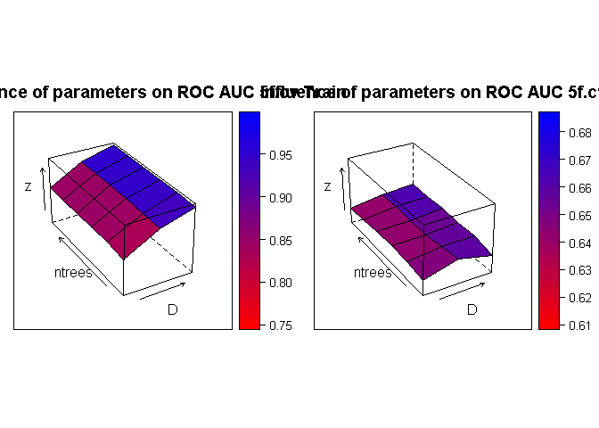
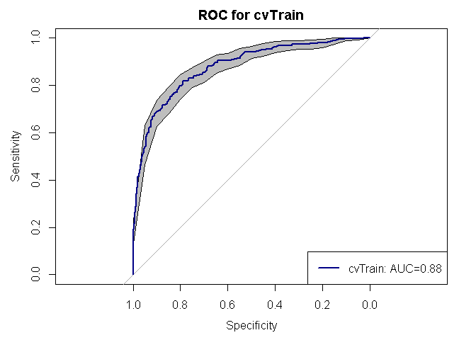
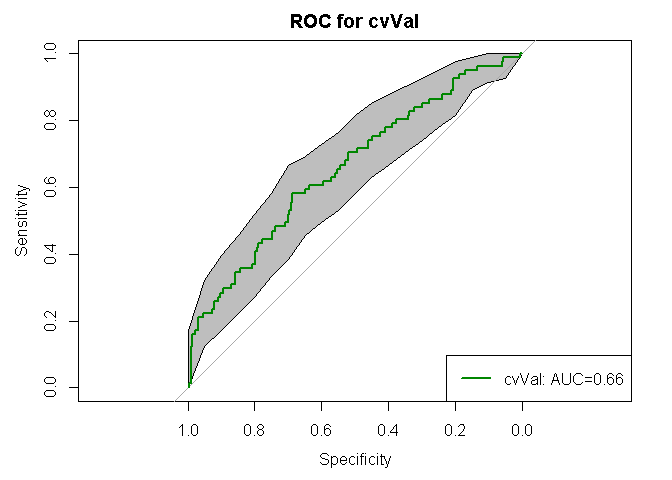
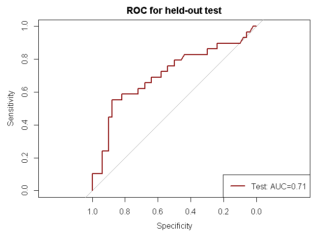
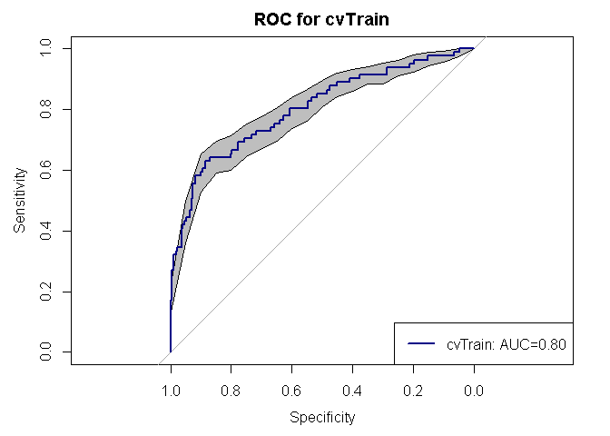
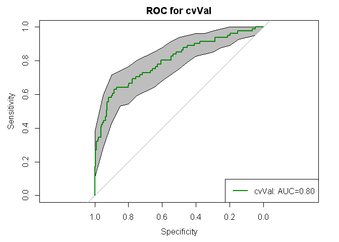
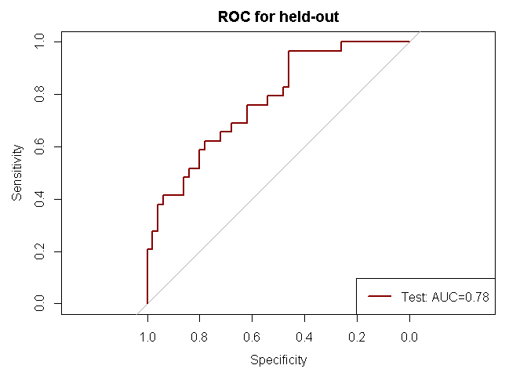

## Functions

The following functions are included to create ensembles of RF with subset_select and parameter search for "Depth" and "ntrees" and 5f-cv resampling:
* cvfold_partition
* kparti_sample
* subset_select
* rpart_looforestTrain
* rpart_looforestTest
* calcAUC_plot
* surface_forestperfm
* create_ensemble (previous non-mass ensemble creation - see main code)


## Create ensembles of RF to compare with unsupervised learning

```r
# Read CSV into R
library(pROC)
setwd("Z:/Cristina/Section3/paper_notes/comparison_traditionalCAD")
source('functionsCAD.R')
pdatalabels <- read.csv(file="input/pdatalabels.csv", header=TRUE, sep=",")
dyn_roi <- read.csv(file="input/dyn_roi_records_allNMEs_descStats.csv", header=TRUE, sep=",")
morpho_roi <- read.csv(file="input/morpho_roi_records_allNMEs_descStats.csv", header=TRUE, sep=",")
text_roi <- read.csv(file="input/text_roi_records_allNMEs_descStats.csv", header=TRUE, sep=",")
stage1_roi <- read.csv(file="input/stage1_roi_records_allNMEs_descStats.csv", header=TRUE, sep=",")

# append all with lables
allfeatures = data.frame(cbind(pdatalabels,
                               dyn_roi[2:ncol(dyn_roi)],
                               morpho_roi[2:ncol(morpho_roi)],
                               text_roi[2:ncol(text_roi)],
                               stage1_roi[2:ncol(stage1_roi)]))

# print summary labesl
summary(allfeatures$labels)
```

```
##   B   K   M 
## 267 415 110
```

```r
# remove unlabeled or 'K'
onlylab = subset(allfeatures, labels!='K')
onlylab$labels = factor(onlylab$labels)
summary(onlylab$labels)
```

```
##   B   M 
## 267 110
```

```r
## split in 90%/10% train/test 
sep = round(nrow(allfeatures)*0.10)
X_test = onlylab[1:sep,]
y_test = X_test$labels
init_indTrain = sep+1
X_train = onlylab[init_indTrain:nrow(onlylab),]
y_train = X_train$labels

###################################################
### Train a CAD classifier using traditional CAD features (only supervised features)
###################################################
## create stratified kfolds
cvK = 5
particvfoldK = cvfold_partition(X_train, cvK)

###################################################
# create grid of evaluation points
gT = c(25,100,250,500,750,1500) 
gD = c(1,3,5) 
grd <- expand.grid(D = gD, ntrees = gT)

###################################################
# initialize grid search metrics
grdperf = data.frame(grd)
grdperf$avaucTrain =0
grdperf$stdTrain =0
grdperf$avaucVal =0
grdperf$stdVal =0

for(k in 1:nrow(grd)){
  # get grid search cell
  D=grd[k,1]
  ntrees=grd[k,2]
  # Build in l
  cat("Depth: ", D, "ntrees: ", ntrees, "\n")
  cvAUC_train = c()
  cvAUC_val = c()
  for(r in 1:cvK){
    ## pick one of cvfold for held-out test, train on the rest
    kparti_setdata = kparti_sample(X_train, particvfoldK, cvK, r)
    
    # Boruta on $cvTrainsetD
    selfeatures_kfold = subset_select(kparti_setdata$cvTrainsetD)
    names(selfeatures_kfold)
    
    # train classifier in train with featset in train
    TrainsetD <-  kparti_setdata$cvTrainsetD[c(names(selfeatures_kfold))]
    ValsetD <-  kparti_setdata$cvValsetD[c(names(selfeatures_kfold))]
    
    # for grid search parameters train
    fit <- rpart_looforestTrain(ntrees, D, TrainsetD)
    # # predict and evaluate performance
    perf <- rpart_looforestTest(ntrees, TrainsetD, ValsetD, fit$forest)
    # for train
    ROC_train <- roc(perf$trainprob$obs, perf$trainprob[,1], plot=FALSE)
    ROC_val <- roc(perf$testprob$obs, perf$testprob[,1], plot=FALSE)
    print(paste0("ROC_train$auc = ",ROC_train$auc))
    print(paste0("ROC_val$auc = ",ROC_val$auc))
    # appends
    cvAUC_train = c(cvAUC_train, ROC_train$auc)
    cvAUC_val = c(cvAUC_val, ROC_val$auc)
  }
  
  # collect data
  grdperf$avaucTrain[k] = mean(cvAUC_train)
  grdperf$stdTrain[k] = sd(cvAUC_train)
  grdperf$avaucVal[k] = mean(cvAUC_val)
  grdperf$stdVal[k] = sd(cvAUC_val)
}
```

```
## Depth:  1 ntrees:  25 
## Boruta performed 99 iterations in 20.99739 secs.
##  9 attributes confirmed important: irregularity, max_F_r_i,
## mean_F_r_i, texture_diffvariance_nondir_post1,
## texture_sumentropy_nondir_post1 and 4 more.
##  175 attributes confirmed unimportant: A_countor, A_inside,
## alpha_countor, alpha_inside, beta_countor and 170 more.
##  13 tentative attributes left: earlySE15, earlySE4, earlySE6,
## SER_inside, texture_entropy_nondir_post2 and 8 more.
## [1] "ROC_train$auc = 0.745086705202312"
## [1] "ROC_val$auc = 0.711647727272727"
## Boruta performed 99 iterations in 24.72212 secs.
##  15 attributes confirmed important: dce2SE6, earlySE3,
## edge_sharp_std, max_F_r_i, texture_contrast_nondir_post1 and 10
## more.
##  162 attributes confirmed unimportant: A_countor, A_inside,
## alpha_inside, beta_countor, beta_inside and 157 more.
##  20 tentative attributes left: alpha_countor, dce3SE6, earlySE12,
## earlySE15, earlySE16 and 15 more.
## [1] "ROC_train$auc = 0.761140583554377"
## [1] "ROC_val$auc = 0.509447674418605"
## Boruta performed 99 iterations in 23.5015 secs.
##  14 attributes confirmed important: alpha_inside, circularity,
## edge_sharp_std, irregularity, max_F_r_i and 9 more.
##  158 attributes confirmed unimportant: A_countor, A_inside,
## beta_countor, beta_inside, dce2SE0 and 153 more.
##  25 tentative attributes left: alpha_countor, earlySE17, earlySE3,
## earlySE6, ivVariance and 20 more.
## [1] "ROC_train$auc = 0.775727370689655"
## [1] "ROC_val$auc = 0.529411764705882"
## Boruta performed 99 iterations in 20.95766 secs.
##  9 attributes confirmed important: irregularity, max_F_r_i,
## SER_inside, texture_entropy_nondir_post1,
## texture_sumentropy_nondir_post1 and 4 more.
##  170 attributes confirmed unimportant: A_countor, A_inside,
## beta_countor, beta_inside, dce2SE0 and 165 more.
##  18 tentative attributes left: alpha_countor, alpha_inside,
## circularity, dce2SE16, earlySE15 and 13 more.
## [1] "ROC_train$auc = 0.769364161849711"
## [1] "ROC_val$auc = 0.633522727272727"
## Boruta performed 99 iterations in 19.23133 secs.
##  11 attributes confirmed important: earlySE17, earlySE6,
## irregularity, max_F_r_i, texture_entropy_nondir_post1 and 6 more.
##  175 attributes confirmed unimportant: A_countor, A_inside,
## alpha_countor, alpha_inside, beta_countor and 170 more.
##  11 tentative attributes left: dce2SE6, earlySE12, earlySE19,
## texture_energy_nondir_post1, texture_sumentropy_nondir_post3 and 6
## more.
## [1] "ROC_train$auc = 0.748806366047745"
## [1] "ROC_val$auc = 0.681686046511628"
## Depth:  3 ntrees:  25 
## Boruta performed 99 iterations in 19.95441 secs.
##  14 attributes confirmed important: irregularity, max_F_r_i,
## mean_F_r_i, texture_diffvariance_nondir_post1,
## texture_entropy_nondir_post1 and 9 more.
##  175 attributes confirmed unimportant: A_countor, A_inside,
## alpha_countor, alpha_inside, beta_countor and 170 more.
##  8 tentative attributes left: earlySE15, earlySE6,
## texture_contrast_nondir_post1, texture_entropy_nondir_post2,
## texture_entropy_nondir_post4 and 3 more.
## [1] "ROC_train$auc = 0.863761671854157"
## [1] "ROC_val$auc = 0.782670454545455"
## Boruta performed 99 iterations in 22.13853 secs.
##  18 attributes confirmed important: dce2SE6, earlySE15, earlySE3,
## edge_sharp_std, max_F_r_i and 13 more.
##  165 attributes confirmed unimportant: A_countor, A_inside,
## alpha_inside, beta_countor, beta_inside and 160 more.
##  14 tentative attributes left: alpha_countor, earlySE12,
## earlySE16, earlySE17, earlySE6 and 9 more.
## [1] "ROC_train$auc = 0.910963748894783"
## [1] "ROC_val$auc = 0.578488372093023"
## Boruta performed 99 iterations in 20.78193 secs.
##  15 attributes confirmed important: alpha_inside, circularity,
## edge_sharp_std, irregularity, max_F_r_i and 10 more.
##  167 attributes confirmed unimportant: A_countor, A_inside,
## beta_countor, beta_inside, dce2SE0 and 162 more.
##  15 tentative attributes left: alpha_countor, earlySE17, earlySE6,
## ivVariance, mean_F_r_i and 10 more.
## [1] "ROC_train$auc = 0.921695402298851"
## [1] "ROC_val$auc = 0.624487004103967"
## Boruta performed 99 iterations in 20.77491 secs.
##  5 attributes confirmed important: irregularity, SER_inside,
## texture_sumentropy_nondir_post2, texture_sumvariance_nondir_post1,
## texture_variance_nondir_post1.
##  173 attributes confirmed unimportant: A_countor, A_inside,
## beta_countor, beta_inside, dce2SE0 and 168 more.
##  19 tentative attributes left: alpha_countor, alpha_inside,
## circularity, dce3SE18, earlySE15 and 14 more.
## [1] "ROC_train$auc = 0.894308581591819"
## [1] "ROC_val$auc = 0.674005681818182"
## Boruta performed 99 iterations in 21.24126 secs.
##  9 attributes confirmed important: earlySE15, earlySE6,
## irregularity, max_F_r_i, texture_entropy_nondir_post1 and 4 more.
##  168 attributes confirmed unimportant: A_countor, A_inside,
## alpha_countor, alpha_inside, beta_countor and 163 more.
##  20 tentative attributes left: dce2SE10, dce2SE6, earlySE10,
## earlySE17, earlySE3 and 15 more.
## [1] "ROC_train$auc = 0.888240495137047"
## [1] "ROC_val$auc = 0.752180232558139"
## Depth:  5 ntrees:  25 
## Boruta performed 99 iterations in 18.84158 secs.
##  12 attributes confirmed important: earlySE3, irregularity,
## max_F_r_i, mean_F_r_i, texture_diffvariance_nondir_post1 and 7
## more.
##  176 attributes confirmed unimportant: A_countor, A_inside,
## alpha_countor, alpha_inside, beta_countor and 171 more.
##  9 tentative attributes left: earlySE15, earlySE17, earlySE4,
## earlySE6, texture_entropy_nondir_post1 and 4 more.
## [1] "ROC_train$auc = 0.968519341929747"
## [1] "ROC_val$auc = 0.728693181818182"
## Boruta performed 99 iterations in 23.6656 secs.
##  15 attributes confirmed important: dce2SE6, earlySE3,
## edge_sharp_std, texture_contrast_nondir_post1,
## texture_diffvariance_nondir_post1 and 10 more.
##  158 attributes confirmed unimportant: A_countor, A_inside,
## alpha_inside, beta_countor, beta_inside and 153 more.
##  24 tentative attributes left: alpha_countor, dce2SE3, dce3SE12,
## dce3SE6, earlySE12 and 19 more.
## [1] "ROC_train$auc = 0.988063660477454"
## [1] "ROC_val$auc = 0.530523255813953"
## Boruta performed 99 iterations in 21.35549 secs.
##  11 attributes confirmed important: edge_sharp_std, irregularity,
## max_F_r_i, SER_inside, texture_diffvariance_nondir_post1 and 6
## more.
##  167 attributes confirmed unimportant: A_countor, A_inside,
## alpha_countor, beta_countor, beta_inside and 162 more.
##  19 tentative attributes left: alpha_inside, circularity,
## earlySE17, k_Max_Margin_Grad, mean_F_r_i and 14 more.
## [1] "ROC_train$auc = 0.972341954022989"
## [1] "ROC_val$auc = 0.59781121751026"
## Boruta performed 99 iterations in 20.77849 secs.
##  9 attributes confirmed important: earlySE16, irregularity,
## max_F_r_i, SER_inside, texture_entropy_nondir_post1 and 4 more.
##  169 attributes confirmed unimportant: A_countor, A_inside,
## beta_countor, beta_inside, dce2SE0 and 164 more.
##  19 tentative attributes left: alpha_countor, alpha_inside,
## circularity, earlySE15, earlySE19 and 14 more.
## [1] "ROC_train$auc = 0.970564695420187"
## [1] "ROC_val$auc = 0.627840909090909"
## Boruta performed 99 iterations in 21.17134 secs.
##  9 attributes confirmed important: earlySE15, earlySE6,
## irregularity, texture_entropy_nondir_post1,
## texture_sumentropy_nondir_post1 and 4 more.
##  168 attributes confirmed unimportant: A_countor, A_inside,
## alpha_countor, alpha_inside, beta_countor and 163 more.
##  20 tentative attributes left: dce2SE10, dce2SE6, earlySE16,
## earlySE17, earlySE3 and 15 more.
## [1] "ROC_train$auc = 0.973740053050398"
## [1] "ROC_val$auc = 0.662790697674419"
## Depth:  1 ntrees:  100 
## Boruta performed 99 iterations in 20.7926 secs.
##  10 attributes confirmed important: irregularity, max_F_r_i,
## mean_F_r_i, texture_diffvariance_nondir_post1,
## texture_sumentropy_nondir_post1 and 5 more.
##  174 attributes confirmed unimportant: A_countor, A_inside,
## alpha_countor, alpha_inside, beta_countor and 169 more.
##  13 tentative attributes left: earlySE15, earlySE3, earlySE4,
## earlySE6, texture_contrast_nondir_post1 and 8 more.
## [1] "ROC_train$auc = 0.763761671854157"
## [1] "ROC_val$auc = 0.732244318181818"
## Boruta performed 99 iterations in 22.7792 secs.
##  15 attributes confirmed important: dce2SE6, edge_sharp_std,
## max_F_r_i, texture_contrast_nondir_post1,
## texture_diffvariance_nondir_post1 and 10 more.
##  164 attributes confirmed unimportant: A_countor, A_inside,
## alpha_inside, beta_countor, beta_inside and 159 more.
##  18 tentative attributes left: alpha_countor, dce2SE3, dce3SE6,
## earlySE15, earlySE16 and 13 more.
## [1] "ROC_train$auc = 0.790229885057471"
## [1] "ROC_val$auc = 0.530523255813953"
## Boruta performed 99 iterations in 22.56994 secs.
##  19 attributes confirmed important: alpha_inside, circularity,
## earlySE17, earlySE3, edge_sharp_std and 14 more.
##  159 attributes confirmed unimportant: A_countor, A_inside,
## beta_countor, beta_inside, dce2SE0 and 154 more.
##  19 tentative attributes left: alpha_countor, earlySE15, earlySE6,
## k_Max_Margin_Grad, Slope_ini_inside and 14 more.
## [1] "ROC_train$auc = 0.788972701149425"
## [1] "ROC_val$auc = 0.569083447332421"
## Boruta performed 99 iterations in 21.14375 secs.
##  7 attributes confirmed important: alpha_inside, earlySE16,
## irregularity, texture_sumentropy_nondir_post2,
## texture_sumvariance_nondir_post1 and 2 more.
##  171 attributes confirmed unimportant: A_countor, A_inside,
## beta_countor, beta_inside, circularity and 166 more.
##  19 tentative attributes left: alpha_countor, dce2SE16, earlySE3,
## earlySE6, lateSE18 and 14 more.
## [1] "ROC_train$auc = 0.778612716763006"
## [1] "ROC_val$auc = 0.640625"
## Boruta performed 99 iterations in 21.09924 secs.
##  8 attributes confirmed important: earlySE6, irregularity,
## texture_entropy_nondir_post1, texture_sumentropy_nondir_post1,
## texture_sumentropy_nondir_post2 and 3 more.
##  167 attributes confirmed unimportant: A_countor, A_inside,
## alpha_countor, alpha_inside, beta_countor and 162 more.
##  22 tentative attributes left: earlySE10, earlySE15, earlySE17,
## earlySE3, k_Max_Margin_Grad and 17 more.
## [1] "ROC_train$auc = 0.748054818744474"
## [1] "ROC_val$auc = 0.682412790697674"
## Depth:  3 ntrees:  100 
## Boruta performed 99 iterations in 19.4739 secs.
##  15 attributes confirmed important: earlySE6, irregularity,
## max_F_r_i, mean_F_r_i, texture_diffentropy_nondir_post1 and 10
## more.
##  174 attributes confirmed unimportant: A_countor, A_inside,
## alpha_countor, alpha_inside, beta_countor and 169 more.
##  8 tentative attributes left: earlySE12, earlySE15, earlySE17,
## earlySE3, earlySE4 and 3 more.
## [1] "ROC_train$auc = 0.891863050244553"
## [1] "ROC_val$auc = 0.715909090909091"
## Boruta performed 99 iterations in 23.008 secs.
##  15 attributes confirmed important: earlySE3, edge_sharp_std,
## irregularity, max_F_r_i, texture_contrast_nondir_post1 and 10
## more.
##  162 attributes confirmed unimportant: A_countor, A_inside,
## alpha_inside, beta_countor, beta_inside and 157 more.
##  20 tentative attributes left: alpha_countor, dce2SE6, dce3SE6,
## earlySE14, earlySE17 and 15 more.
## [1] "ROC_train$auc = 0.916445623342175"
## [1] "ROC_val$auc = 0.561046511627907"
## Boruta performed 99 iterations in 22.54604 secs.
##  15 attributes confirmed important: alpha_inside, circularity,
## earlySE3, edge_sharp_std, irregularity and 10 more.
##  164 attributes confirmed unimportant: A_countor, A_inside,
## beta_countor, beta_inside, dce2SE0 and 159 more.
##  18 tentative attributes left: alpha_countor, earlySE17, earlySE6,
## mean_F_r_i, Slope_ini_inside and 13 more.
## [1] "ROC_train$auc = 0.918372844827586"
## [1] "ROC_val$auc = 0.615595075239398"
## Boruta performed 99 iterations in 21.25882 secs.
##  5 attributes confirmed important: irregularity,
## texture_sumentropy_nondir_post2, texture_sumvariance_nondir_post1,
## texture_sumvariance_nondir_post2, texture_variance_nondir_post1.
##  174 attributes confirmed unimportant: A_countor, A_inside,
## beta_countor, beta_inside, dce2SE0 and 169 more.
##  18 tentative attributes left: alpha_countor, alpha_inside,
## circularity, earlySE15, earlySE16 and 13 more.
## [1] "ROC_train$auc = 0.893374833259226"
## [1] "ROC_val$auc = 0.660511363636364"
## Boruta performed 99 iterations in 22.0545 secs.
##  10 attributes confirmed important: earlySE15, earlySE17,
## earlySE6, irregularity, texture_entropy_nondir_post1 and 5 more.
##  166 attributes confirmed unimportant: A_countor, A_inside,
## alpha_countor, alpha_inside, beta_countor and 161 more.
##  21 tentative attributes left: dce2SE10, dce2SE6, dce3SE10,
## earlySE10, earlySE16 and 16 more.
## [1] "ROC_train$auc = 0.888063660477454"
## [1] "ROC_val$auc = 0.75"
## Depth:  5 ntrees:  100 
## Boruta performed 99 iterations in 20.7313 secs.
##  9 attributes confirmed important: irregularity, max_F_r_i,
## mean_F_r_i, texture_diffvariance_nondir_post1,
## texture_sumentropy_nondir_post1 and 4 more.
##  173 attributes confirmed unimportant: A_countor, A_inside,
## alpha_countor, alpha_inside, beta_countor and 168 more.
##  15 tentative attributes left: earlySE15, earlySE17, earlySE3,
## earlySE6, SER_inside and 10 more.
## [1] "ROC_train$auc = 0.978923966207203"
## [1] "ROC_val$auc = 0.725852272727273"
## Boruta performed 99 iterations in 21.48443 secs.
##  16 attributes confirmed important: dce2SE6, earlySE17, earlySE6,
## edge_sharp_std, texture_contrast_nondir_post1 and 11 more.
##  166 attributes confirmed unimportant: A_countor, A_inside,
## alpha_inside, beta_countor, beta_inside and 161 more.
##  15 tentative attributes left: alpha_countor, earlySE12,
## earlySE15, earlySE16, earlySE3 and 10 more.
## [1] "ROC_train$auc = 0.98841732979664"
## [1] "ROC_val$auc = 0.582848837209302"
## Boruta performed 99 iterations in 21.77468 secs.
##  16 attributes confirmed important: alpha_inside, circularity,
## earlySE3, edge_sharp_std, irregularity and 11 more.
##  162 attributes confirmed unimportant: A_countor, A_inside,
## alpha_countor, beta_countor, beta_inside and 157 more.
##  19 tentative attributes left: earlySE15, earlySE17, earlySE6,
## mean_F_r_i, texture_energy_nondir_post2 and 14 more.
## [1] "ROC_train$auc = 0.987877155172414"
## [1] "ROC_val$auc = 0.601915184678523"
## Boruta performed 99 iterations in 19.41693 secs.
##  8 attributes confirmed important: alpha_inside, earlySE16,
## irregularity, SER_inside, texture_sumentropy_nondir_post2 and 3
## more.
##  176 attributes confirmed unimportant: A_countor, A_inside,
## beta_countor, beta_inside, dce2SE0 and 171 more.
##  13 tentative attributes left: alpha_countor, circularity,
## earlySE15, earlySE17, earlySE3 and 8 more.
## [1] "ROC_train$auc = 0.973766118274789"
## [1] "ROC_val$auc = 0.6875"
## Boruta performed 99 iterations in 21.78992 secs.
##  11 attributes confirmed important: earlySE15, earlySE6,
## irregularity, max_F_r_i, texture_entropy_nondir_post1 and 6 more.
##  170 attributes confirmed unimportant: A_countor, A_inside,
## alpha_inside, beta_countor, beta_inside and 165 more.
##  16 tentative attributes left: alpha_countor, earlySE16, earlySE3,
## SER_inside, texture_energy_nondir_post1 and 11 more.
## [1] "ROC_train$auc = 0.983731211317418"
## [1] "ROC_val$auc = 0.725290697674419"
## Depth:  1 ntrees:  250 
## Boruta performed 99 iterations in 19.79186 secs.
##  14 attributes confirmed important: earlySE3, irregularity,
## max_F_r_i, mean_F_r_i, texture_diffvariance_nondir_post1 and 9
## more.
##  174 attributes confirmed unimportant: A_countor, A_inside,
## alpha_countor, alpha_inside, beta_countor and 169 more.
##  9 tentative attributes left: earlySE15, earlySE17, earlySE6,
## SER_inside, texture_contrast_nondir_post1 and 4 more.
## [1] "ROC_train$auc = 0.767140951534015"
## [1] "ROC_val$auc = 0.723011363636364"
## Boruta performed 99 iterations in 21.76328 secs.
##  14 attributes confirmed important: edge_sharp_std, irregularity,
## texture_contrast_nondir_post1, texture_diffentropy_nondir_post1,
## texture_diffvariance_nondir_post1 and 9 more.
##  164 attributes confirmed unimportant: A_countor, A_inside,
## alpha_inside, beta_countor, beta_inside and 159 more.
##  19 tentative attributes left: alpha_countor, dce2SE3, dce2SE6,
## dce3SE6, earlySE12 and 14 more.
## [1] "ROC_train$auc = 0.803271441202476"
## [1] "ROC_val$auc = 0.495639534883721"
## Boruta performed 99 iterations in 22.61952 secs.
##  14 attributes confirmed important: alpha_inside, circularity,
## edge_sharp_std, irregularity, max_F_r_i and 9 more.
##  160 attributes confirmed unimportant: A_countor, A_inside,
## beta_countor, beta_inside, dce2SE0 and 155 more.
##  23 tentative attributes left: alpha_countor, earlySE17, earlySE3,
## earlySE6, mean_F_r_i and 18 more.
## [1] "ROC_train$auc = 0.787805316091954"
## [1] "ROC_val$auc = 0.599179206566347"
## Boruta performed 99 iterations in 20.08956 secs.
##  6 attributes confirmed important: alpha_inside, earlySE16,
## irregularity, texture_sumvariance_nondir_post1,
## texture_sumvariance_nondir_post2 and 1 more.
##  172 attributes confirmed unimportant: A_countor, A_inside,
## beta_countor, beta_inside, dce2SE0 and 167 more.
##  19 tentative attributes left: alpha_countor, circularity,
## earlySE15, earlySE3, lateSE18 and 14 more.
## [1] "ROC_train$auc = 0.768252556691863"
## [1] "ROC_val$auc = 0.652698863636364"
## Boruta performed 99 iterations in 20.87544 secs.
##  13 attributes confirmed important: earlySE15, earlySE17,
## earlySE3, earlySE6, irregularity and 8 more.
##  169 attributes confirmed unimportant: A_countor, A_inside,
## alpha_countor, alpha_inside, beta_countor and 164 more.
##  15 tentative attributes left: dce2SE6, dce3SE10, dce3SE6,
## lateSE15, texture_energy_nondir_post1 and 10 more.
## [1] "ROC_train$auc = 0.753757736516357"
## [1] "ROC_val$auc = 0.732558139534884"
## Depth:  3 ntrees:  250 
## Boruta performed 99 iterations in 19.59394 secs.
##  7 attributes confirmed important: irregularity, max_F_r_i,
## mean_F_r_i, texture_sumentropy_nondir_post1,
## texture_sumentropy_nondir_post2 and 2 more.
##  175 attributes confirmed unimportant: A_countor, A_inside,
## alpha_countor, alpha_inside, beta_countor and 170 more.
##  15 tentative attributes left: earlySE12, earlySE15, earlySE17,
## earlySE3, earlySE6 and 10 more.
## [1] "ROC_train$auc = 0.902445531347265"
## [1] "ROC_val$auc = 0.714488636363636"
## Boruta performed 99 iterations in 24.38481 secs.
##  17 attributes confirmed important: dce2SE6, earlySE15, earlySE17,
## earlySE3, edge_sharp_std and 12 more.
##  154 attributes confirmed unimportant: A_countor, A_inside,
## alpha_inside, beta_countor, beta_inside and 149 more.
##  26 tentative attributes left: alpha_countor, dce2SE15, dce2SE3,
## dce3SE3, dce3SE6 and 21 more.
## [1] "ROC_train$auc = 0.926083112290009"
## [1] "ROC_val$auc = 0.520348837209302"
## Boruta performed 99 iterations in 21.6037 secs.
##  14 attributes confirmed important: alpha_inside, circularity,
## edge_sharp_std, irregularity, max_F_r_i and 9 more.
##  164 attributes confirmed unimportant: A_countor, A_inside,
## beta_countor, beta_inside, dce2SE0 and 159 more.
##  19 tentative attributes left: alpha_countor, earlySE17, earlySE3,
## mean_F_r_i, Slope_ini_inside and 14 more.
## [1] "ROC_train$auc = 0.9296875"
## [1] "ROC_val$auc = 0.599179206566347"
## Boruta performed 99 iterations in 20.85522 secs.
##  8 attributes confirmed important: alpha_inside, earlySE16,
## irregularity, SER_inside, texture_sumvariance_nondir_post1 and 3
## more.
##  170 attributes confirmed unimportant: A_countor, A_inside,
## beta_countor, beta_inside, circularity and 165 more.
##  19 tentative attributes left: alpha_countor, dce2SE16, earlySE15,
## earlySE17, earlySE3 and 14 more.
## [1] "ROC_train$auc = 0.915251222765674"
## [1] "ROC_val$auc = 0.639204545454545"
## Boruta performed 99 iterations in 19.29509 secs.
##  9 attributes confirmed important: earlySE6, irregularity,
## max_F_r_i, texture_entropy_nondir_post1,
## texture_sumentropy_nondir_post1 and 4 more.
##  173 attributes confirmed unimportant: A_countor, A_inside,
## alpha_countor, alpha_inside, beta_countor and 168 more.
##  15 tentative attributes left: earlySE15, earlySE16, earlySE17,
## earlySE3, k_Max_Margin_Grad and 10 more.
## [1] "ROC_train$auc = 0.903890362511052"
## [1] "ROC_val$auc = 0.734011627906977"
## Depth:  5 ntrees:  250 
## Boruta performed 99 iterations in 17.37351 secs.
##  7 attributes confirmed important: irregularity, max_F_r_i,
## mean_F_r_i, texture_sumentropy_nondir_post1,
## texture_sumentropy_nondir_post2 and 2 more.
##  181 attributes confirmed unimportant: A_countor, A_inside,
## alpha_countor, alpha_inside, beta_countor and 176 more.
##  9 tentative attributes left: earlySE15, earlySE6,
## texture_energy_nondir_post1, texture_sumentropy_nondir_post4,
## texture_sumvariance_nondir_post2 and 4 more.
## [1] "ROC_train$auc = 0.975277901289462"
## [1] "ROC_val$auc = 0.725852272727273"
## Boruta performed 99 iterations in 25.80742 secs.
##  14 attributes confirmed important: earlySE3, edge_sharp_std,
## texture_contrast_nondir_post1, texture_diffentropy_nondir_post1,
## texture_diffvariance_nondir_post1 and 9 more.
##  165 attributes confirmed unimportant: A_countor, A_inside,
## alpha_inside, beta_countor, beta_inside and 160 more.
##  18 tentative attributes left: alpha_countor, dce2SE6, earlySE12,
## earlySE15, earlySE16 and 13 more.
## [1] "ROC_train$auc = 0.985587975243148"
## [1] "ROC_val$auc = 0.546511627906977"
## Boruta performed 99 iterations in 26.51829 secs.
##  13 attributes confirmed important: circularity, edge_sharp_std,
## irregularity, max_F_r_i, SER_inside and 8 more.
##  164 attributes confirmed unimportant: A_countor, A_inside,
## beta_countor, beta_inside, dce2SE0 and 159 more.
##  20 tentative attributes left: alpha_countor, alpha_inside,
## earlySE17, earlySE3, k_Max_Margin_Grad and 15 more.
## [1] "ROC_train$auc = 0.986889367816092"
## [1] "ROC_val$auc = 0.619699042407661"
## Boruta performed 99 iterations in 24.62299 secs.
##  4 attributes confirmed important: irregularity,
## texture_sumvariance_nondir_post1,
## texture_sumvariance_nondir_post2, texture_variance_nondir_post1.
##  166 attributes confirmed unimportant: A_countor, A_inside,
## beta_countor, beta_inside, dce2SE0 and 161 more.
##  27 tentative attributes left: alpha_countor, alpha_inside,
## circularity, dce2SE16, earlySE15 and 22 more.
## [1] "ROC_train$auc = 0.981858603823922"
## [1] "ROC_val$auc = 0.657670454545455"
## Boruta performed 99 iterations in 20.48654 secs.
##  10 attributes confirmed important: earlySE15, earlySE17,
## earlySE6, irregularity, texture_entropy_nondir_post1 and 5 more.
##  173 attributes confirmed unimportant: A_countor, A_inside,
## alpha_countor, alpha_inside, beta_countor and 168 more.
##  14 tentative attributes left: dce2SE6, max_F_r_i, mean_F_r_i,
## texture_energy_nondir_post4, texture_entropy_nondir_post4 and 9
## more.
## [1] "ROC_train$auc = 0.97869142351901"
## [1] "ROC_val$auc = 0.75"
## Depth:  1 ntrees:  500 
## Boruta performed 99 iterations in 19.19421 secs.
##  10 attributes confirmed important: earlySE3, irregularity,
## max_F_r_i, texture_diffvariance_nondir_post1,
## texture_sumentropy_nondir_post1 and 5 more.
##  175 attributes confirmed unimportant: A_countor, A_inside,
## alpha_countor, alpha_inside, beta_countor and 170 more.
##  12 tentative attributes left: dce2SE6, earlySE15, earlySE17,
## mean_F_r_i, SER_inside and 7 more.
## [1] "ROC_train$auc = 0.766251667407737"
## [1] "ROC_val$auc = 0.6875"
## Boruta performed 99 iterations in 21.53047 secs.
##  15 attributes confirmed important: dce2SE6, earlySE6,
## edge_sharp_std, texture_contrast_nondir_post1,
## texture_diffvariance_nondir_post1 and 10 more.
##  166 attributes confirmed unimportant: A_countor, A_inside,
## alpha_inside, beta_countor, beta_inside and 161 more.
##  16 tentative attributes left: alpha_countor, dce2SE16, dce3SE6,
## earlySE15, earlySE16 and 11 more.
## [1] "ROC_train$auc = 0.801414677276746"
## [1] "ROC_val$auc = 0.521075581395349"
## Boruta performed 99 iterations in 19.82861 secs.
##  14 attributes confirmed important: alpha_inside, circularity,
## edge_sharp_std, irregularity, max_F_r_i and 9 more.
##  169 attributes confirmed unimportant: A_countor, A_inside,
## beta_countor, beta_inside, dce2SE0 and 164 more.
##  14 tentative attributes left: alpha_countor, earlySE17, earlySE3,
## mean_F_r_i, texture_entropy_nondir_post2 and 9 more.
## [1] "ROC_train$auc = 0.785650143678161"
## [1] "ROC_val$auc = 0.584815321477428"
## Boruta performed 99 iterations in 19.39641 secs.
##  5 attributes confirmed important: irregularity, SER_inside,
## texture_sumentropy_nondir_post2, texture_sumvariance_nondir_post1,
## texture_variance_nondir_post1.
##  176 attributes confirmed unimportant: A_countor, A_inside,
## beta_countor, beta_inside, circularity and 171 more.
##  16 tentative attributes left: alpha_countor, alpha_inside,
## dce2SE16, earlySE16, lateSE18 and 11 more.
## [1] "ROC_train$auc = 0.771587372165407"
## [1] "ROC_val$auc = 0.667613636363636"
## Boruta performed 99 iterations in 19.80172 secs.
##  11 attributes confirmed important: earlySE15, earlySE6,
## irregularity, max_F_r_i, texture_entropy_nondir_post1 and 6 more.
##  174 attributes confirmed unimportant: A_countor, A_inside,
## alpha_countor, alpha_inside, beta_countor and 169 more.
##  12 tentative attributes left: earlySE16, earlySE3, earlySE8,
## k_Max_Margin_Grad, mean_F_r_i and 7 more.
## [1] "ROC_train$auc = 0.754332449160035"
## [1] "ROC_val$auc = 0.725290697674419"
## Depth:  3 ntrees:  500 
## Boruta performed 99 iterations in 19.09688 secs.
##  8 attributes confirmed important: irregularity, max_F_r_i,
## mean_F_r_i, texture_diffvariance_nondir_post1,
## texture_sumentropy_nondir_post1 and 3 more.
##  177 attributes confirmed unimportant: A_countor, A_inside,
## alpha_countor, alpha_inside, beta_countor and 172 more.
##  12 tentative attributes left: earlySE15, earlySE17, earlySE3,
## texture_entropy_nondir_post1, texture_entropy_nondir_post2 and 7
## more.
## [1] "ROC_train$auc = 0.905291240551356"
## [1] "ROC_val$auc = 0.708806818181818"
## Boruta performed 99 iterations in 22.58621 secs.
##  17 attributes confirmed important: dce2SE6, earlySE3,
## edge_sharp_std, max_F_r_i, texture_contrast_nondir_post1 and 12
## more.
##  164 attributes confirmed unimportant: A_countor, A_inside,
## alpha_inside, beta_countor, beta_inside and 159 more.
##  16 tentative attributes left: alpha_countor, dce3SE6, earlySE15,
## earlySE16, earlySE17 and 11 more.
## [1] "ROC_train$auc = 0.920512820512821"
## [1] "ROC_val$auc = 0.545058139534884"
## Boruta performed 99 iterations in 22.34863 secs.
##  14 attributes confirmed important: alpha_inside, circularity,
## edge_sharp_std, irregularity, max_F_r_i and 9 more.
##  161 attributes confirmed unimportant: A_countor, A_inside,
## alpha_countor, beta_countor, beta_inside and 156 more.
##  22 tentative attributes left: earlySE17, earlySE3, earlySE6,
## k_Max_Margin_Grad, mean_F_r_i and 17 more.
## [1] "ROC_train$auc = 0.927173132183908"
## [1] "ROC_val$auc = 0.59781121751026"
## Boruta performed 99 iterations in 21.12673 secs.
##  8 attributes confirmed important: alpha_inside, earlySE16,
## irregularity, SER_inside, texture_sumentropy_nondir_post2 and 3
## more.
##  170 attributes confirmed unimportant: A_countor, A_inside,
## beta_countor, beta_inside, dce2SE0 and 165 more.
##  19 tentative attributes left: alpha_countor, circularity,
## earlySE15, earlySE3, lateSE18 and 14 more.
## [1] "ROC_train$auc = 0.912761227212094"
## [1] "ROC_val$auc = 0.660511363636364"
## Boruta performed 99 iterations in 20.77638 secs.
##  9 attributes confirmed important: earlySE15, earlySE6,
## irregularity, texture_entropy_nondir_post1,
## texture_sumentropy_nondir_post1 and 4 more.
##  170 attributes confirmed unimportant: A_countor, A_inside,
## alpha_inside, beta_countor, beta_inside and 165 more.
##  18 tentative attributes left: alpha_countor, dce2SE6, earlySE10,
## earlySE3, max_F_r_i and 13 more.
## [1] "ROC_train$auc = 0.899911582670203"
## [1] "ROC_val$auc = 0.725290697674419"
## Depth:  5 ntrees:  500 
## Boruta performed 99 iterations in 20.82467 secs.
##  9 attributes confirmed important: irregularity, max_F_r_i,
## mean_F_r_i, texture_diffvariance_nondir_post1,
## texture_sumentropy_nondir_post1 and 4 more.
##  170 attributes confirmed unimportant: A_countor, A_inside,
## alpha_countor, alpha_inside, beta_countor and 165 more.
##  18 tentative attributes left: earlySE15, earlySE17, earlySE3,
## earlySE4, earlySE6 and 13 more.
## [1] "ROC_train$auc = 0.979190751445087"
## [1] "ROC_val$auc = 0.772727272727273"
## Boruta performed 99 iterations in 23.10681 secs.
##  15 attributes confirmed important: dce2SE6, earlySE6,
## edge_sharp_std, texture_contrast_nondir_post1,
## texture_diffvariance_nondir_post1 and 10 more.
##  164 attributes confirmed unimportant: A_countor, A_inside,
## alpha_inside, beta_countor, beta_inside and 159 more.
##  18 tentative attributes left: alpha_countor, dce2SE3, dce3SE6,
## earlySE15, earlySE16 and 13 more.
## [1] "ROC_train$auc = 0.981078691423519"
## [1] "ROC_val$auc = 0.550872093023256"
## Boruta performed 99 iterations in 21.24219 secs.
##  16 attributes confirmed important: alpha_inside, circularity,
## earlySE3, edge_sharp_std, irregularity and 11 more.
##  166 attributes confirmed unimportant: A_countor, A_inside,
## beta_countor, beta_inside, dce2SE0 and 161 more.
##  15 tentative attributes left: alpha_countor, earlySE17, earlySE6,
## mean_F_r_i, Slope_ini_inside and 10 more.
## [1] "ROC_train$auc = 0.986979166666667"
## [1] "ROC_val$auc = 0.614227086183311"
## Boruta performed 99 iterations in 19.88604 secs.
##  9 attributes confirmed important: irregularity, max_F_r_i,
## SER_inside, texture_entropy_nondir_post1,
## texture_sumentropy_nondir_post2 and 4 more.
##  174 attributes confirmed unimportant: A_countor, A_inside,
## beta_countor, beta_inside, circularity and 169 more.
##  14 tentative attributes left: alpha_countor, alpha_inside,
## dce2SE16, earlySE16, earlySE3 and 9 more.
## [1] "ROC_train$auc = 0.979991107158737"
## [1] "ROC_val$auc = 0.688920454545455"
## Boruta performed 99 iterations in 20.70352 secs.
##  14 attributes confirmed important: earlySE15, earlySE17,
## earlySE3, earlySE6, irregularity and 9 more.
##  172 attributes confirmed unimportant: A_countor, A_inside,
## alpha_countor, alpha_inside, beta_countor and 167 more.
##  11 tentative attributes left: dce2SE6, earlySE16, earlySE8,
## texture_energy_nondir_post1, texture_entropy_nondir_post3 and 6
## more.
## [1] "ROC_train$auc = 0.985499557913351"
## [1] "ROC_val$auc = 0.723837209302326"
## Depth:  1 ntrees:  750 
## Boruta performed 99 iterations in 19.84188 secs.
##  12 attributes confirmed important: irregularity, max_F_r_i,
## texture_diffvariance_nondir_post1, texture_entropy_nondir_post1,
## texture_sumentropy_nondir_post1 and 7 more.
##  176 attributes confirmed unimportant: A_countor, A_inside,
## alpha_countor, alpha_inside, beta_countor and 171 more.
##  9 tentative attributes left: earlySE15, earlySE17, earlySE4,
## earlySE6, mean_F_r_i and 4 more.
## [1] "ROC_train$auc = 0.760204535349044"
## [1] "ROC_val$auc = 0.682528409090909"
## Boruta performed 99 iterations in 20.99703 secs.
##  14 attributes confirmed important: earlySE3, edge_sharp_std,
## max_F_r_i, texture_contrast_nondir_post1,
## texture_diffvariance_nondir_post1 and 9 more.
##  168 attributes confirmed unimportant: A_countor, A_inside,
## alpha_inside, beta_countor, beta_inside and 163 more.
##  15 tentative attributes left: alpha_countor, dce2SE6, dce3SE6,
## earlySE12, earlySE15 and 10 more.
## [1] "ROC_train$auc = 0.798187444739169"
## [1] "ROC_val$auc = 0.501453488372093"
## Boruta performed 99 iterations in 21.5235 secs.
##  13 attributes confirmed important: circularity, edge_sharp_std,
## irregularity, max_F_r_i, SER_inside and 8 more.
##  163 attributes confirmed unimportant: A_countor, A_inside,
## beta_countor, beta_inside, dce2SE0 and 158 more.
##  21 tentative attributes left: alpha_countor, alpha_inside,
## earlySE3, ivVariance, k_Max_Margin_Grad and 16 more.
## [1] "ROC_train$auc = 0.791352370689655"
## [1] "ROC_val$auc = 0.59781121751026"
## Boruta performed 99 iterations in 20.93855 secs.
##  6 attributes confirmed important: irregularity, SER_inside,
## texture_sumentropy_nondir_post2, texture_sumvariance_nondir_post1,
## texture_sumvariance_nondir_post2 and 1 more.
##  170 attributes confirmed unimportant: A_countor, A_inside,
## alpha_countor, beta_countor, beta_inside and 165 more.
##  21 tentative attributes left: alpha_inside, circularity,
## dce2SE16, dce3SE18, earlySE16 and 16 more.
## [1] "ROC_train$auc = 0.780391285015562"
## [1] "ROC_val$auc = 0.663352272727273"
## Boruta performed 99 iterations in 21.90062 secs.
##  11 attributes confirmed important: earlySE15, earlySE17,
## earlySE6, irregularity, max_F_r_i and 6 more.
##  167 attributes confirmed unimportant: A_countor, A_inside,
## alpha_inside, beta_countor, beta_inside and 162 more.
##  19 tentative attributes left: alpha_countor, dce2SE6, earlySE16,
## earlySE3, earlySE7 and 14 more.
## [1] "ROC_train$auc = 0.751547303271441"
## [1] "ROC_val$auc = 0.699127906976744"
## Depth:  3 ntrees:  750 
## Boruta performed 99 iterations in 21.04841 secs.
##  12 attributes confirmed important: earlySE6, irregularity,
## max_F_r_i, mean_F_r_i, texture_diffvariance_nondir_post1 and 7
## more.
##  171 attributes confirmed unimportant: A_countor, A_inside,
## alpha_countor, beta_countor, beta_inside and 166 more.
##  14 tentative attributes left: alpha_inside, earlySE15, earlySE17,
## earlySE4, k_Max_Margin_Grad and 9 more.
## [1] "ROC_train$auc = 0.907692307692308"
## [1] "ROC_val$auc = 0.771306818181818"
## Boruta performed 99 iterations in 22.96764 secs.
##  14 attributes confirmed important: dce2SE6, edge_sharp_std,
## max_F_r_i, texture_contrast_nondir_post1,
## texture_diffvariance_nondir_post1 and 9 more.
##  161 attributes confirmed unimportant: A_countor, A_inside,
## alpha_inside, beta_countor, beta_inside and 156 more.
##  22 tentative attributes left: alpha_countor, dce2SE15, dce2SE3,
## dce3SE6, earlySE12 and 17 more.
## [1] "ROC_train$auc = 0.918302387267904"
## [1] "ROC_val$auc = 0.529069767441861"
## Boruta performed 99 iterations in 22.88841 secs.
##  14 attributes confirmed important: alpha_inside, circularity,
## edge_sharp_std, irregularity, max_F_r_i and 9 more.
##  160 attributes confirmed unimportant: A_countor, A_inside,
## beta_countor, beta_inside, dce2SE0 and 155 more.
##  23 tentative attributes left: alpha_countor, earlySE17,
## ivVariance, mean_F_r_i, Slope_ini_inside and 18 more.
## [1] "ROC_train$auc = 0.93139367816092"
## [1] "ROC_val$auc = 0.589603283173735"
## Boruta performed 99 iterations in 20.99337 secs.
##  6 attributes confirmed important: irregularity, SER_inside,
## texture_sumentropy_nondir_post2, texture_sumvariance_nondir_post1,
## texture_sumvariance_nondir_post2 and 1 more.
##  172 attributes confirmed unimportant: A_countor, A_inside,
## beta_countor, beta_inside, dce2SE0 and 167 more.
##  19 tentative attributes left: alpha_countor, alpha_inside,
## circularity, dce2SE16, earlySE16 and 14 more.
## [1] "ROC_train$auc = 0.911249444197421"
## [1] "ROC_val$auc = 0.681818181818182"
## Boruta performed 99 iterations in 21.3935 secs.
##  11 attributes confirmed important: earlySE15, earlySE6,
## irregularity, max_F_r_i, texture_entropy_nondir_post1 and 6 more.
##  169 attributes confirmed unimportant: A_countor, A_inside,
## alpha_countor, alpha_inside, beta_countor and 164 more.
##  17 tentative attributes left: dce2SE6, earlySE16, earlySE3,
## k_Max_Margin_Grad, mean_F_r_i and 12 more.
## [1] "ROC_train$auc = 0.907073386383731"
## [1] "ROC_val$auc = 0.73546511627907"
## Depth:  5 ntrees:  750 
## Boruta performed 99 iterations in 20.10753 secs.
##  12 attributes confirmed important: irregularity, max_F_r_i,
## mean_F_r_i, texture_diffvariance_nondir_post1,
## texture_entropy_nondir_post1 and 7 more.
##  173 attributes confirmed unimportant: A_countor, A_inside,
## alpha_countor, alpha_inside, beta_countor and 168 more.
##  12 tentative attributes left: dce2SE6, earlySE15, earlySE17,
## earlySE3, earlySE4 and 7 more.
## [1] "ROC_train$auc = 0.978479324144064"
## [1] "ROC_val$auc = 0.755681818181818"
## Boruta performed 99 iterations in 20.84334 secs.
##  19 attributes confirmed important: dce2SE6, earlySE15, earlySE3,
## edge_sharp_std, irregularity and 14 more.
##  168 attributes confirmed unimportant: A_countor, A_inside,
## alpha_inside, beta_countor, beta_inside and 163 more.
##  10 tentative attributes left: alpha_countor, dce3SE6, earlySE16,
## earlySE6, texture_energy_nondir_post1 and 5 more.
## [1] "ROC_train$auc = 0.983731211317418"
## [1] "ROC_val$auc = 0.540697674418605"
## Boruta performed 99 iterations in 22.99594 secs.
##  13 attributes confirmed important: alpha_inside, edge_sharp_std,
## irregularity, max_F_r_i, SER_inside and 8 more.
##  160 attributes confirmed unimportant: A_countor, A_inside,
## beta_countor, beta_inside, dce2SE0 and 155 more.
##  24 tentative attributes left: alpha_countor, circularity,
## earlySE17, earlySE3, earlySE6 and 19 more.
## [1] "ROC_train$auc = 0.989313936781609"
## [1] "ROC_val$auc = 0.614227086183311"
## Boruta performed 99 iterations in 20.0845 secs.
##  7 attributes confirmed important: earlySE16, irregularity,
## SER_inside, texture_sumentropy_nondir_post2,
## texture_sumvariance_nondir_post1 and 2 more.
##  173 attributes confirmed unimportant: A_countor, A_inside,
## beta_countor, beta_inside, dce2SE0 and 168 more.
##  17 tentative attributes left: alpha_countor, alpha_inside,
## circularity, dce2SE16, earlySE17 and 12 more.
## [1] "ROC_train$auc = 0.980791462872388"
## [1] "ROC_val$auc = 0.684659090909091"
## Boruta performed 99 iterations in 20.85898 secs.
##  9 attributes confirmed important: earlySE3, earlySE6,
## irregularity, max_F_r_i, texture_entropy_nondir_post1 and 4 more.
##  169 attributes confirmed unimportant: A_countor, A_inside,
## alpha_inside, beta_countor, beta_inside and 164 more.
##  19 tentative attributes left: alpha_countor, dce2SE6, earlySE15,
## earlySE17, k_Max_Margin_Grad and 14 more.
## [1] "ROC_train$auc = 0.983908045977011"
## [1] "ROC_val$auc = 0.748546511627907"
## Depth:  1 ntrees:  1500 
## Boruta performed 99 iterations in 19.63887 secs.
##  10 attributes confirmed important: irregularity, max_F_r_i,
## mean_F_r_i, texture_diffvariance_nondir_post1,
## texture_sumentropy_nondir_post1 and 5 more.
##  175 attributes confirmed unimportant: A_countor, A_inside,
## alpha_countor, alpha_inside, beta_countor and 170 more.
##  12 tentative attributes left: earlySE12, earlySE15, earlySE17,
## earlySE6, texture_entropy_nondir_post1 and 7 more.
## [1] "ROC_train$auc = 0.769097376611828"
## [1] "ROC_val$auc = 0.683238636363636"
## Boruta performed 99 iterations in 21.5389 secs.
##  14 attributes confirmed important: dce2SE6, earlySE3,
## edge_sharp_std, texture_contrast_nondir_post1,
## texture_diffvariance_nondir_post1 and 9 more.
##  165 attributes confirmed unimportant: A_countor, A_inside,
## alpha_inside, beta_countor, beta_inside and 160 more.
##  18 tentative attributes left: alpha_countor, dce2SE16, dce3SE6,
## earlySE15, earlySE6 and 13 more.
## [1] "ROC_train$auc = 0.800442086648983"
## [1] "ROC_val$auc = 0.497093023255814"
## Boruta performed 99 iterations in 20.04838 secs.
##  14 attributes confirmed important: alpha_inside, circularity,
## edge_sharp_std, irregularity, max_F_r_i and 9 more.
##  168 attributes confirmed unimportant: A_countor, A_inside,
## alpha_countor, beta_countor, beta_inside and 163 more.
##  15 tentative attributes left: earlySE17, k_Max_Margin_Grad,
## mean_F_r_i, Slope_ini_inside, texture_energy_nondir_post1 and 10
## more.
## [1] "ROC_train$auc = 0.785739942528736"
## [1] "ROC_val$auc = 0.584131326949384"
## Boruta performed 99 iterations in 22.34754 secs.
##  7 attributes confirmed important: earlySE16, irregularity,
## SER_inside, texture_sumentropy_nondir_post2,
## texture_sumvariance_nondir_post1 and 2 more.
##  167 attributes confirmed unimportant: A_countor, A_inside,
## beta_countor, beta_inside, dce2SE0 and 162 more.
##  23 tentative attributes left: alpha_countor, alpha_inside,
## circularity, dce3SE18, earlySE15 and 18 more.
## [1] "ROC_train$auc = 0.777678968430414"
## [1] "ROC_val$auc = 0.623579545454545"
## Boruta performed 99 iterations in 20.97814 secs.
##  11 attributes confirmed important: earlySE15, earlySE17,
## earlySE6, irregularity, max_F_r_i and 6 more.
##  171 attributes confirmed unimportant: A_countor, A_inside,
## alpha_countor, alpha_inside, beta_countor and 166 more.
##  15 tentative attributes left: dce2SE6, earlySE10, earlySE12,
## earlySE3, mean_F_r_i and 10 more.
## [1] "ROC_train$auc = 0.751237842617153"
## [1] "ROC_val$auc = 0.713662790697674"
## Depth:  3 ntrees:  1500 
## Boruta performed 99 iterations in 20.9955 secs.
##  9 attributes confirmed important: irregularity, max_F_r_i,
## mean_F_r_i, texture_diffvariance_nondir_post1,
## texture_sumentropy_nondir_post1 and 4 more.
##  168 attributes confirmed unimportant: A_countor, A_inside,
## alpha_countor, alpha_inside, beta_countor and 163 more.
##  20 tentative attributes left: earlySE15, earlySE17, earlySE3,
## earlySE6, k_Max_Margin_Grad and 15 more.
## [1] "ROC_train$auc = 0.902000889284126"
## [1] "ROC_val$auc = 0.768465909090909"
## Boruta performed 99 iterations in 21.20408 secs.
##  19 attributes confirmed important: dce2SE6, earlySE15, earlySE3,
## earlySE6, edge_sharp_std and 14 more.
##  166 attributes confirmed unimportant: A_countor, A_inside,
## alpha_inside, beta_countor, beta_inside and 161 more.
##  12 tentative attributes left: alpha_countor, dce2SE15, dce3SE12,
## earlySE16, earlySE17 and 7 more.
## [1] "ROC_train$auc = 0.925464190981432"
## [1] "ROC_val$auc = 0.533430232558139"
## Boruta performed 99 iterations in 22.61744 secs.
##  14 attributes confirmed important: alpha_inside, circularity,
## edge_sharp_std, irregularity, max_F_r_i and 9 more.
##  160 attributes confirmed unimportant: A_countor, A_inside,
## beta_countor, beta_inside, dce2SE0 and 155 more.
##  23 tentative attributes left: alpha_countor, earlySE17, earlySE3,
## earlySE6, ivVariance and 18 more.
## [1] "ROC_train$auc = 0.933638649425287"
## [1] "ROC_val$auc = 0.599179206566347"
## Boruta performed 99 iterations in 21.48455 secs.
##  5 attributes confirmed important: irregularity, SER_inside,
## texture_sumvariance_nondir_post1,
## texture_sumvariance_nondir_post2, texture_variance_nondir_post1.
##  168 attributes confirmed unimportant: A_countor, A_inside,
## beta_countor, beta_inside, dce2SE0 and 163 more.
##  24 tentative attributes left: alpha_countor, alpha_inside,
## circularity, dce3SE18, earlySE15 and 19 more.
## [1] "ROC_train$auc = 0.911783014673188"
## [1] "ROC_val$auc = 0.632102272727273"
## Boruta performed 99 iterations in 20.44833 secs.
##  12 attributes confirmed important: earlySE15, earlySE3, earlySE6,
## irregularity, max_F_r_i and 7 more.
##  172 attributes confirmed unimportant: A_countor, A_inside,
## alpha_countor, alpha_inside, beta_countor and 167 more.
##  13 tentative attributes left: dce2SE6, earlySE12, earlySE16,
## earlySE17, SER_inside and 8 more.
## [1] "ROC_train$auc = 0.907073386383731"
## [1] "ROC_val$auc = 0.73546511627907"
## Depth:  5 ntrees:  1500 
## Boruta performed 99 iterations in 19.44273 secs.
##  12 attributes confirmed important: irregularity, max_F_r_i,
## mean_F_r_i, texture_diffvariance_nondir_post1,
## texture_entropy_nondir_post1 and 7 more.
##  174 attributes confirmed unimportant: A_countor, A_inside,
## alpha_countor, alpha_inside, beta_countor and 169 more.
##  11 tentative attributes left: earlySE15, earlySE17, earlySE6,
## SER_inside, texture_sumentropy_nondir_post3 and 6 more.
## [1] "ROC_train$auc = 0.980168963983993"
## [1] "ROC_val$auc = 0.789772727272727"
## Boruta performed 99 iterations in 22.34486 secs.
##  15 attributes confirmed important: dce2SE6, edge_sharp_std,
## max_F_r_i, texture_contrast_nondir_post1,
## texture_diffvariance_nondir_post1 and 10 more.
##  162 attributes confirmed unimportant: A_countor, A_inside,
## alpha_inside, beta_countor, beta_inside and 157 more.
##  20 tentative attributes left: alpha_countor, dce2SE15, dce3SE3,
## dce3SE6, earlySE14 and 15 more.
## [1] "ROC_train$auc = 0.983289124668435"
## [1] "ROC_val$auc = 0.527616279069767"
## Boruta performed 99 iterations in 22.21906 secs.
##  13 attributes confirmed important: alpha_inside, edge_sharp_std,
## irregularity, max_F_r_i, SER_inside and 8 more.
##  162 attributes confirmed unimportant: A_countor, A_inside,
## beta_countor, beta_inside, dce2SE0 and 157 more.
##  22 tentative attributes left: alpha_countor, circularity,
## earlySE17, earlySE3, earlySE6 and 17 more.
## [1] "ROC_train$auc = 0.988056752873563"
## [1] "ROC_val$auc = 0.627906976744186"
## Boruta performed 99 iterations in 21.73839 secs.
##  8 attributes confirmed important: earlySE16, irregularity,
## max_F_r_i, SER_inside, texture_sumentropy_nondir_post2 and 3 more.
##  169 attributes confirmed unimportant: A_inside, beta_countor,
## beta_inside, dce2SE0, dce2SE1 and 164 more.
##  20 tentative attributes left: A_countor, alpha_countor,
## alpha_inside, circularity, dce2SE16 and 15 more.
## [1] "ROC_train$auc = 0.983281458425967"
## [1] "ROC_val$auc = 0.642045454545455"
## Boruta performed 99 iterations in 21.73993 secs.
##  7 attributes confirmed important: earlySE6, irregularity,
## texture_sumentropy_nondir_post1, texture_sumentropy_nondir_post2,
## texture_sumentropy_nondir_post4 and 2 more.
##  166 attributes confirmed unimportant: A_countor, A_inside,
## alpha_countor, alpha_inside, beta_countor and 161 more.
##  24 tentative attributes left: dce2SE6, earlySE14, earlySE15,
## earlySE16, earlySE17 and 19 more.
## [1] "ROC_train$auc = 0.986030061892131"
## [1] "ROC_val$auc = 0.768895348837209"
```

```r
print(grdperf)
```

```
##    D ntrees avaucTrain    stdTrain  avaucVal     stdVal
## 1  1     25  0.7600250 0.013077073 0.6131432 0.09025007
## 2  3     25  0.8957940 0.022284164 0.6823663 0.08536019
## 3  5     25  0.9746459 0.007751709 0.6295319 0.07374090
## 4  1    100  0.7739264 0.017936114 0.6309778 0.08202981
## 5  3    100  0.9016240 0.014555171 0.6606124 0.07580865
## 6  5    100  0.9825432 0.006214979 0.6646814 0.06813996
## 7  1    250  0.7760456 0.019469916 0.6406174 0.09762624
## 8  3    250  0.9154715 0.012435314 0.6414466 0.08712011
## 9  5    250  0.9816611 0.004805162 0.6599467 0.08207575
## 10 1    500  0.7758473 0.018185836 0.6372590 0.08283126
## 11 3    500  0.9131300 0.011045636 0.6474956 0.07573395
## 12 5    500  0.9825479 0.003475436 0.6701168 0.08819202
## 13 1    750  0.7763366 0.019963254 0.6288547 0.08093831
## 14 3    750  0.9151422 0.010122469 0.6614526 0.10080687
## 15 5    750  0.9832448 0.004069384 0.6687624 0.09158039
## 16 1   1500  0.7768392 0.018387428 0.6203411 0.08540603
## 17 3   1500  0.9159920 0.013173221 0.6537285 0.09716036
## 18 5   1500  0.9841653 0.003005840 0.6712474 0.10833331
```

```r
################
# plot learning surface of ensemble parameters
grdperf_toplot = grdperf[c(3,5,1,2)]
surface_forestperfm(grdperf_toplot, 2, "D", "ntrees")
```

<!-- -->

```r
################
# select best grid parameters
index = which(grdperf$avaucVal == max(grdperf$avaucVal), arr.ind = TRUE)[1]
Dmax = grdperf$D[index]
nTmax = grdperf$ntrees[index]

maxG = list()
# to pool data
train_pr=data.frame()
val_pr=data.frame()
for(r in 1:cvK){
  ## pick one of cvfold for held-out test, train on the rest
  kparti_setdata = kparti_sample(X_train, particvfoldK, cvK, r)
  
  # Boruta on $cvTrainsetD
  selfeatures = subset_select(kparti_setdata$cvTrainsetD)
  names(selfeatures)
  
  # train classifier in train with featset in train
  TrainsetD <-  kparti_setdata$cvTrainsetD[c(names(selfeatures))]
  ValsetD <-  kparti_setdata$cvValsetD[c(names(selfeatures))]
  
  # for grid search parameters train
  fit <- rpart_looforestTrain(nTmax, Dmax, TrainsetD)
  # # predict and evaluate performance
  perf <- rpart_looforestTest(nTmax, TrainsetD, ValsetD, fit$forest)
  # for train
  ROC_train <- roc(perf$trainprob$obs, perf$trainprob$M, plot=FALSE)
  ROC_val <- roc(perf$testprob$obs, perf$testprob[,1], plot=FALSE)
  print(paste0("ROC_train$auc = ",ROC_train$auc))
  print(paste0("ROC_val$auc = ",ROC_val$auc))
  
  # append
  train_pr = rbind(train_pr, perf$trainprob)
  val_pr = rbind(val_pr, perf$testprob)
  
  # appends forest trees
  maxG = append(maxG, fit$forest)
}
```

```
## Boruta performed 99 iterations in 19.08658 secs.
##  11 attributes confirmed important: irregularity, max_F_r_i,
## mean_F_r_i, texture_diffvariance_nondir_post1,
## texture_entropy_nondir_post1 and 6 more.
##  176 attributes confirmed unimportant: A_countor, A_inside,
## alpha_countor, alpha_inside, beta_countor and 171 more.
##  10 tentative attributes left: earlySE15,
## texture_entropy_nondir_post2, texture_entropy_nondir_post4,
## texture_sumentropy_nondir_post4, texture_sumvariance_nondir_post2
## and 5 more.
## [1] "ROC_train$auc = 0.858559359715429"
## [1] "ROC_val$auc = 0.707386363636364"
## Boruta performed 99 iterations in 21.30246 secs.
##  12 attributes confirmed important: edge_sharp_std,
## texture_contrast_nondir_post1, texture_diffvariance_nondir_post1,
## texture_entropy_nondir_post1, texture_sumentropy_nondir_post1 and
## 7 more.
##  167 attributes confirmed unimportant: A_countor, A_inside,
## alpha_inside, beta_countor, beta_inside and 162 more.
##  18 tentative attributes left: alpha_countor, dce2SE15, dce2SE6,
## dce3SE6, earlySE12 and 13 more.
## [1] "ROC_train$auc = 0.870601237842617"
## [1] "ROC_val$auc = 0.556686046511628"
## Boruta performed 99 iterations in 21.50562 secs.
##  15 attributes confirmed important: alpha_inside, circularity,
## edge_sharp_std, irregularity, max_F_r_i and 10 more.
##  164 attributes confirmed unimportant: A_countor, A_inside,
## alpha_countor, beta_countor, beta_inside and 159 more.
##  18 tentative attributes left: earlySE17, earlySE3, earlySE6,
## ivVariance, mean_F_r_i and 13 more.
## [1] "ROC_train$auc = 0.878322557471264"
## [1] "ROC_val$auc = 0.660738714090287"
## Boruta performed 99 iterations in 21.16417 secs.
##  10 attributes confirmed important: alpha_inside, earlySE16,
## irregularity, lateSE18, max_F_r_i and 5 more.
##  170 attributes confirmed unimportant: A_countor, A_inside,
## beta_countor, beta_inside, circularity and 165 more.
##  17 tentative attributes left: alpha_countor, dce2SE16, earlySE17,
## earlySE3, earlySE6 and 12 more.
## [1] "ROC_train$auc = 0.907069808803913"
## [1] "ROC_val$auc = 0.693181818181818"
## Boruta performed 99 iterations in 19.38435 secs.
##  10 attributes confirmed important: earlySE15, earlySE6,
## irregularity, max_F_r_i, texture_entropy_nondir_post1 and 5 more.
##  175 attributes confirmed unimportant: A_countor, A_inside,
## alpha_inside, beta_countor, beta_inside and 170 more.
##  12 tentative attributes left: alpha_countor, earlySE16,
## earlySE17, mean_F_r_i, texture_entropy_nondir_post2 and 7 more.
## [1] "ROC_train$auc = 0.891777188328913"
## [1] "ROC_val$auc = 0.699127906976744"
```

```r
# # predict and evaluate performance
# assess on held out test
perfinal <- rpart_looforestTest(nTmax, X_train, X_test, maxG)

## plot ROC 
plot.new()
ROCcv_train <- plot.roc(train_pr$obs, train_pr$M, col="#000086", lty=1)
ciobj <- ci.se(ROCcv_train, specificities=seq(0, 1, 0.05)) 
par(new=TRUE)
plot(ciobj, type="shape", col="grey") # plot as a blue shape
par(new=TRUE)
ROCcv_train <- plot.roc(train_pr$obs, train_pr$M, col="#000086", lty=1, main="ROC for cvTrain")
legend("bottomright", 
       legend = c(paste0("cvTrain: AUC=", formatC(ROCcv_train$auc,digits=2, format="f"))), 
       col = c("#000086"),lwd = 2, lty = c(1))
```

<!-- -->

```r
plot.new()
ROCcv_val <- plot.roc(val_pr$obs, val_pr$M, col="#008600", lty=1)
ciobj <- ci.se(ROCcv_val, specificities=seq(0, 1, 0.05)) 
par(new=TRUE)
plot(ciobj, type="shape", col="grey") # plot as a blue shape
par(new=TRUE)
ROCcv_val <- plot.roc(val_pr$obs, val_pr$M, col="#008600", lty=1, main="ROC for cvVal")
legend("bottomright", 
       legend = c(paste0("cvVal: AUC=", formatC(ROCcv_val$auc,digits=2, format="f"))), 
       col = c("#008600"),lwd = 2, lty = c(1))
```

<!-- -->

```r
plot.new()
#ROC_test <- plot.roc(perfinal$testprob$obs, perfinal$testprob$B, col="#860000", lty=1)
#ciobj <- ci.se(ROC_test, specificities=seq(0, 1, 0.05)) 
#par(new=TRUE)
#plot(ciobj, type="shape", col="grey") # plot as a blue shape
par(new=TRUE)
ROC_test <- plot.roc(perfinal$testprob$obs, perfinal$testprob$B, col="#860000", lty=1, main="ROC for held-out test")
legend("bottomright", 
       legend = c(paste0("Test: AUC=", formatC(ROC_test$auc,digits=2, format="f"))), 
       col = c("#860000"),lwd = 2, lty = c(1))
```

<!-- -->

```r
print(ROCcv_train$auc)
```

```
## Area under the curve: 0.8773
```

```r
print(ROCcv_val$auc)
```

```
## Area under the curve: 0.657
```

```r
print(ROC_test$auc)
```

```
## Area under the curve: 0.7052
```

```r
## significance testing between AUCs
roc.test(ROCcv_train,ROCcv_val,method="bootstrap",boot.stratified = TRUE, alternative="greater")
```

```
## 
## 	Bootstrap test for two ROC curves
## 
## data:  ROCcv_train and ROCcv_val
## D = 5.6283, boot.n = 2000, boot.stratified = 1, p-value = 9.1e-09
## alternative hypothesis: true difference in AUC is greater than 0
## sample estimates:
## AUC of roc1 AUC of roc2 
##   0.8772970   0.6569949
```

```r
roc.test(ROCcv_val,ROC_test,method="bootstrap",boot.stratified = TRUE, alternative="greater")
```

```
## 
## 	Bootstrap test for two ROC curves
## 
## data:  ROCcv_val and ROC_test
## D = -0.64416, boot.n = 2000, boot.stratified = 1, p-value = 0.7403
## alternative hypothesis: true difference in AUC is greater than 0
## sample estimates:
## AUC of roc1 AUC of roc2 
##   0.6569949   0.7051724
```

```r
###############################
### now with DEC +MLP classifier
pdZ_grdperf <- read.csv(file="input/pdAUC_Zlatent.csv", header=TRUE, sep=",")
print(pdZ_grdperf)
```

```
##    Zspace_cvAUC_train Zspace_cvAUC_valid num_clusters spaceD_Redx
## 1           0.8016157          0.8119875            3           2
## 2           0.7785174          0.7865790            4           2
## 3           0.7585907          0.7672163            5           2
## 4           0.7615647          0.7691919            6           2
## 5           0.7945406          0.7999257            7           2
## 6           0.7966055          0.7991607            8           2
## 7           0.7763107          0.7814171            9           2
## 8           0.7739569          0.7777778           10           2
## 9           0.7809664          0.7843434           11           2
## 10          0.7783591          0.7849153           12           2
## 11          0.7821377          0.7787879            3           5
## 12          0.7873490          0.7844029            4           5
## 13          0.7594639          0.7629531            5           5
## 14          0.7836529          0.7837270            6           5
## 15          0.7717521          0.7702243            7           5
## 16          0.7846926          0.7864528            8           5
## 17          0.7666604          0.7693925            9           5
## 18          0.7787277          0.7857398           10           5
## 19          0.7719294          0.7733512           11           5
## 20          0.7533168          0.7584893           12           5
## 21          0.7938850          0.7905154            3          10
## 22          0.7611844          0.7684863            4          10
## 23          0.7988627          0.7992647            5          10
## 24          0.7766055          0.7772356            6          10
## 25          0.7832129          0.7824792            7          10
## 26          0.7730735          0.7690582            8          10
## 27          0.7865370          0.7783051            9          10
## 28          0.7790457          0.7772133           10          10
## 29          0.7820877          0.7786245           11          10
## 30          0.7827783          0.7827614           12          10
## 31          0.7739583          0.7788102            3          15
## 32          0.7614151          0.7640969            4          15
## 33          0.7463704          0.7494430            5          15
## 34          0.8165982          0.8123886            6          15
## 35          0.7811694          0.7757279            7          15
## 36          0.7887859          0.7866459            8          15
## 37          0.7736388          0.7757650            9          15
## 38          0.7798247          0.7850713           10          15
## 39          0.7528628          0.7564840           11          15
## 40          0.8028987          0.8059566           12          15
```

```r
################
# plot learning surface of ensemble parameters
# assumes the first two columns are AUCtrain, AUCtest
surface_forestperfm(pdZ_grdperf, 2, "spaceD_Redx", "num_clusters")
```

<!-- -->

```r
pdZ_pooled_pred_train <- read.csv(file="input/pooled_pred_train.csv", header=TRUE, sep=",")
pdZ_pooled_pred_val <- read.csv(file="input/pooled_pred_val.csv", header=TRUE, sep=",")
pdZ_test <- read.csv(file="input/pdZ_test.csv", header=TRUE, sep=",")
pdZ_pooled_pred_train$labels = factor(ifelse(pdZ_pooled_pred_train$labels==1,"M","B"))
pdZ_pooled_pred_val$labels = factor(ifelse(pdZ_pooled_pred_val$labels==1,"M","B"))
pdZ_test$labels = factor(ifelse(pdZ_test$labels==1,"M","B"))

## plot ROC 
plot.new()
Z_ROCcv_train <- plot.roc(pdZ_pooled_pred_train$labels, pdZ_pooled_pred_train$probC, col="#000086", lty=1)
ciobj <- ci.se(Z_ROCcv_train, specificities=seq(0, 1, 0.05)) 
par(new=TRUE)
plot(ciobj, type="shape", col="grey") # plot as a blue shape
par(new=TRUE)
Z_ROCcv_train <- plot.roc(pdZ_pooled_pred_train$labels, pdZ_pooled_pred_train$probC, col="#000086", lty=1, main="ROC for cvTrain")
legend("bottomright", 
       legend = c(paste0("cvTrain: AUC=", formatC(Z_ROCcv_train$auc,digits=2, format="f"))), 
       col = c("#000086"),lwd = 2, lty = c(1))
```

<!-- -->

```r
plot.new()
Z_ROCcv_val <- plot.roc(pdZ_pooled_pred_val$labels, pdZ_pooled_pred_val$probC, col="#008600", lty=1)
ciobj <- ci.se(Z_ROCcv_val, specificities=seq(0, 1, 0.05)) 
par(new=TRUE)
plot(ciobj, type="shape", col="grey") # plot as a blue shape
par(new=TRUE)
Z_ROCcv_val <- plot.roc(pdZ_pooled_pred_val$labels, pdZ_pooled_pred_val$probC, col="#008600", lty=1, main="ROC for cvVal")
legend("bottomright", 
       legend = c(paste0("cvVal: AUC=", formatC(Z_ROCcv_val$auc,digits=2, format="f"))), 
       col = c("#008600"),lwd = 2, lty = c(1))
```

<!-- -->

```r
plot.new()
Z_ROCtest <- plot.roc(pdZ_test$labels, pdZ_test$probC, col="#860000", lty=1, main="ROC for held-out")
legend("bottomright", 
       legend = c(paste0("Test: AUC=", formatC(Z_ROCtest$auc,digits=2, format="f"))), 
       col = c("#860000"),lwd = 2, lty = c(1))
```

<!-- -->

```r
print(Z_ROCcv_train$auc)
```

```
## Area under the curve: 0.802
```

```r
print(Z_ROCcv_val$auc)
```

```
## Area under the curve: 0.802
```

```r
print(Z_ROCtest$auc)
```

```
## Area under the curve: 0.7752
```

```r
## significance testing between AUCs
roc.test(Z_ROCcv_train, Z_ROCcv_val, method="bootstrap",boot.stratified = TRUE, alternative="greater")
```

```
## 
## 	Bootstrap test for two ROC curves
## 
## data:  Z_ROCcv_train and Z_ROCcv_val
## D = 0, boot.n = 2000, boot.stratified = 1, p-value = 0.5
## alternative hypothesis: true difference in AUC is greater than 0
## sample estimates:
## AUC of roc1 AUC of roc2 
##    0.802014    0.802014
```

```r
roc.test(Z_ROCcv_train, Z_ROCtest, method="bootstrap",boot.stratified = TRUE, alternative="greater")
```

```
## 
## 	Bootstrap test for two ROC curves
## 
## data:  Z_ROCcv_train and Z_ROCtest
## D = 0.48742, boot.n = 2000, boot.stratified = 1, p-value = 0.313
## alternative hypothesis: true difference in AUC is greater than 0
## sample estimates:
## AUC of roc1 AUC of roc2 
##   0.8020140   0.7751724
```

```r
# compare two methods on pooled predictions from all data
roc.test(ROCcv_val, Z_ROCcv_val, method="bootstrap",boot.stratified = TRUE, alternative="less")
```

```
## 
## 	Bootstrap test for two ROC curves
## 
## data:  ROCcv_val and Z_ROCcv_val
## D = -3.0084, boot.n = 2000, boot.stratified = 1, p-value =
## 0.001313
## alternative hypothesis: true difference in AUC is less than 0
## sample estimates:
## AUC of roc1 AUC of roc2 
##   0.6569949   0.8020140
```

```r
save.image("Z:/Cristina/Section3/paper_notes/comparison_traditionalCAD/traditionalCADperf_gsplits.RData")
```

