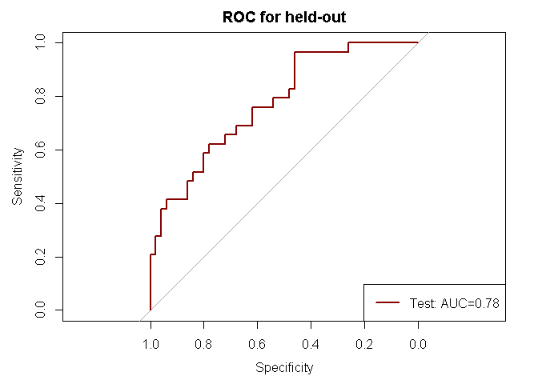

## Functions

The following functions are included to create ensembles of RF with subset_select and parameter search for "Depth" and "ntrees" and 5f-cv resampling:
* cvfold_partition
* kparti_sample
* subset_select
* rpart_looforestTrain
* rpart_looforestTest
* calcAUC_plot
* surface_forestperfm
* create_ensemble (previous non-mass ensemble creation - see main code)


## Create ensembles of RF to compare with unsupervised learning

```r
# Read CSV into R
library(pROC)
setwd("Z:/Cristina/Section3/paper_notes/comparison_traditionalCAD")
source('functionsCAD.R')
pdatalabels <- read.csv(file="input/pdatalabels.csv", header=TRUE, sep=",")
dyn_roi <- read.csv(file="input/dyn_roi_records_allNMEs_descStats.csv", header=TRUE, sep=",")
morpho_roi <- read.csv(file="input/morpho_roi_records_allNMEs_descStats.csv", header=TRUE, sep=",")
text_roi <- read.csv(file="input/text_roi_records_allNMEs_descStats.csv", header=TRUE, sep=",")
stage1_roi <- read.csv(file="input/stage1_roi_records_allNMEs_descStats.csv", header=TRUE, sep=",")

nxGnorm <- read.csv(file="input/nxGnormfeatures_allNMEs_descStats.csv", header=FALSE, sep=",")
colnames(nxGnorm) <- paste("nxg", c(1:ncol(nxGnorm)),  sep ="")

# append all with lables
allfeatures = data.frame(cbind(pdatalabels,
                               dyn_roi[2:ncol(dyn_roi)],
                               morpho_roi[2:ncol(morpho_roi)],
                               text_roi[2:ncol(text_roi)],
                               stage1_roi[2:ncol(stage1_roi)]))

# print summary labesl
summary(allfeatures$labels)
```

```
##   B   K   M 
## 267 415 110
```

```r
# remove unlabeled or 'K'
# print summary of lesions in dataset:
onlylab_nxG =  cbind(allfeatures[allfeatures$labels!='K',], nxGnorm[allfeatures$labels!='K',])
onlylab_nxG$labels = factor(onlylab_nxG$labels)
summary(onlylab_nxG$labels)
```

```
##   B   M 
## 267 110
```

```r
## normalize data before training a neural network on it
onlylab_nxG$dce2SE19[is.na(onlylab_nxG$dce2SE19)] <- summary(onlylab_nxG$dce2SE19)[[4]]
onlylab_nxG$dce3SE19[is.na(onlylab_nxG$dce3SE19)] <- summary(onlylab_nxG$dce3SE19)[[4]]
onlylab_nxG$earlySE19[is.na(onlylab_nxG$earlySE19)] <- summary(onlylab_nxG$earlySE19)[[4]]

## split in 90%/10% train/test 
sep = round(nrow(allfeatures)*0.10)
X_test = onlylab_nxG[1:sep,]
y_test = X_test$labels
init_indTrain = sep+1
X_train = onlylab_nxG[init_indTrain:nrow(onlylab_nxG),]
y_train = X_train$labels


###################################################
### Train a CAD classifier using traditional CAD features (only supervised features)
###################################################
## create stratified kfolds
cvK = 5
particvfoldK = cvfold_partition(X_train, cvK)

###################################################
# create grid of evaluation points
gT = c(25,100,250,500,750,1500) 
gD = c(1,3,5) 
grd <- expand.grid(D = gD, ntrees = gT)

###################################################
# initialize grid search metrics
grdperf = data.frame(grd)
grdperf$avaucTrain =0
grdperf$stdTrain =0
grdperf$avaucVal =0
grdperf$stdVal =0

for(k in 1:nrow(grd)){
  # get grid search cell
  D=grd[k,1]
  ntrees=grd[k,2]
  # Build in l
  cat("Depth: ", D, "ntrees: ", ntrees, "\n")
  cvAUC_train = c()
  cvAUC_val = c()
  for(r in 1:cvK){
    ## pick one of cvfold for held-out test, train on the rest
    kparti_setdata = kparti_sample(X_train, particvfoldK, cvK, r)
    
    # Boruta on $cvTrainsetD
    selfeatures_kfold = subset_select(kparti_setdata$cvTrainsetD)
    names(selfeatures_kfold)
    
    # train classifier in train with featset in train
    TrainsetD <-  kparti_setdata$cvTrainsetD[c(names(selfeatures_kfold))]
    ValsetD <-  kparti_setdata$cvValsetD[c(names(selfeatures_kfold))]
    
    # for grid search parameters train
    fit <- rpart_looforestTrain(ntrees, D, TrainsetD)
    # # predict and evaluate performance
    perf <- rpart_looforestTest(ntrees, TrainsetD, ValsetD, fit$forest)
    # for train
    ROC_train <- roc(perf$trainprob$obs, perf$trainprob[,1], plot=FALSE)
    ROC_val <- roc(perf$testprob$obs, perf$testprob[,1], plot=FALSE)
    print(paste0("ROC_train$auc = ",ROC_train$auc))
    print(paste0("ROC_val$auc = ",ROC_val$auc))
    # appends
    cvAUC_train = c(cvAUC_train, ROC_train$auc)
    cvAUC_val = c(cvAUC_val, ROC_val$auc)
  }
  
  # collect data
  grdperf$avaucTrain[k] = mean(cvAUC_train)
  grdperf$stdTrain[k] = sd(cvAUC_train)
  grdperf$avaucVal[k] = mean(cvAUC_val)
  grdperf$stdVal[k] = sd(cvAUC_val)
}
```

```
## Depth:  1 ntrees:  25 
## Boruta performed 99 iterations in 35.82316 secs.
##  16 attributes confirmed important: earlySE15, earlySE3, nxg248,
## nxg256, texture_diffvariance_nondir_post1 and 11 more.
##  494 attributes confirmed unimportant: A_countor, A_inside,
## alpha_inside, beta_countor, beta_inside and 489 more.
##  13 tentative attributes left: alpha_countor, max_F_r_i,
## mean_F_r_i, nxg113, nxg255 and 8 more.
## [1] "ROC_train$auc = 0.780524677634504"
## [1] "ROC_val$auc = 0.516335227272727"
## Boruta performed 79 iterations in 28.30797 secs.
##  8 attributes confirmed important: earlySE6, nxg8,
## texture_diffvariance_nondir_post1,
## texture_sumaverage_nondir_post4, texture_sumvariance_nondir_post1
## and 3 more.
##  515 attributes confirmed unimportant: A_countor, A_inside,
## alpha_countor, alpha_inside, beta_countor and 510 more.
## [1] "ROC_train$auc = 0.781918656056587"
## [1] "ROC_val$auc = 0.694767441860465"
## Boruta performed 99 iterations in 31.60867 secs.
##  9 attributes confirmed important: earlySE16, max_F_r_i, nxg113,
## nxg237, nxg248 and 4 more.
##  511 attributes confirmed unimportant: A_countor, A_inside,
## alpha_countor, alpha_inside, beta_countor and 506 more.
##  3 tentative attributes left: dce3SE18, earlySE17, nxg255.
## [1] "ROC_train$auc = 0.765870910698497"
## [1] "ROC_val$auc = 0.774709302325581"
## Boruta performed 99 iterations in 36.88613 secs.
##  12 attributes confirmed important: alpha_inside, earlySE6,
## irregularity, max_F_r_i, nxg154 and 7 more.
##  490 attributes confirmed unimportant: A_countor, A_inside,
## beta_countor, beta_inside, circularity and 485 more.
##  21 tentative attributes left: alpha_countor, dce2SE6, earlySE12,
## earlySE15, earlySE16 and 16 more.
## [1] "ROC_train$auc = 0.704876077586207"
## [1] "ROC_val$auc = 0.654582763337893"
## Boruta performed 99 iterations in 37.76312 secs.
##  16 attributes confirmed important: earlySE12, earlySE17,
## max_F_r_i, mean_F_r_i, nxg114 and 11 more.
##  499 attributes confirmed unimportant: A_countor, A_inside,
## alpha_countor, alpha_inside, beta_countor and 494 more.
##  8 tentative attributes left: edge_sharp_std, nxg145,
## texture_entropy_nondir_post2, texture_sumentropy_nondir_post3,
## texture_sumvariance_nondir_post2 and 3 more.
## [1] "ROC_train$auc = 0.784615384615385"
## [1] "ROC_val$auc = 0.426846590909091"
## Depth:  3 ntrees:  25 
## Boruta performed 99 iterations in 41.67991 secs.
##  14 attributes confirmed important: earlySE15, earlySE3, nxg248,
## nxg256, texture_diffvariance_nondir_post1 and 9 more.
##  490 attributes confirmed unimportant: A_countor, A_inside,
## alpha_inside, beta_countor, beta_inside and 485 more.
##  19 tentative attributes left: alpha_countor, dce2SE16, earlySE17,
## earlySE18, nxg113 and 14 more.
## [1] "ROC_train$auc = 0.879190751445087"
## [1] "ROC_val$auc = 0.568892045454545"
## Boruta performed 95 iterations in 30.91491 secs.
##  12 attributes confirmed important: earlySE4, earlySE6, nxg8,
## texture_contrast_nondir_post4, texture_diffvariance_nondir_post1
## and 7 more.
##  511 attributes confirmed unimportant: A_countor, A_inside,
## alpha_countor, alpha_inside, beta_countor and 506 more.
## [1] "ROC_train$auc = 0.881388152077807"
## [1] "ROC_val$auc = 0.723837209302326"
## Boruta performed 99 iterations in 29.5996 secs.
##  7 attributes confirmed important: earlySE16, max_F_r_i, nxg248,
## nxg256, nxg94 and 2 more.
##  515 attributes confirmed unimportant: A_countor, A_inside,
## alpha_countor, alpha_inside, beta_countor and 510 more.
##  1 tentative attributes left: mean_F_r_i.
## [1] "ROC_train$auc = 0.898010610079576"
## [1] "ROC_val$auc = 0.763808139534884"
## Boruta performed 99 iterations in 35.21804 secs.
##  12 attributes confirmed important: alpha_inside, earlySE6,
## irregularity, nxg248, SER_inside and 7 more.
##  498 attributes confirmed unimportant: A_countor, A_inside,
## beta_countor, beta_inside, circularity and 493 more.
##  13 tentative attributes left: alpha_countor, earlySE15,
## earlySE17, earlySE4, max_F_r_i and 8 more.
## [1] "ROC_train$auc = 0.890176005747126"
## [1] "ROC_val$auc = 0.531463748290014"
## Boruta performed 99 iterations in 32.93516 secs.
##  16 attributes confirmed important: earlySE17, edge_sharp_std,
## max_F_r_i, nxg126, nxg248 and 11 more.
##  503 attributes confirmed unimportant: A_countor, A_inside,
## alpha_countor, alpha_inside, beta_countor and 498 more.
##  4 tentative attributes left: earlySE16, nxg274,
## texture_contrast_nondir_post1, texture_sumvariance_nondir_post4.
## [1] "ROC_train$auc = 0.875855935971543"
## [1] "ROC_val$auc = 0.603693181818182"
## Depth:  5 ntrees:  25 
## Boruta performed 99 iterations in 37.05295 secs.
##  15 attributes confirmed important: earlySE3, nxg248, nxg256,
## texture_diffvariance_nondir_post1, texture_entropy_nondir_post1
## and 10 more.
##  492 attributes confirmed unimportant: A_countor, A_inside,
## alpha_inside, beta_countor, beta_inside and 487 more.
##  16 tentative attributes left: alpha_countor, earlySE15,
## earlySE17, lateSE18, nxg114 and 11 more.
## [1] "ROC_train$auc = 0.961049355269008"
## [1] "ROC_val$auc = 0.484375"
## Boruta performed 99 iterations in 34.30358 secs.
##  11 attributes confirmed important: dce2SE6, earlySE15, earlySE6,
## nxg248, texture_diffvariance_nondir_post1 and 6 more.
##  508 attributes confirmed unimportant: A_countor, A_inside,
## alpha_countor, alpha_inside, beta_countor and 503 more.
##  4 tentative attributes left: earlySE19,
## texture_sumentropy_nondir_post4, texture_sumvariance_nondir_post3,
## texture_variance_nondir_post2.
## [1] "ROC_train$auc = 0.939434129089301"
## [1] "ROC_val$auc = 0.813953488372093"
## Boruta performed 99 iterations in 33.68765 secs.
##  8 attributes confirmed important: earlySE16, max_F_r_i, nxg248,
## nxg256, SER_inside and 3 more.
##  512 attributes confirmed unimportant: A_countor, A_inside,
## alpha_countor, alpha_inside, beta_countor and 507 more.
##  3 tentative attributes left: dce3SE18, lateSE18, var_F_r_i.
## [1] "ROC_train$auc = 0.971441202475685"
## [1] "ROC_val$auc = 0.765988372093023"
## Boruta performed 99 iterations in 38.52506 secs.
##  11 attributes confirmed important: alpha_inside, earlySE15,
## earlySE6, nxg148, nxg8 and 6 more.
##  501 attributes confirmed unimportant: A_countor, A_inside,
## alpha_countor, beta_countor, beta_inside and 496 more.
##  11 tentative attributes left: earlySE3, nxg158,
## texture_entropy_nondir_post1, texture_entropy_nondir_post2,
## texture_sumentropy_nondir_post3 and 6 more.
## [1] "ROC_train$auc = 0.95483117816092"
## [1] "ROC_val$auc = 0.496580027359781"
## Boruta performed 99 iterations in 38.0525 secs.
##  12 attributes confirmed important: earlySE17, nxg103, nxg126,
## nxg248, nxg255 and 7 more.
##  504 attributes confirmed unimportant: A_countor, A_inside,
## alpha_countor, alpha_inside, beta_countor and 499 more.
##  7 tentative attributes left: edge_sharp_std, lateSE16,
## SER_inside, texture_sumvariance_nondir_post2,
## texture_sumvariance_nondir_post3 and 2 more.
## [1] "ROC_train$auc = 0.973943975100044"
## [1] "ROC_val$auc = 0.643465909090909"
## Depth:  1 ntrees:  100 
## Boruta performed 99 iterations in 43.89843 secs.
##  17 attributes confirmed important: earlySE15, earlySE3, nxg248,
## nxg256, texture_contrast_nondir_post1 and 12 more.
##  490 attributes confirmed unimportant: A_countor, A_inside,
## alpha_inside, beta_countor, beta_inside and 485 more.
##  16 tentative attributes left: alpha_countor, dce2SE16, dce3SE18,
## earlySE11, earlySE16 and 11 more.
## [1] "ROC_train$auc = 0.811160515784793"
## [1] "ROC_val$auc = 0.548295454545455"
## Boruta performed 99 iterations in 41.73656 secs.
##  11 attributes confirmed important: dce2SE6, earlySE15, earlySE6,
## edge_sharp_std, nxg256 and 6 more.
##  506 attributes confirmed unimportant: A_countor, A_inside,
## alpha_countor, alpha_inside, beta_countor and 501 more.
##  6 tentative attributes left: lateSE15, nxg47,
## texture_entropy_nondir_post1, texture_sumaverage_nondir_post4,
## texture_sumvariance_nondir_post3 and 1 more.
## [1] "ROC_train$auc = 0.768346595932803"
## [1] "ROC_val$auc = 0.742732558139535"
## Boruta performed 99 iterations in 39.00633 secs.
##  9 attributes confirmed important: earlySE16, nxg113, nxg237,
## nxg248, nxg256 and 4 more.
##  509 attributes confirmed unimportant: A_countor, A_inside,
## alpha_inside, beta_countor, beta_inside and 504 more.
##  5 tentative attributes left: alpha_countor, dce3SE18, lateSE18,
## nxg255, var_F_r_i.
## [1] "ROC_train$auc = 0.777409372236958"
## [1] "ROC_val$auc = 0.771802325581395"
## Boruta performed 99 iterations in 42.76657 secs.
##  12 attributes confirmed important: alpha_inside, irregularity,
## max_F_r_i, nxg148, Slope_ini_inside and 7 more.
##  503 attributes confirmed unimportant: A_countor, A_inside,
## beta_countor, beta_inside, circularity and 498 more.
##  8 tentative attributes left: alpha_countor, dce2SE6, earlySE17,
## earlySE3, texture_entropy_nondir_post1 and 3 more.
## [1] "ROC_train$auc = 0.744701867816092"
## [1] "ROC_val$auc = 0.624487004103967"
## Boruta performed 99 iterations in 44.23158 secs.
##  14 attributes confirmed important: earlySE17, nxg126, nxg248,
## nxg255, nxg256 and 9 more.
##  494 attributes confirmed unimportant: A_countor, A_inside,
## alpha_countor, alpha_inside, beta_countor and 489 more.
##  15 tentative attributes left: earlySE6, edge_sharp_std,
## max_F_r_i, mean_F_r_i, nxg224 and 10 more.
## [1] "ROC_train$auc = 0.804668741662961"
## [1] "ROC_val$auc = 0.610795454545455"
## Depth:  3 ntrees:  100 
## Boruta performed 99 iterations in 41.27996 secs.
##  19 attributes confirmed important: earlySE15, earlySE3, nxg248,
## nxg255, nxg256 and 14 more.
##  500 attributes confirmed unimportant: A_countor, A_inside,
## alpha_inside, beta_countor, beta_inside and 495 more.
##  4 tentative attributes left: alpha_countor, earlySE11,
## texture_sumentropy_nondir_post3, texture_sumentropy_nondir_post4.
## [1] "ROC_train$auc = 0.900400177856825"
## [1] "ROC_val$auc = 0.514204545454545"
## Boruta performed 99 iterations in 41.0974 secs.
##  8 attributes confirmed important: earlySE6, nxg214, nxg8,
## SER_inside, texture_diffvariance_nondir_post1 and 3 more.
##  500 attributes confirmed unimportant: A_countor, A_inside,
## alpha_countor, alpha_inside, beta_countor and 495 more.
##  15 tentative attributes left: dce2SE6, earlySE16, earlySE5,
## nxg201, nxg255 and 10 more.
## [1] "ROC_train$auc = 0.914500442086649"
## [1] "ROC_val$auc = 0.734011627906977"
## Boruta performed 99 iterations in 37.44253 secs.
##  11 attributes confirmed important: earlySE16, max_F_r_i, nxg113,
## nxg114, nxg237 and 6 more.
##  507 attributes confirmed unimportant: A_countor, A_inside,
## alpha_countor, beta_countor, beta_inside and 502 more.
##  5 tentative attributes left: alpha_inside, nxg255,
## Slope_ini_inside, texture_entropy_nondir_post1, var_F_r_i.
## [1] "ROC_train$auc = 0.880636604774536"
## [1] "ROC_val$auc = 0.818313953488372"
## Boruta performed 99 iterations in 43.26123 secs.
##  13 attributes confirmed important: alpha_inside, earlySE6,
## irregularity, nxg256, SER_inside and 8 more.
##  493 attributes confirmed unimportant: A_countor, A_inside,
## beta_countor, beta_inside, circularity and 488 more.
##  17 tentative attributes left: alpha_countor, earlySE15,
## earlySE17, nxg103, nxg148 and 12 more.
## [1] "ROC_train$auc = 0.870689655172414"
## [1] "ROC_val$auc = 0.555403556771546"
## Boruta performed 99 iterations in 42.53515 secs.
##  15 attributes confirmed important: earlySE17, earlySE6,
## max_F_r_i, mean_F_r_i, nxg126 and 10 more.
##  500 attributes confirmed unimportant: A_countor, A_inside,
## alpha_countor, alpha_inside, beta_countor and 495 more.
##  8 tentative attributes left: earlySE16, edge_sharp_std,
## texture_diffentropy_nondir_post1, texture_sumentropy_nondir_post3,
## texture_sumentropy_nondir_post4 and 3 more.
## [1] "ROC_train$auc = 0.912405513561583"
## [1] "ROC_val$auc = 0.40625"
## Depth:  5 ntrees:  100 
## Boruta performed 99 iterations in 45.59842 secs.
##  18 attributes confirmed important: earlySE3, nxg114, nxg248,
## nxg256, texture_contrast_nondir_post1 and 13 more.
##  495 attributes confirmed unimportant: A_countor, A_inside,
## alpha_inside, beta_countor, beta_inside and 490 more.
##  10 tentative attributes left: alpha_countor, dce2SE16, earlySE11,
## lateSE16, nxg237 and 5 more.
## [1] "ROC_train$auc = 0.974744330813695"
## [1] "ROC_val$auc = 0.539772727272727"
## Boruta performed 99 iterations in 39.57098 secs.
##  9 attributes confirmed important: earlySE6, edge_sharp_std,
## texture_diffvariance_nondir_post1,
## texture_sumentropy_nondir_post2, texture_sumvariance_nondir_post1
## and 4 more.
##  510 attributes confirmed unimportant: A_countor, A_inside,
## alpha_countor, alpha_inside, beta_countor and 505 more.
##  4 tentative attributes left: earlySE15, SER_inside,
## texture_contrast_nondir_post1, texture_sumvariance_nondir_post3.
## [1] "ROC_train$auc = 0.979398762157383"
## [1] "ROC_val$auc = 0.703488372093023"
## Boruta performed 99 iterations in 38.33954 secs.
##  5 attributes confirmed important: earlySE16, nxg248, nxg256,
## texture_sumentropy_nondir_post1, texture_sumvariance_nondir_post1.
##  515 attributes confirmed unimportant: A_countor, A_inside,
## alpha_countor, alpha_inside, beta_countor and 510 more.
##  3 tentative attributes left: dce3SE18,
## texture_sumentropy_nondir_post2, var_F_r_i.
## [1] "ROC_train$auc = 0.976480990274094"
## [1] "ROC_val$auc = 0.78343023255814"
## Boruta performed 99 iterations in 44.7104 secs.
##  17 attributes confirmed important: alpha_inside, earlySE15,
## earlySE6, irregularity, max_F_r_i and 12 more.
##  494 attributes confirmed unimportant: A_inside, alpha_countor,
## beta_countor, beta_inside, circularity and 489 more.
##  12 tentative attributes left: A_countor, dce2SE17, dce2SE3,
## earlySE12, earlySE17 and 7 more.
## [1] "ROC_train$auc = 0.984015804597701"
## [1] "ROC_val$auc = 0.60875512995896"
## Boruta performed 99 iterations in 39.51367 secs.
##  16 attributes confirmed important: earlySE17, edge_sharp_std,
## max_F_r_i, nxg126, nxg248 and 11 more.
##  498 attributes confirmed unimportant: A_countor, A_inside,
## alpha_countor, alpha_inside, beta_countor and 493 more.
##  9 tentative attributes left: earlySE15, earlySE16, lateSE16,
## texture_diffentropy_nondir_post1, texture_entropy_nondir_post2 and
## 4 more.
## [1] "ROC_train$auc = 0.980524677634504"
## [1] "ROC_val$auc = 0.592329545454545"
## Depth:  1 ntrees:  250 
## Boruta performed 99 iterations in 42.16973 secs.
##  13 attributes confirmed important: earlySE15, earlySE3, nxg248,
## nxg256, texture_diffvariance_nondir_post1 and 8 more.
##  492 attributes confirmed unimportant: A_countor, A_inside,
## alpha_inside, beta_countor, beta_inside and 487 more.
##  18 tentative attributes left: alpha_countor, earlySE11,
## earlySE17, lateSE18, nxg113 and 13 more.
## [1] "ROC_train$auc = 0.810137839039573"
## [1] "ROC_val$auc = 0.524147727272727"
## Boruta performed 99 iterations in 34.54866 secs.
##  10 attributes confirmed important: dce2SE6, earlySE15, earlySE6,
## nxg236, nxg248 and 5 more.
##  507 attributes confirmed unimportant: A_countor, A_inside,
## alpha_countor, alpha_inside, beta_countor and 502 more.
##  6 tentative attributes left: earlySE16,
## texture_sumentropy_nondir_post1, texture_sumentropy_nondir_post4,
## texture_sumvariance_nondir_post3, V4 and 1 more.
## [1] "ROC_train$auc = 0.785632183908046"
## [1] "ROC_val$auc = 0.770348837209302"
## Boruta performed 99 iterations in 32.03149 secs.
##  10 attributes confirmed important: earlySE16, nxg114, nxg236,
## nxg248, nxg256 and 5 more.
##  510 attributes confirmed unimportant: A_countor, A_inside,
## alpha_countor, alpha_inside, beta_countor and 505 more.
##  3 tentative attributes left: max_F_r_i, nxg255, var_F_r_i.
## [1] "ROC_train$auc = 0.787400530503979"
## [1] "ROC_val$auc = 0.799418604651163"
## Boruta performed 99 iterations in 34.24144 secs.
##  11 attributes confirmed important: alpha_inside, irregularity,
## nxg118, SER_inside, Slope_ini_inside and 6 more.
##  505 attributes confirmed unimportant: A_countor, A_inside,
## alpha_countor, beta_countor, beta_inside and 500 more.
##  7 tentative attributes left: earlySE17, edge_sharp_std,
## texture_entropy_nondir_post1, texture_entropy_nondir_post3,
## texture_sumentropy_nondir_post3 and 2 more.
## [1] "ROC_train$auc = 0.753771551724138"
## [1] "ROC_val$auc = 0.596443228454172"
## Boruta performed 99 iterations in 35.71352 secs.
##  14 attributes confirmed important: earlySE17, max_F_r_i,
## mean_F_r_i, nxg126, nxg248 and 9 more.
##  500 attributes confirmed unimportant: A_countor, A_inside,
## alpha_inside, beta_countor, beta_inside and 495 more.
##  9 tentative attributes left: alpha_countor, earlySE15, earlySE6,
## edge_sharp_std, lateSE16 and 4 more.
## [1] "ROC_train$auc = 0.811293908403735"
## [1] "ROC_val$auc = 0.620028409090909"
## Depth:  3 ntrees:  250 
## Boruta performed 99 iterations in 37.9084 secs.
##  20 attributes confirmed important: earlySE15, earlySE3, nxg248,
## nxg256, nxg317 and 15 more.
##  493 attributes confirmed unimportant: A_countor, A_inside,
## alpha_countor, alpha_inside, beta_countor and 488 more.
##  10 tentative attributes left: dce2SE5, earlySE11, earlySE16,
## earlySE17, earlySE5 and 5 more.
## [1] "ROC_train$auc = 0.906447309915518"
## [1] "ROC_val$auc = 0.495738636363636"
## Boruta performed 99 iterations in 33.66476 secs.
##  11 attributes confirmed important: dce2SE6, earlySE6,
## irregularity, k_Max_Margin_Grad, nxg8 and 6 more.
##  505 attributes confirmed unimportant: A_countor, A_inside,
## alpha_countor, alpha_inside, beta_countor and 500 more.
##  7 tentative attributes left: earlySE11, earlySE17,
## Slope_ini_inside, texture_sumvariance_nondir_post4,
## texture_variance_nondir_post2 and 2 more.
## [1] "ROC_train$auc = 0.905747126436782"
## [1] "ROC_val$auc = 0.726744186046512"
## Boruta performed 99 iterations in 31.8567 secs.
##  12 attributes confirmed important: earlySE16, irregularity,
## max_F_r_i, nxg113, nxg236 and 7 more.
##  509 attributes confirmed unimportant: A_countor, A_inside,
## alpha_countor, alpha_inside, beta_countor and 504 more.
##  2 tentative attributes left: texture_entropy_nondir_post1,
## Vr_post_1_countor.
## [1] "ROC_train$auc = 0.900884173297966"
## [1] "ROC_val$auc = 0.835755813953488"
## Boruta performed 99 iterations in 37.39033 secs.
##  13 attributes confirmed important: alpha_inside, earlySE15,
## earlySE6, irregularity, nxg154 and 8 more.
##  496 attributes confirmed unimportant: A_countor, A_inside,
## beta_countor, beta_inside, circularity and 491 more.
##  14 tentative attributes left: alpha_countor, dce2SE6, earlySE17,
## max_F_r_i, mean_F_r_i and 9 more.
## [1] "ROC_train$auc = 0.896461925287356"
## [1] "ROC_val$auc = 0.59233926128591"
## Boruta performed 99 iterations in 34.74777 secs.
##  15 attributes confirmed important: earlySE17, earlySE6,
## max_F_r_i, nxg126, nxg237 and 10 more.
##  505 attributes confirmed unimportant: A_countor, A_inside,
## alpha_countor, alpha_inside, beta_countor and 500 more.
##  3 tentative attributes left: texture_sumvariance_nondir_post2,
## texture_sumvariance_nondir_post3, texture_variance_nondir_post2.
## [1] "ROC_train$auc = 0.899155180080036"
## [1] "ROC_val$auc = 0.414772727272727"
## Depth:  5 ntrees:  250 
## Boruta performed 99 iterations in 38.22862 secs.
##  15 attributes confirmed important: earlySE3, nxg237, nxg248,
## nxg256, texture_diffvariance_nondir_post1 and 10 more.
##  489 attributes confirmed unimportant: A_countor, A_inside,
## alpha_countor, alpha_inside, beta_countor and 484 more.
##  19 tentative attributes left: earlySE15, earlySE17, earlySE5,
## lateSE18, max_F_r_i and 14 more.
## [1] "ROC_train$auc = 0.971098265895954"
## [1] "ROC_val$auc = 0.521306818181818"
## Boruta performed 63 iterations in 26.74026 secs.
##  3 attributes confirmed important:
## texture_sumvariance_nondir_post1,
## texture_sumvariance_nondir_post2, texture_variance_nondir_post1.
##  520 attributes confirmed unimportant: A_countor, A_inside,
## alpha_countor, alpha_inside, beta_countor and 515 more.
## [1] "ROC_train$auc = 0.949425287356322"
## [1] "ROC_val$auc = 0.726744186046512"
## Boruta performed 99 iterations in 34.8487 secs.
##  11 attributes confirmed important: earlySE16, max_F_r_i, nxg113,
## nxg114, nxg236 and 6 more.
##  504 attributes confirmed unimportant: A_countor, A_inside,
## alpha_countor, alpha_inside, beta_countor and 499 more.
##  8 tentative attributes left: dce3SE18, mean_F_r_i,
## Slope_ini_inside, texture_contrast_nondir_post1,
## texture_diffvariance_nondir_post1 and 3 more.
## [1] "ROC_train$auc = 0.980106100795756"
## [1] "ROC_val$auc = 0.803779069767442"
## Boruta performed 99 iterations in 39.03683 secs.
##  9 attributes confirmed important: alpha_inside, irregularity,
## SER_inside, Slope_ini_inside, texture_sumentropy_nondir_post1 and
## 4 more.
##  491 attributes confirmed unimportant: A_countor, A_inside,
## beta_countor, beta_inside, circularity and 486 more.
##  23 tentative attributes left: alpha_countor, dce2SE6, earlySE15,
## earlySE17, earlySE6 and 18 more.
## [1] "ROC_train$auc = 0.975933908045977"
## [1] "ROC_val$auc = 0.586867305061559"
## Boruta performed 95 iterations in 31.78891 secs.
##  17 attributes confirmed important: circularity, earlySE17,
## edge_sharp_std, max_F_r_i, mean_F_r_i and 12 more.
##  506 attributes confirmed unimportant: A_countor, A_inside,
## alpha_countor, alpha_inside, beta_countor and 501 more.
## [1] "ROC_train$auc = 0.979101823032459"
## [1] "ROC_val$auc = 0.467329545454545"
## Depth:  1 ntrees:  500 
## Boruta performed 99 iterations in 39.66168 secs.
##  15 attributes confirmed important: earlySE15, earlySE3, nxg248,
## nxg256, texture_diffvariance_nondir_post1 and 10 more.
##  485 attributes confirmed unimportant: A_countor, A_inside,
## alpha_countor, alpha_inside, beta_countor and 480 more.
##  23 tentative attributes left: dce3SE18, earlySE11, earlySE16,
## earlySE17, lateSE18 and 18 more.
## [1] "ROC_train$auc = 0.805113383726101"
## [1] "ROC_val$auc = 0.540482954545455"
## Boruta performed 99 iterations in 35.4736 secs.
##  8 attributes confirmed important: earlySE6, k_Max_Margin_Grad,
## nxg248, nxg8, texture_diffvariance_nondir_post1 and 3 more.
##  499 attributes confirmed unimportant: A_countor, A_inside,
## alpha_countor, alpha_inside, beta_countor and 494 more.
##  16 tentative attributes left: dce2SE6, earlySE15, earlySE3,
## edge_sharp_std, SER_inside and 11 more.
## [1] "ROC_train$auc = 0.789036251105217"
## [1] "ROC_val$auc = 0.707122093023256"
## Boruta performed 99 iterations in 30.78163 secs.
##  7 attributes confirmed important: earlySE16, nxg237, nxg248,
## nxg256, SER_inside and 2 more.
##  512 attributes confirmed unimportant: A_countor, A_inside,
## alpha_countor, alpha_inside, beta_countor and 507 more.
##  4 tentative attributes left: lateSE18, mean_F_r_i,
## texture_sumentropy_nondir_post2, Vr_post_1_countor.
## [1] "ROC_train$auc = 0.784040671971706"
## [1] "ROC_val$auc = 0.768168604651163"
## Boruta performed 99 iterations in 34.60496 secs.
##  14 attributes confirmed important: alpha_inside, dce3SE3,
## earlySE6, irregularity, nxg256 and 9 more.
##  503 attributes confirmed unimportant: A_countor, A_inside,
## beta_countor, beta_inside, circularity and 498 more.
##  6 tentative attributes left: alpha_countor, earlySE15,
## texture_entropy_nondir_post1, texture_sumentropy_nondir_post3,
## texture_sumvariance_nondir_post3 and 1 more.
## [1] "ROC_train$auc = 0.779947916666667"
## [1] "ROC_val$auc = 0.580027359781122"
## Boruta performed 99 iterations in 34.62209 secs.
##  16 attributes confirmed important: earlySE17, max_F_r_i,
## mean_F_r_i, nxg114, nxg126 and 11 more.
##  499 attributes confirmed unimportant: A_countor, A_inside,
## alpha_countor, alpha_inside, beta_countor and 494 more.
##  8 tentative attributes left: earlySE15, earlySE6, nxg219, nxg47,
## SER_inside and 3 more.
## [1] "ROC_train$auc = 0.822009782125389"
## [1] "ROC_val$auc = 0.607244318181818"
## Depth:  3 ntrees:  500 
## Boruta performed 99 iterations in 37.19494 secs.
##  19 attributes confirmed important: earlySE15, earlySE3,
## max_F_r_i, nxg248, nxg255 and 14 more.
##  492 attributes confirmed unimportant: A_countor, A_inside,
## alpha_inside, beta_countor, beta_inside and 487 more.
##  12 tentative attributes left: alpha_countor, earlySE11,
## earlySE17, nxg113, nxg114 and 7 more.
## [1] "ROC_train$auc = 0.908492663405958"
## [1] "ROC_val$auc = 0.572443181818182"
## Boruta performed 99 iterations in 34.95194 secs.
##  11 attributes confirmed important: earlySE6, nxg229, nxg255,
## nxg38, nxg8 and 6 more.
##  503 attributes confirmed unimportant: A_countor, A_inside,
## alpha_countor, alpha_inside, beta_countor and 498 more.
##  9 tentative attributes left: dce2SE6, nxg126, nxg256,
## texture_entropy_nondir_post1, texture_sumentropy_nondir_post2 and
## 4 more.
## [1] "ROC_train$auc = 0.89867374005305"
## [1] "ROC_val$auc = 0.71656976744186"
## Boruta performed 99 iterations in 34.67022 secs.
##  12 attributes confirmed important: earlySE16, nxg113, nxg114,
## nxg236, nxg237 and 7 more.
##  506 attributes confirmed unimportant: A_countor, A_inside,
## alpha_countor, alpha_inside, beta_countor and 501 more.
##  5 tentative attributes left: irregularity, max_F_r_i, nxg255,
## var_F_r_i, Vr_post_1_countor.
## [1] "ROC_train$auc = 0.900442086648983"
## [1] "ROC_val$auc = 0.796511627906977"
## Boruta performed 99 iterations in 38.73855 secs.
##  12 attributes confirmed important: alpha_inside, earlySE6,
## irregularity, SER_inside, Slope_ini_inside and 7 more.
##  496 attributes confirmed unimportant: A_countor, A_inside,
## beta_countor, beta_inside, circularity and 491 more.
##  15 tentative attributes left: alpha_countor, dce3SE3, earlySE15,
## earlySE16, earlySE17 and 10 more.
## [1] "ROC_train$auc = 0.894576149425287"
## [1] "ROC_val$auc = 0.599179206566347"
## Boruta performed 99 iterations in 35.08911 secs.
##  14 attributes confirmed important: earlySE17, mean_F_r_i, nxg126,
## nxg248, nxg255 and 9 more.
##  505 attributes confirmed unimportant: A_countor, A_inside,
## alpha_countor, alpha_inside, beta_countor and 500 more.
##  4 tentative attributes left: earlySE16, nxg274,
## texture_sumvariance_nondir_post3, Vr_post_1_countor.
## [1] "ROC_train$auc = 0.902000889284126"
## [1] "ROC_val$auc = 0.409090909090909"
## Depth:  5 ntrees:  500 
## Boruta performed 99 iterations in 38.69464 secs.
##  17 attributes confirmed important: earlySE15, earlySE3, nxg114,
## nxg248, nxg256 and 12 more.
##  494 attributes confirmed unimportant: A_countor, A_inside,
## alpha_inside, beta_countor, beta_inside and 489 more.
##  12 tentative attributes left: alpha_countor, earlySE16,
## earlySE17, lateSE18, max_F_r_i and 7 more.
## [1] "ROC_train$auc = 0.97003112494442"
## [1] "ROC_val$auc = 0.526988636363636"
## Boruta performed 99 iterations in 34.57684 secs.
##  8 attributes confirmed important: earlySE15, earlySE6, nxg256,
## nxg8, texture_diffvariance_nondir_post1 and 3 more.
##  511 attributes confirmed unimportant: A_countor, A_inside,
## alpha_countor, alpha_inside, beta_countor and 506 more.
##  4 tentative attributes left: nxg126, nxg47,
## texture_contrast_nondir_post1, texture_sumentropy_nondir_post4.
## [1] "ROC_train$auc = 0.97869142351901"
## [1] "ROC_val$auc = 0.734011627906977"
## Boruta performed 99 iterations in 35.56323 secs.
##  10 attributes confirmed important: irregularity, max_F_r_i,
## nxg114, nxg237, nxg248 and 5 more.
##  511 attributes confirmed unimportant: A_countor, A_inside,
## alpha_countor, beta_countor, beta_inside and 506 more.
##  2 tentative attributes left: alpha_inside, earlySE15.
## [1] "ROC_train$auc = 0.979045092838196"
## [1] "ROC_val$auc = 0.840116279069767"
## Boruta performed 99 iterations in 38.96083 secs.
##  17 attributes confirmed important: alpha_inside, earlySE15,
## earlySE6, irregularity, max_F_r_i and 12 more.
##  499 attributes confirmed unimportant: A_countor, A_inside,
## beta_countor, beta_inside, circularity and 494 more.
##  7 tentative attributes left: alpha_countor, earlySE17, nxg255,
## nxg8, texture_entropy_nondir_post2 and 2 more.
## [1] "ROC_train$auc = 0.975395114942529"
## [1] "ROC_val$auc = 0.590971272229822"
## Boruta performed 99 iterations in 37.51998 secs.
##  18 attributes confirmed important: earlySE17, earlySE6,
## edge_sharp_std, max_F_r_i, mean_F_r_i and 13 more.
##  502 attributes confirmed unimportant: A_countor, A_inside,
## alpha_countor, alpha_inside, beta_countor and 497 more.
##  3 tentative attributes left: texture_sumentropy_nondir_post4,
## texture_sumvariance_nondir_post3, texture_variance_nondir_post2.
## [1] "ROC_train$auc = 0.985593597154291"
## [1] "ROC_val$auc = 0.423295454545455"
## Depth:  1 ntrees:  750 
## Boruta performed 99 iterations in 37.35982 secs.
##  19 attributes confirmed important: earlySE15, earlySE3, nxg248,
## nxg256, texture_diffvariance_nondir_post1 and 14 more.
##  500 attributes confirmed unimportant: A_countor, A_inside,
## alpha_inside, beta_countor, beta_inside and 495 more.
##  4 tentative attributes left: alpha_countor, dce2SE5, max_F_r_i,
## texture_sumentropy_nondir_post3.
## [1] "ROC_train$auc = 0.796531791907514"
## [1] "ROC_val$auc = 0.511363636363636"
## Boruta performed 77 iterations in 31.01367 secs.
##  9 attributes confirmed important: earlySE6,
## texture_contrast_nondir_post1, texture_sumentropy_nondir_post2,
## texture_sumentropy_nondir_post4, texture_sumvariance_nondir_post1
## and 4 more.
##  514 attributes confirmed unimportant: A_countor, A_inside,
## alpha_countor, alpha_inside, beta_countor and 509 more.
## [1] "ROC_train$auc = 0.743015030946065"
## [1] "ROC_val$auc = 0.686773255813953"
## Boruta performed 99 iterations in 33.59958 secs.
##  8 attributes confirmed important: earlySE16, nxg236, nxg248,
## nxg256, SER_inside and 3 more.
##  511 attributes confirmed unimportant: A_countor, A_inside,
## alpha_countor, beta_countor, beta_inside and 506 more.
##  4 tentative attributes left: alpha_inside, lateSE18, nxg255,
## texture_sumentropy_nondir_post2.
## [1] "ROC_train$auc = 0.796109637488948"
## [1] "ROC_val$auc = 0.784156976744186"
## Boruta performed 99 iterations in 37.21292 secs.
##  12 attributes confirmed important: alpha_inside, earlySE6,
## irregularity, nxg154, SER_inside and 7 more.
##  495 attributes confirmed unimportant: A_countor, A_inside,
## beta_countor, beta_inside, circularity and 490 more.
##  16 tentative attributes left: alpha_countor, dce3SE3, earlySE17,
## nxg148, nxg199 and 11 more.
## [1] "ROC_train$auc = 0.786368534482759"
## [1] "ROC_val$auc = 0.595075239398085"
## Boruta performed 99 iterations in 35.14407 secs.
##  18 attributes confirmed important: earlySE17, earlySE6, nxg114,
## nxg126, nxg248 and 13 more.
##  497 attributes confirmed unimportant: A_countor, A_inside,
## alpha_countor, alpha_inside, beta_countor and 492 more.
##  8 tentative attributes left: dce3SE3, earlySE15, nxg224, nxg236,
## SER_inside and 3 more.
## [1] "ROC_train$auc = 0.819030680302357"
## [1] "ROC_val$auc = 0.619318181818182"
## Depth:  3 ntrees:  750 
## Boruta performed 99 iterations in 38.43353 secs.
##  13 attributes confirmed important: earlySE3, nxg248, nxg256,
## texture_diffvariance_nondir_post1, texture_sumentropy_nondir_post1
## and 8 more.
##  487 attributes confirmed unimportant: A_countor, A_inside,
## alpha_inside, beta_countor, beta_inside and 482 more.
##  23 tentative attributes left: alpha_countor, dce2SE16, earlySE11,
## earlySE15, earlySE16 and 18 more.
## [1] "ROC_train$auc = 0.906269453090262"
## [1] "ROC_val$auc = 0.553977272727273"
## Boruta performed 99 iterations in 31.02101 secs.
##  8 attributes confirmed important: earlySE6,
## texture_contrast_nondir_post1, texture_diffvariance_nondir_post1,
## texture_sumentropy_nondir_post2, texture_sumvariance_nondir_post1
## and 3 more.
##  512 attributes confirmed unimportant: A_countor, A_inside,
## alpha_countor, alpha_inside, beta_countor and 507 more.
##  3 tentative attributes left: dce2SE6,
## texture_diffvariance_nondir_post3,
## texture_sumvariance_nondir_post4.
## [1] "ROC_train$auc = 0.869761273209549"
## [1] "ROC_val$auc = 0.691860465116279"
## Boruta performed 99 iterations in 33.28448 secs.
##  12 attributes confirmed important: earlySE16, nxg113, nxg114,
## nxg236, nxg237 and 7 more.
##  505 attributes confirmed unimportant: A_countor, A_inside,
## alpha_countor, alpha_inside, beta_countor and 500 more.
##  6 tentative attributes left: max_F_r_i, nxg255,
## texture_sumentropy_nondir_post2, V15, var_F_r_i and 1 more.
## [1] "ROC_train$auc = 0.900353669319187"
## [1] "ROC_val$auc = 0.818313953488372"
## Boruta performed 99 iterations in 34.27912 secs.
##  17 attributes confirmed important: alpha_inside, earlySE15,
## earlySE6, irregularity, mean_F_r_i and 12 more.
##  501 attributes confirmed unimportant: A_countor, A_inside,
## beta_countor, beta_inside, circularity and 496 more.
##  5 tentative attributes left: alpha_countor, earlySE17,
## texture_entropy_nondir_post2, texture_sumentropy_nondir_post3,
## texture_sumvariance_nondir_post3.
## [1] "ROC_train$auc = 0.895743534482759"
## [1] "ROC_val$auc = 0.593707250341997"
## Boruta performed 99 iterations in 33.03436 secs.
##  13 attributes confirmed important: earlySE17, max_F_r_i,
## mean_F_r_i, nxg126, nxg248 and 8 more.
##  505 attributes confirmed unimportant: A_countor, A_inside,
## alpha_countor, alpha_inside, beta_countor and 500 more.
##  5 tentative attributes left: earlySE16, nxg325,
## texture_sumvariance_nondir_post2, texture_variance_nondir_post2,
## Vr_post_1_countor.
## [1] "ROC_train$auc = 0.896398399288573"
## [1] "ROC_val$auc = 0.401988636363636"
## Depth:  5 ntrees:  750 
## Boruta performed 99 iterations in 37.08918 secs.
##  18 attributes confirmed important: earlySE15, earlySE3, nxg248,
## nxg255, nxg256 and 13 more.
##  494 attributes confirmed unimportant: A_countor, A_inside,
## alpha_inside, beta_countor, beta_inside and 489 more.
##  11 tentative attributes left: alpha_countor, earlySE11,
## earlySE17, lateSE18, max_F_r_i and 6 more.
## [1] "ROC_train$auc = 0.971453979546465"
## [1] "ROC_val$auc = 0.497159090909091"
## Boruta performed 99 iterations in 32.21465 secs.
##  11 attributes confirmed important: earlySE6, edge_sharp_std,
## k_Max_Margin_Grad, nxg236, nxg255 and 6 more.
##  508 attributes confirmed unimportant: A_countor, A_inside,
## alpha_countor, alpha_inside, beta_countor and 503 more.
##  4 tentative attributes left: texture_sumentropy_nondir_post2,
## texture_sumvariance_nondir_post3, texture_variance_nondir_post4,
## var_F_r_i.
## [1] "ROC_train$auc = 0.978603006189213"
## [1] "ROC_val$auc = 0.819767441860465"
## Boruta performed 99 iterations in 30.62862 secs.
##  7 attributes confirmed important: nxg236, nxg248, nxg256,
## SER_inside, texture_sumentropy_nondir_post1 and 2 more.
##  513 attributes confirmed unimportant: A_countor, A_inside,
## alpha_countor, alpha_inside, beta_countor and 508 more.
##  3 tentative attributes left: dce3SE18, max_F_r_i, nxg255.
## [1] "ROC_train$auc = 0.976392572944297"
## [1] "ROC_val$auc = 0.811046511627907"
## Boruta performed 99 iterations in 36.25084 secs.
##  17 attributes confirmed important: alpha_inside, earlySE6,
## irregularity, max_F_r_i, mean_F_r_i and 12 more.
##  497 attributes confirmed unimportant: A_countor, A_inside,
## beta_countor, beta_inside, circularity and 492 more.
##  9 tentative attributes left: alpha_countor, dce2SE6, earlySE1,
## nxg148, texture_entropy_nondir_post1 and 4 more.
## [1] "ROC_train$auc = 0.978627873563218"
## [1] "ROC_val$auc = 0.599179206566347"
## Boruta performed 99 iterations in 35.84777 secs.
##  14 attributes confirmed important: earlySE12, earlySE17,
## max_F_r_i, mean_F_r_i, nxg126 and 9 more.
##  497 attributes confirmed unimportant: A_countor, A_inside,
## alpha_inside, beta_countor, beta_inside and 492 more.
##  12 tentative attributes left: alpha_countor, dce3SE12, dce3SE3,
## earlySE15, earlySE16 and 7 more.
## [1] "ROC_train$auc = 0.98932859048466"
## [1] "ROC_val$auc = 0.599431818181818"
## Depth:  1 ntrees:  1500 
## Boruta performed 99 iterations in 37.56757 secs.
##  20 attributes confirmed important: earlySE15, earlySE3, nxg237,
## nxg248, nxg255 and 15 more.
##  492 attributes confirmed unimportant: A_countor, A_inside,
## alpha_countor, alpha_inside, beta_countor and 487 more.
##  11 tentative attributes left: earlySE17, lateSE18, nxg236,
## Slope_ini_countor, texture_diffentropy_nondir_post1 and 6 more.
## [1] "ROC_train$auc = 0.807425522454424"
## [1] "ROC_val$auc = 0.538352272727273"
## Boruta performed 99 iterations in 35.15095 secs.
##  13 attributes confirmed important: dce2SE6, earlySE15, earlySE6,
## irregularity, nxg87 and 8 more.
##  503 attributes confirmed unimportant: A_countor, A_inside,
## alpha_countor, alpha_inside, beta_countor and 498 more.
##  7 tentative attributes left: nxg224,
## texture_sumentropy_nondir_post1, texture_sumvariance_nondir_post3,
## texture_sumvariance_nondir_post4, texture_variance_nondir_post2
## and 2 more.
## [1] "ROC_train$auc = 0.776304155614501"
## [1] "ROC_val$auc = 0.694767441860465"
## Boruta performed 99 iterations in 35.45366 secs.
##  9 attributes confirmed important: nxg113, nxg114, nxg236, nxg248,
## nxg256 and 4 more.
##  508 attributes confirmed unimportant: A_countor, A_inside,
## alpha_countor, alpha_inside, beta_countor and 503 more.
##  6 tentative attributes left: dce3SE18, earlySE16, earlySE3,
## max_F_r_i, mean_F_r_i and 1 more.
## [1] "ROC_train$auc = 0.775331564986737"
## [1] "ROC_val$auc = 0.780523255813954"
## Boruta performed 99 iterations in 39.8378 secs.
##  10 attributes confirmed important: alpha_inside, dce3SE3,
## earlySE6, irregularity, Slope_ini_inside and 5 more.
##  496 attributes confirmed unimportant: A_countor, A_inside,
## beta_countor, beta_inside, circularity and 491 more.
##  17 tentative attributes left: alpha_countor, earlySE15,
## earlySE17, nxg248, nxg256 and 12 more.
## [1] "ROC_train$auc = 0.783764367816092"
## [1] "ROC_val$auc = 0.590287277701778"
## Boruta performed 99 iterations in 39.19895 secs.
##  18 attributes confirmed important: earlySE12, earlySE17,
## edge_sharp_std, max_F_r_i, mean_F_r_i and 13 more.
##  497 attributes confirmed unimportant: A_countor, A_inside,
## alpha_inside, beta_countor, beta_inside and 492 more.
##  8 tentative attributes left: alpha_countor, earlySE6, nxg236,
## texture_entropy_nondir_post3, texture_sumentropy_nondir_post3 and
## 3 more.
## [1] "ROC_train$auc = 0.812094264117386"
## [1] "ROC_val$auc = 0.600852272727273"
## Depth:  3 ntrees:  1500 
## Boruta performed 99 iterations in 38.81418 secs.
##  19 attributes confirmed important: earlySE15, earlySE3, nxg248,
## nxg255, nxg256 and 14 more.
##  499 attributes confirmed unimportant: A_countor, A_inside,
## alpha_inside, beta_countor, beta_inside and 494 more.
##  5 tentative attributes left: alpha_countor, lateSE16,
## texture_entropy_nondir_post4, texture_sumentropy_nondir_post3,
## texture_sumentropy_nondir_post4.
## [1] "ROC_train$auc = 0.903779457536683"
## [1] "ROC_val$auc = 0.542613636363636"
## Boruta performed 99 iterations in 33.44909 secs.
##  7 attributes confirmed important: dce2SE6, earlySE6, max_F_r_i,
## texture_sumentropy_nondir_post2, texture_sumvariance_nondir_post1
## and 2 more.
##  515 attributes confirmed unimportant: A_countor, A_inside,
## alpha_countor, alpha_inside, beta_countor and 510 more.
##  1 tentative attributes left: lateSE14.
## [1] "ROC_train$auc = 0.883200707338638"
## [1] "ROC_val$auc = 0.745639534883721"
## Boruta performed 99 iterations in 32.17593 secs.
##  11 attributes confirmed important: earlySE16, irregularity,
## nxg113, nxg236, nxg248 and 6 more.
##  509 attributes confirmed unimportant: A_countor, A_inside,
## alpha_countor, alpha_inside, beta_countor and 504 more.
##  3 tentative attributes left: max_F_r_i, mean_F_r_i, nxg255.
## [1] "ROC_train$auc = 0.896109637488948"
## [1] "ROC_val$auc = 0.813953488372093"
## Boruta performed 99 iterations in 37.69504 secs.
##  15 attributes confirmed important: alpha_inside, earlySE6,
## irregularity, nxg154, nxg248 and 10 more.
##  499 attributes confirmed unimportant: A_countor, A_inside,
## alpha_countor, beta_countor, beta_inside and 494 more.
##  9 tentative attributes left: earlySE15, earlySE17, lateSE3,
## nxg236, texture_entropy_nondir_post1 and 4 more.
## [1] "ROC_train$auc = 0.906968390804598"
## [1] "ROC_val$auc = 0.566347469220246"
## Boruta performed 99 iterations in 36.08585 secs.
##  12 attributes confirmed important: earlySE17, max_F_r_i,
## mean_F_r_i, nxg126, nxg248 and 7 more.
##  508 attributes confirmed unimportant: A_countor, A_inside,
## alpha_countor, alpha_inside, beta_countor and 503 more.
##  3 tentative attributes left: earlySE15, earlySE16,
## texture_sumvariance_nondir_post2.
## [1] "ROC_train$auc = 0.895953757225434"
## [1] "ROC_val$auc = 0.605113636363636"
## Depth:  5 ntrees:  1500 
## Boruta performed 99 iterations in 40.85477 secs.
##  14 attributes confirmed important: earlySE15, earlySE3, nxg248,
## nxg256, texture_diffvariance_nondir_post1 and 9 more.
##  486 attributes confirmed unimportant: A_countor, A_inside,
## alpha_inside, beta_countor, beta_inside and 481 more.
##  23 tentative attributes left: alpha_countor, earlySE11,
## earlySE17, earlySE5, edge_sharp_std and 18 more.
## [1] "ROC_train$auc = 0.977145397954646"
## [1] "ROC_val$auc = 0.464488636363636"
## Boruta performed 79 iterations in 31.42118 secs.
##  9 attributes confirmed important: dce2SE6, earlySE6, nxg8, nxg81,
## texture_diffvariance_nondir_post1 and 4 more.
##  514 attributes confirmed unimportant: A_countor, A_inside,
## alpha_countor, alpha_inside, beta_countor and 509 more.
## [1] "ROC_train$auc = 0.970468611847922"
## [1] "ROC_val$auc = 0.699127906976744"
## Boruta performed 99 iterations in 34.6662 secs.
##  9 attributes confirmed important: earlySE16, nxg236, nxg248,
## nxg256, SER_inside and 4 more.
##  512 attributes confirmed unimportant: A_countor, A_inside,
## alpha_countor, alpha_inside, beta_countor and 507 more.
##  2 tentative attributes left: lateSE18, max_F_r_i.
## [1] "ROC_train$auc = 0.983023872679045"
## [1] "ROC_val$auc = 0.803779069767442"
## Boruta performed 99 iterations in 38.62858 secs.
##  14 attributes confirmed important: alpha_inside, earlySE6,
## irregularity, nxg154, SER_inside and 9 more.
##  501 attributes confirmed unimportant: A_countor, A_inside,
## beta_countor, beta_inside, circularity and 496 more.
##  8 tentative attributes left: alpha_countor, dce2SE15, earlySE17,
## earlySE3, edge_sharp_std and 3 more.
## [1] "ROC_train$auc = 0.979525862068966"
## [1] "ROC_val$auc = 0.534883720930233"
## Boruta performed 99 iterations in 39.91304 secs.
##  11 attributes confirmed important: earlySE17, nxg126, nxg248,
## nxg255, nxg256 and 6 more.
##  497 attributes confirmed unimportant: A_countor, A_inside,
## alpha_countor, alpha_inside, beta_countor and 492 more.
##  15 tentative attributes left: dce3SE3, earlySE15, earlySE16,
## max_F_r_i, mean_F_r_i and 10 more.
## [1] "ROC_train$auc = 0.98399288572699"
## [1] "ROC_val$auc = 0.419034090909091"
```

```r
print(grdperf)
```

```
##    D ntrees avaucTrain    stdTrain  avaucVal     stdVal
## 1  1     25  0.7635611 0.033605479 0.6134483 0.14014377
## 2  3     25  0.8849243 0.009033896 0.6383389 0.10062055
## 3  5     25  0.9601400 0.013928483 0.6408726 0.15077261
## 4  1    100  0.7812574 0.027203356 0.6596226 0.09421238
## 5  3    100  0.8957265 0.019410321 0.6056367 0.16759326
## 6  5    100  0.9790329 0.003608762 0.6455552 0.09713769
## 7  1    250  0.7896472 0.023434357 0.6620774 0.11798927
## 8  3    250  0.9017391 0.004286246 0.6130701 0.17031516
## 9  5    250  0.9711331 0.012632234 0.6212054 0.14080855
## 10 1    500  0.7960296 0.017383518 0.6406091 0.09421253
## 11 3    500  0.9008371 0.005098964 0.6187589 0.14803055
## 12 5    500  0.9777513 0.005683574 0.6230767 0.16552111
## 13 1    750  0.7882111 0.027962238 0.6393375 0.10242078
## 14 3    750  0.8937053 0.014024820 0.6119695 0.15552264
## 15 5    750  0.9788812 0.006531585 0.6653168 0.14325168
## 16 1   1500  0.7909840 0.017525600 0.6409565 0.09627804
## 17 3   1500  0.8972024 0.009184673 0.6547336 0.11880656
## 18 5   1500  0.9788313 0.005419383 0.5842627 0.16237769
```

```r
################
# plot learning surface of ensemble parameters
grdperf_toplot = grdperf[c(3,5,1,2)]
surface_forestperfm(grdperf_toplot, 2, "D", "ntrees")
```

<!-- -->

```r
################
# select best grid parameters
index = which(grdperf$avaucVal == max(grdperf$avaucVal), arr.ind = TRUE)[1]
Dmax = grdperf$D[index]
nTmax = grdperf$ntrees[index]

maxG = list()
# to pool data
train_pr=data.frame()
val_pr=data.frame()
for(r in 1:cvK){
  ## pick one of cvfold for held-out test, train on the rest
  kparti_setdata = kparti_sample(X_train, particvfoldK, cvK, r)
  
  # Boruta on $cvTrainsetD
  selfeatures = subset_select(kparti_setdata$cvTrainsetD)
  names(selfeatures)
  
  # train classifier in train with featset in train
  TrainsetD <-  kparti_setdata$cvTrainsetD[c(names(selfeatures))]
  ValsetD <-  kparti_setdata$cvValsetD[c(names(selfeatures))]
  
  # for grid search parameters train
  fit <- rpart_looforestTrain(nTmax, Dmax, TrainsetD)
  # # predict and evaluate performance
  perf <- rpart_looforestTest(nTmax, TrainsetD, ValsetD, fit$forest)
  # for train
  ROC_train <- roc(perf$trainprob$obs, perf$trainprob$M, plot=FALSE)
  ROC_val <- roc(perf$testprob$obs, perf$testprob[,1], plot=FALSE)
  print(paste0("ROC_train$auc = ",ROC_train$auc))
  print(paste0("ROC_val$auc = ",ROC_val$auc))
  
  # append
  train_pr = rbind(train_pr, perf$trainprob)
  val_pr = rbind(val_pr, perf$testprob)
  
  # appends forest trees
  maxG = append(maxG, fit$forest)
}
```

```
## Boruta performed 99 iterations in 39.72311 secs.
##  14 attributes confirmed important: earlySE3, nxg248, nxg256,
## texture_diffvariance_nondir_post1, texture_entropy_nondir_post1
## and 9 more.
##  489 attributes confirmed unimportant: A_countor, A_inside,
## alpha_countor, alpha_inside, beta_countor and 484 more.
##  20 tentative attributes left: dce3SE18, earlySE15, earlySE16,
## earlySE17, earlySE5 and 15 more.
## [1] "ROC_train$auc = 0.9741218319253"
## [1] "ROC_val$auc = 0.477272727272727"
## Boruta performed 99 iterations in 33.65405 secs.
##  14 attributes confirmed important: earlySE6, edge_sharp_std,
## irregularity, nxg255, nxg265 and 9 more.
##  504 attributes confirmed unimportant: A_countor, A_inside,
## alpha_countor, alpha_inside, beta_countor and 499 more.
##  5 tentative attributes left: nxg256,
## texture_diffvariance_nondir_post3,
## texture_sumentropy_nondir_post4, texture_variance_nondir_post2,
## texture_variance_nondir_post3.
## [1] "ROC_train$auc = 0.978337754199823"
## [1] "ROC_val$auc = 0.742732558139535"
## Boruta performed 99 iterations in 31.9383 secs.
##  10 attributes confirmed important: earlySE16, max_F_r_i, nxg113,
## nxg237, nxg248 and 5 more.
##  512 attributes confirmed unimportant: A_countor, A_inside,
## alpha_countor, alpha_inside, beta_countor and 507 more.
##  1 tentative attributes left: texture_sumentropy_nondir_post2.
## [1] "ROC_train$auc = 0.979840848806366"
## [1] "ROC_val$auc = 0.796511627906977"
## Boruta performed 99 iterations in 37.09824 secs.
##  19 attributes confirmed important: alpha_inside, earlySE15,
## earlySE17, earlySE6, max_F_r_i and 14 more.
##  499 attributes confirmed unimportant: A_countor, A_inside,
## beta_countor, beta_inside, circularity and 494 more.
##  5 tentative attributes left: alpha_countor, dce2SE14,
## texture_entropy_nondir_post2, texture_sumentropy_nondir_post3, V2.
## [1] "ROC_train$auc = 0.9765625"
## [1] "ROC_val$auc = 0.59781121751026"
## Boruta performed 99 iterations in 34.99394 secs.
##  17 attributes confirmed important: earlySE17, earlySE6,
## max_F_r_i, mean_F_r_i, nxg126 and 12 more.
##  499 attributes confirmed unimportant: A_countor, A_inside,
## alpha_countor, alpha_inside, beta_countor and 494 more.
##  7 tentative attributes left: circularity, dce3SE6, earlySE15,
## edge_sharp_std, nxg47 and 2 more.
## [1] "ROC_train$auc = 0.988172521120498"
## [1] "ROC_val$auc = 0.596590909090909"
```

```r
# # predict and evaluate performance
# assess on held out test
perfinal <- rpart_looforestTest(nTmax, X_train, X_test, maxG)

## plot ROC 
plot.new()
ROCcv_train <- plot.roc(train_pr$obs, train_pr$M, col="#000086", lty=1)
ciobj <- ci.se(ROCcv_train, specificities=seq(0, 1, 0.05)) 
par(new=TRUE)
plot(ciobj, type="shape", col="grey") # plot as a blue shape
par(new=TRUE)
ROCcv_train <- plot.roc(train_pr$obs, train_pr$M, col="#000086", lty=1, main="ROC for cvTrain")
legend("bottomright", 
       legend = c(paste0("cvTrain: AUC=", formatC(ROCcv_train$auc,digits=2, format="f"))), 
       col = c("#000086"),lwd = 2, lty = c(1))
```

<!-- -->

```r
plot.new()
ROCcv_val <- plot.roc(val_pr$obs, val_pr$M, col="#008600", lty=1)
ciobj <- ci.se(ROCcv_val, specificities=seq(0, 1, 0.05)) 
par(new=TRUE)
plot(ciobj, type="shape", col="grey") # plot as a blue shape
par(new=TRUE)
ROCcv_val <- plot.roc(val_pr$obs, val_pr$M, col="#008600", lty=1, main="ROC for cvVal")
legend("bottomright", 
       legend = c(paste0("cvVal: AUC=", formatC(ROCcv_val$auc,digits=2, format="f"))), 
       col = c("#008600"),lwd = 2, lty = c(1))
```

<!-- -->

```r
plot.new()
#ROC_test <- plot.roc(perfinal$testprob$obs, perfinal$testprob$B, col="#860000", lty=1)
#ciobj <- ci.se(ROC_test, specificities=seq(0, 1, 0.05)) 
#par(new=TRUE)
#plot(ciobj, type="shape", col="grey") # plot as a blue shape
par(new=TRUE)
ROC_test <- plot.roc(perfinal$testprob$obs, perfinal$testprob$B, col="#860000", lty=1, main="ROC for held-out test")
legend("bottomright", 
       legend = c(paste0("Test: AUC=", formatC(ROC_test$auc,digits=2, format="f"))), 
       col = c("#860000"),lwd = 2, lty = c(1))
```

<!-- -->

```r
print(ROCcv_train$auc)
```

```
## Area under the curve: 0.9788
```

```r
print(ROCcv_val$auc)
```

```
## Area under the curve: 0.6495
```

```r
print(ROC_test$auc)
```

```
## Area under the curve: 0.6572
```

```r
## significance testing between AUCs
roc.test(ROCcv_train,ROCcv_val,method="bootstrap",boot.stratified = TRUE, alternative="greater")
```

```
## 
## 	Bootstrap test for two ROC curves
## 
## data:  ROCcv_train and ROCcv_val
## D = 9.0187, boot.n = 2000, boot.stratified = 1, p-value < 2.2e-16
## alternative hypothesis: true difference in AUC is greater than 0
## sample estimates:
## AUC of roc1 AUC of roc2 
##   0.9787862   0.6495420
```

```r
roc.test(ROCcv_val,ROC_test,method="bootstrap",boot.stratified = TRUE, alternative="greater")
```

```
## 
## 	Bootstrap test for two ROC curves
## 
## data:  ROCcv_val and ROC_test
## D = -0.10372, boot.n = 2000, boot.stratified = 1, p-value = 0.5413
## alternative hypothesis: true difference in AUC is greater than 0
## sample estimates:
## AUC of roc1 AUC of roc2 
##   0.6495420   0.6572414
```

```r
###############################
### now with DEC +MLP classifier
pdZ_grdperf <- read.csv(file="input/pdAUC_Zlatent.csv", header=TRUE, sep=",")
print(pdZ_grdperf)
```

```
##    Zspace_cvAUC_train Zspace_cvAUC_valid num_clusters spaceD_Redx
## 1           0.8016157          0.8119875            3           2
## 2           0.7785174          0.7865790            4           2
## 3           0.7585907          0.7672163            5           2
## 4           0.7615647          0.7691919            6           2
## 5           0.7945406          0.7999257            7           2
## 6           0.7966055          0.7991607            8           2
## 7           0.7763107          0.7814171            9           2
## 8           0.7739569          0.7777778           10           2
## 9           0.7809664          0.7843434           11           2
## 10          0.7783591          0.7849153           12           2
## 11          0.7821377          0.7787879            3           5
## 12          0.7873490          0.7844029            4           5
## 13          0.7594639          0.7629531            5           5
## 14          0.7836529          0.7837270            6           5
## 15          0.7717521          0.7702243            7           5
## 16          0.7846926          0.7864528            8           5
## 17          0.7666604          0.7693925            9           5
## 18          0.7787277          0.7857398           10           5
## 19          0.7719294          0.7733512           11           5
## 20          0.7533168          0.7584893           12           5
## 21          0.7938850          0.7905154            3          10
## 22          0.7611844          0.7684863            4          10
## 23          0.7988627          0.7992647            5          10
## 24          0.7766055          0.7772356            6          10
## 25          0.7832129          0.7824792            7          10
## 26          0.7730735          0.7690582            8          10
## 27          0.7865370          0.7783051            9          10
## 28          0.7790457          0.7772133           10          10
## 29          0.7820877          0.7786245           11          10
## 30          0.7827783          0.7827614           12          10
## 31          0.7739583          0.7788102            3          15
## 32          0.7614151          0.7640969            4          15
## 33          0.7463704          0.7494430            5          15
## 34          0.8165982          0.8123886            6          15
## 35          0.7811694          0.7757279            7          15
## 36          0.7887859          0.7866459            8          15
## 37          0.7736388          0.7757650            9          15
## 38          0.7798247          0.7850713           10          15
## 39          0.7528628          0.7564840           11          15
## 40          0.8028987          0.8059566           12          15
```

```r
################
# plot learning surface of ensemble parameters
# assumes the first two columns are AUCtrain, AUCtest
surface_forestperfm(pdZ_grdperf, 2, "spaceD_Redx", "num_clusters")
```

<!-- -->

```r
pdZ_pooled_pred_train <- read.csv(file="input/pooled_pred_train.csv", header=TRUE, sep=",")
pdZ_pooled_pred_val <- read.csv(file="input/pooled_pred_val.csv", header=TRUE, sep=",")
pdZ_test <- read.csv(file="input/pdZ_test.csv", header=TRUE, sep=",")
pdZ_pooled_pred_train$labels = factor(ifelse(pdZ_pooled_pred_train$labels==1,"M","B"))
pdZ_pooled_pred_val$labels = factor(ifelse(pdZ_pooled_pred_val$labels==1,"M","B"))
pdZ_test$labels = factor(ifelse(pdZ_test$labels==1,"M","B"))

## plot ROC 
plot.new()
Z_ROCcv_train <- plot.roc(pdZ_pooled_pred_train$labels, pdZ_pooled_pred_train$probC, col="#000086", lty=1)
ciobj <- ci.se(Z_ROCcv_train, specificities=seq(0, 1, 0.05)) 
par(new=TRUE)
plot(ciobj, type="shape", col="grey") # plot as a blue shape
par(new=TRUE)
Z_ROCcv_train <- plot.roc(pdZ_pooled_pred_train$labels, pdZ_pooled_pred_train$probC, col="#000086", lty=1, main="ROC for cvTrain")
legend("bottomright", 
       legend = c(paste0("cvTrain: AUC=", formatC(Z_ROCcv_train$auc,digits=2, format="f"))), 
       col = c("#000086"),lwd = 2, lty = c(1))
```

<!-- -->

```r
plot.new()
Z_ROCcv_val <- plot.roc(pdZ_pooled_pred_val$labels, pdZ_pooled_pred_val$probC, col="#008600", lty=1)
ciobj <- ci.se(Z_ROCcv_val, specificities=seq(0, 1, 0.05)) 
par(new=TRUE)
plot(ciobj, type="shape", col="grey") # plot as a blue shape
par(new=TRUE)
Z_ROCcv_val <- plot.roc(pdZ_pooled_pred_val$labels, pdZ_pooled_pred_val$probC, col="#008600", lty=1, main="ROC for cvVal")
legend("bottomright", 
       legend = c(paste0("cvVal: AUC=", formatC(Z_ROCcv_val$auc,digits=2, format="f"))), 
       col = c("#008600"),lwd = 2, lty = c(1))
```

<!-- -->

```r
plot.new()
Z_ROCtest <- plot.roc(pdZ_test$labels, pdZ_test$probC, col="#860000", lty=1, main="ROC for held-out")
legend("bottomright", 
       legend = c(paste0("Test: AUC=", formatC(Z_ROCtest$auc,digits=2, format="f"))), 
       col = c("#860000"),lwd = 2, lty = c(1))
```

<!-- -->

```r
print(Z_ROCcv_train$auc)
```

```
## Area under the curve: 0.802
```

```r
print(Z_ROCcv_val$auc)
```

```
## Area under the curve: 0.802
```

```r
print(Z_ROCtest$auc)
```

```
## Area under the curve: 0.7752
```

```r
## significance testing between AUCs
roc.test(Z_ROCcv_train, Z_ROCcv_val, method="bootstrap",boot.stratified = TRUE, alternative="greater")
```

```
## 
## 	Bootstrap test for two ROC curves
## 
## data:  Z_ROCcv_train and Z_ROCcv_val
## D = 0, boot.n = 2000, boot.stratified = 1, p-value = 0.5
## alternative hypothesis: true difference in AUC is greater than 0
## sample estimates:
## AUC of roc1 AUC of roc2 
##    0.802014    0.802014
```

```r
roc.test(Z_ROCcv_train, Z_ROCtest, method="bootstrap",boot.stratified = TRUE, alternative="greater")
```

```
## 
## 	Bootstrap test for two ROC curves
## 
## data:  Z_ROCcv_train and Z_ROCtest
## D = 0.50479, boot.n = 2000, boot.stratified = 1, p-value = 0.3069
## alternative hypothesis: true difference in AUC is greater than 0
## sample estimates:
## AUC of roc1 AUC of roc2 
##   0.8020140   0.7751724
```

```r
# compare two methods on pooled predictions from all data
roc.test(ROCcv_val, Z_ROCcv_val, method="bootstrap",boot.stratified = TRUE, alternative="less")
```

```
## 
## 	Bootstrap test for two ROC curves
## 
## data:  ROCcv_val and Z_ROCcv_val
## D = -3.0452, boot.n = 2000, boot.stratified = 1, p-value =
## 0.001162
## alternative hypothesis: true difference in AUC is less than 0
## sample estimates:
## AUC of roc1 AUC of roc2 
##    0.649542    0.802014
```

```r
save.image("Z:/Cristina/Section3/paper_notes/comparison_traditionalCAD/traditionalCADperf_wgraph_gsplits.RData")
```

