<style>
.column-left13{
  float: left;
  width: 33%;
  text-align: left;
}
.column-right23{
  float: left;
  width: 66%;
  text-align: left;
}
.column-left{
  float: left;
  width: 33%;
  text-align: left;
}
.column-center{
  display: inline-block;
  width: 33%;
  text-align: center;
}
.column-right{
  float: right;
  width: 33%;
  text-align: right;
}
</style>

## Methodologies
<h1>Receiver operating characteristic (ROC)</h1>
- Originally developed in the field of radar signal-detection theory to characterize the quality of a forecast system  (Peterson and Birdsall 1953)

- Used extensively in the fields of psychological and medical test evaluation (eGreen and Swets 1966; Swets 1973; Egan 1975; Metz 1978)

- Ability to anticipate correctly the occurrence or non-occurrence of pre-defined events

<h1>Relative operating levels (ROL)</h1>
- The 'intensity' of the events varies across a continuous scale

<h1>Interpretations:</h1>
<h1>ROC Area:</h1>
- Probability that the forecast probability assigned to the event is higher than to the non-event. 

<h1>ROL Area:</h1>
- Probability that the outcome is more intense when a warning has been issued than when not.

## Probabilitic forecast systems and the ROC curve 
* forecasts (a sequence of warnings or non-warnings) 
* observations (a sequence of events or non-events) 

<div class="columns-2">
  <div align="top">
  
  </div>
  <div align="top">
  
  </div>
</div>

source: Fawcett, T. (2006). An introduction to ROC analysis. <http://doi.org/10.1016/j.patrec.2005.10.010>

## Continuous forecast probabilities (no ties):
  <!-- $$ e = \text{n of pre-defined events}   $$ -->
  <!-- $$ e^{\prime} =  \text{n of non-events}   $$ -->
  <!-- $$  f = \text{ n of non-events with higher Pr than the current hit}   $$ -->
  <!-- $$ \text{area gained} = \frac{(e^{\prime}-f)}{ee^{\prime}}   $$ -->
  <!-- $$   A = \frac{1}{ee^{\prime}} \sum_{i=1}^{e}(e^{\prime}-f_i) $$ -->
<div class="columns-2">
  <div align="top">
  * two-component vector: Hit rate, False-alarm rate
  * 'hit rate': event fraction for which a warning was correctly issued
  
  
  </div>
  <div align="right">
  
  </div>
</div>

## Discrete forecast probabilities (ties allowed):
<div class="columns-2">
<div align="top">
  
  </div>
  <div align="right">
  
  </div>
</div>

## Sorting (inversions) and ROC Area
<!--  $$ F =  \sum_{i=1}^{e} f_i = \sum_{i=1}^{e} r_i -  \frac{e(e+1)}{2}   $$ -->
<!-- where: -->
<!--  $$ f_i  =  \text{false alarm with higher Prob than each hit}   $$ -->
<!--  $$ r _i = \text{rank of the forecasts corresponding to each hit} $$ -->
<div class="columns-2">
  <div align="left">
  
  </div>
  <div align="right">
  
  </div>
</div>


## Distribution of inversions
* Mann-Whitney U-test for differences in the central tendencies of two independent samples (Conover 1999)
* Given two samples sized n1 and n2, the Mann-Whitney U-statistic is:
<!-- U = \sum_{i=1}^{n_1}r_{1i} - \frac{n_1(n_1+1)}{2} -->

  

## Normal Approximation of the ROC Area
* For large sample sizes $(e \gt 30)$:


* Resultant errors in significance levels from the normality assumption:


## An example (N=15)
<div class="columns-2">
<div align="top">
  
  </div>
  <div align="right">
  
  </div>
</div>
* The ROC area = 0.875, has a p-value of 0.007549 
* The skill of the model is significantly high at a confidence level of greater than 99% (p<0.01)


## Significance Tests for comparing two or more ROC areas:
<h1>Parametric:</h1> 
* t-test and $\chi^2 tests$

<h1>Non-Parametric:</h1> 
* Delong et al. (1988)
* Bootstrap: involves repeatedly computing the ROC curve from resamples (or a part of it).

<h1>Implementation used in Demo:</h1>
* <h1>pROC R package:</h1> Xavier Robin, Natacha Turck, et al. (2011). "pROC: an open-source package for R and S+ to analyze and compare ROC curves". BMC Bioinformatics, 12, p. 77. 

DOI: <https://bmcbioinformatics.biomedcentral.com/articles/10.1186/1471-2105-12-77> 

## Delong method


* This test statistic usually follows a normal distribution asymptotically (i.e., for large samples)
* Paired design: all diagnostic tests are applied to the same set of patients. Accuracy measures for any tests will be correlated, resulting in a nonzero value for the Cov.


## Data and labels:

```r
# UCI -Breast Cancer Wisconsin (Diagnostic) Data Set
# Instances: 569
# Attributes: 30 plus the id attribute
# Ten real-valued features are computed for cell-nuclei: 
# -----------------------------------------
# 1) radius (mean of distances from center to points on the perimeter) 
# 2) texture (standard deviation of gray-scale values) 
# 3) perimeter 
# 4) area 
# 5) smoothness (local variation in radius lengths) 
# 6) compactness (perimeter^2 / area - 1.0) 
# 7) concavity (severity of concave portions of the contour) 
# 8) concave points (number of concave portions of the contour) 
# 9) symmetry 
# 10) fractal dimension ("coastline approximation" - 1)
# Mean, standard error(SE) and "worst" (mean of the three largest values) 
# were computed for each image, resulting in 30 features
# -----------------------------------------
# Dependent variable (Diagnosis): (0 for benign, 1 for malignant)
# Classes: Benign: 357 (62.7%)  -  Malignant: 212 (37.3%)
```
source: <https://www.kaggle.com/uciml/breast-cancer-wisconsin-data/data>


## Train a Neural Network (MLP) classifier

```r
# Create Split (any column is fine)
split = sample.split(data$diagnosis, SplitRatio = 0.70)

# Split based off of split Boolean Vector
train = subset(data, split == TRUE)
test = subset(data, split == FALSE)

library(neuralnet)
nn <- neuralnet(diagnosis ~ radius_mean + texture_mean + perimeter_mean + area_mean + 
        smoothness_mean + compactness_mean + concavity_mean + concave.points_mean + 
        symmetry_mean + fractal_dimension_mean + radius_se + texture_se + 
        perimeter_se + area_se + smoothness_se + compactness_se + 
        concavity_se + concave.points_se + symmetry_se + fractal_dimension_se + 
        radius_worst + texture_worst + perimeter_worst + area_worst + 
        smoothness_worst + compactness_worst + concavity_worst + 
        concave.points_worst + symmetry_worst + fractal_dimension_worst,
    train,hidden=c(10),linear.output=FALSE)

# Compute Predictions off Test Set
train.nn.values <- compute(nn,train[-c(ncol(test))])
test.nn.values <- compute(nn,test[-c(ncol(test))])
```


## ROC curve
<div class="column-left13">
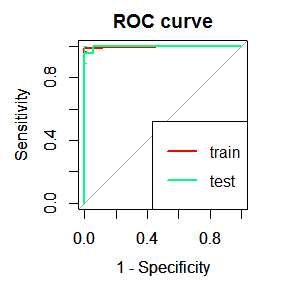<!-- -->
</div>
<div class="column-right23">

```r
#  compare the two ROC curves (DeLong) based on U-statistics theory 
Tr$auc
```

```
## Area under the curve: 0.9962162
```

```r
Te$auc
```

```
## Area under the curve: 0.9973715
```

```r
roc.test(Tr$ROC,Te$ROC,method="delong",alternative="two.sided")
```

```
## 
## 	DeLong's test for two ROC curves
## 
## data:  Tr$ROC and Te$ROC
## D = -0.3189755, df = 561.29535, p-value = 0.7498638
## alternative hypothesis: true difference in AUC is not equal to 0
## sample estimates:
##  AUC of roc1  AUC of roc2 
## 0.9962162162 0.9973714953
```
</div>


## Real dataset: Clinical MRI nonmass findings

```r
# print summary of lesions in dataset:
summary(allfeatures$labels)
```

```
##   B   K   M 
## 267 415 110
```

```r
## Types and # of conventional CAD features:
# 34 Dynamic, 19 morphological, 44 texture, 20 dispersion, 80 single-enhancement
# --- 
# 197 Total conventional CAD features

# split in 90%/10% train/test:
sep = round(nrow(allfeatures)*0.10)
X_test = onlylab[1:sep,]
y_test = X_test$labels
init_indTrain = sep+1
X_train = onlylab[init_indTrain:nrow(onlylab),]
y_train = X_train$labels
```

## Train ensembles of "bagging" classification binary trees:
```pseudo
Define sets of model parameter values to evaluate: Depth, and number of Trees
Hold-out an independent test sample (Test set)
With the remainder samples define resampling: Stratified kfold cross-validation
for each parameter set do:
  for each resampling iteration do:
    Feature selection in nth-kth folds (Train set)
    Train classifier in nth-kth folds 
    Predict probabilities in kth fold (Validation set)
  end
  Calculate average performance across Train and Validation sets
end
Determine the optimal parameter set
Fit the final model to all samples used using the optimal parameter set
Calculate performance and generalization in the held-out independent set
```

## Ensembles performance:

```r
print(grdperf)
```

```
##    D ntrees   avaucTrain       stdTrain     avaucVal        stdVal
## 1  1     25 0.7600250375 0.013077072639 0.6131431880 0.09025007495
## 2  3     25 0.8957939800 0.022284164067 0.6823663490 0.08536018588
## 3  5     25 0.9746459410 0.007751708950 0.6295318524 0.07374089809
## 4  1    100 0.7739263587 0.017936114288 0.6309777624 0.08202981284
## 5  3    100 0.9016240024 0.014555171088 0.6606124083 0.07580864549
## 6  5    100 0.9825431562 0.006214979211 0.6646813985 0.06813996122
## 7  1    250 0.7760456004 0.019469915888 0.6406174217 0.09762624115
## 8  3    250 0.9154715458 0.012435313610 0.6414465707 0.08712010528
## 9  5    250 0.9816610543 0.004805162470 0.6599466795 0.08207574577
## 10 1    500 0.7758472619 0.018185835708 0.6372590474 0.08283125618
## 11 3    500 0.9131300006 0.011045636016 0.6474956473 0.07573394875
## 12 5    500 0.9825478549 0.003475435893 0.6701168232 0.08819201943
## 13 1    750 0.7763365878 0.019963253730 0.6288546589 0.08093830941
## 14 3    750 0.9151422407 0.010122469095 0.6614526334 0.10080686661
## 15 5    750 0.9832447962 0.004069383727 0.6687624363 0.09158038668
## 16 1   1500 0.7768392434 0.018387427879 0.6203410645 0.08540603265
## 17 3   1500 0.9159920261 0.013173221353 0.6537285474 0.09716035683
## 18 5   1500 0.9841652724 0.003005840276 0.6712473573 0.10833330504
```

## Ensembles performance surface plots:
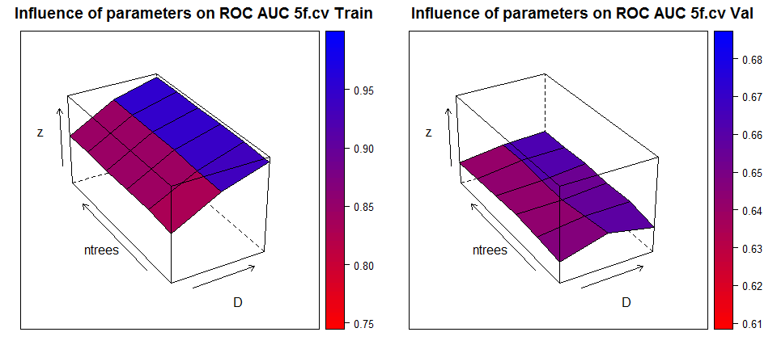<!-- -->

## Ensembles of trees ROC
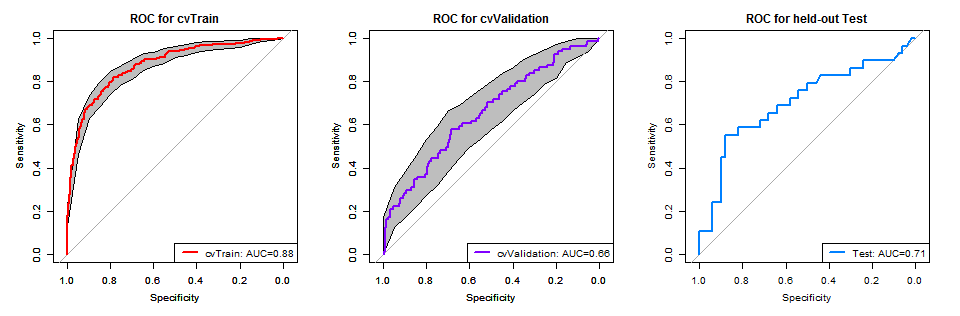<!-- -->


## Adding graph connectivity features 

```r
nxGnorm <- read.csv(file="input/nxGnormfeatures_allNMEs_descStats.csv", header=FALSE, sep=",")
colnames(nxGnorm) <- paste("nxg", c(1:ncol(nxGnorm)),  sep ="")

# print summary of lesions in dataset:
onlylab_nxG =  cbind(allfeatures[allfeatures$labels!='K',], nxGnorm[allfeatures$labels!='K',])
summary(onlylab_nxG$labels)

## Features:
# 34 Dynamic, 19 morphological, 44 texture, 20 dispersion, 80 single-enhancement
# + 20 connectivity metric distributions over graphs, x 17 summary statistics
# --- 
# 537 Total conventional CAD features + graph features

# split in 90%/10% train/test:
sep = round(nrow(allfeatures)*0.10)
test = onlylab_nxG[1:sep,]
init_indTrain = sep+1
train = onlylab_nxG[init_indTrain:nrow(onlylab_nxG),]
```


## Ensembles performance surface plots:
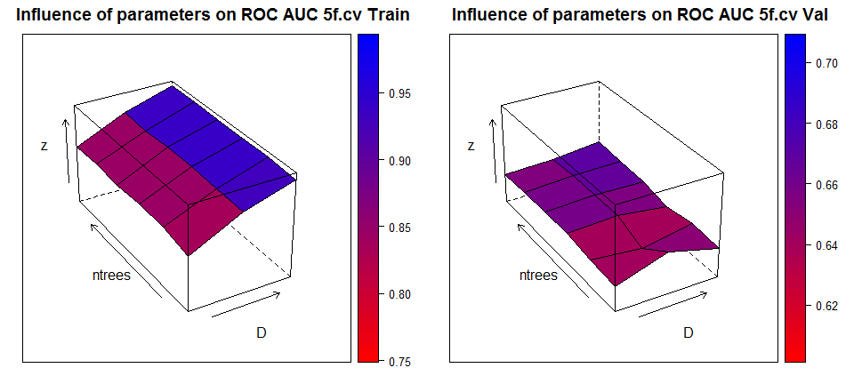<!-- -->

## ROC of ensembles with graph features 
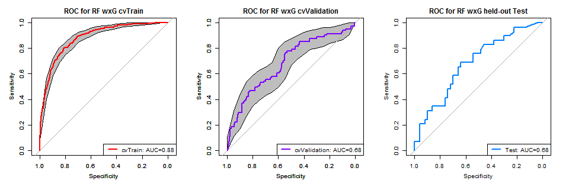<!-- -->


## Graph features and Deep Embedding (DEC + MLP)
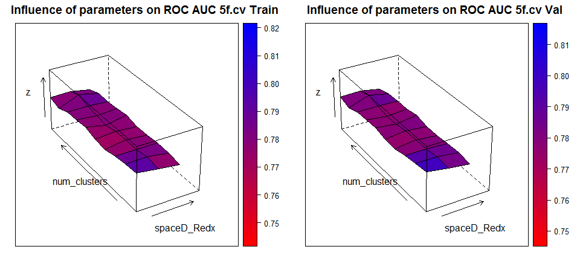<!-- -->


## ROC MLP+DEC
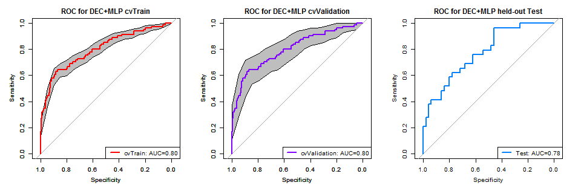<!-- -->


## AUC comparison: Boostrap method
<h1>AUC difference significance testing</h1>

* Computation details:
a) boot.n (2000) bootstrap replicates are drawn from the data. If boot.stratified = TRUE, each replicate contains exactly the same number of controls and cases than the original sample

b) for each bootstrap replicate, the AUC of the two ROC curves are computed and the difference is used:
 $$  D =  \frac{AUC_1-AUC_2}{std(AUC_1-AUC_2)} \sim Z$$
where $std$ is the standard deviation of the bootstrap differences and AUC1 and AUC2 the AUC of the two (bootstrap replicate) ROC curves.

c) Z approximately follows a normal distribution, one or two-tailed p-values can be calculated accordingly.


## ROC Comparison: Ensembles of trees
<div class="column-left13">
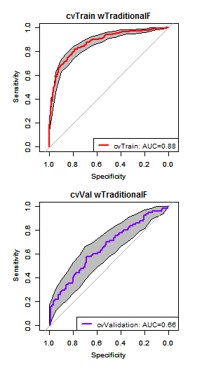<!-- -->
</div>
<div class="column-right23">

```r
# Do we significantly overtrain?
roc.test(Tr_RF,val_RF,method="bootstrap",alternative="greater")
```

```
## 	Bootstrap test for two ROC curves
## data:  Tr_RF and val_RF
## D = 5.7229585, boot.n = 2000, p-value = 0.000000005234243
## alternative hypothesis: true difference in AUC is greater than 0
## sample estimates:
##  AUC of roc1  AUC of roc2 
## 0.8772970359 0.6569949366
```

```r
#  compare the two ROC curves (DeLong) based on U-statistics theory
roc.test(Tr_RF,val_RF,method="delong",alternative="greater")
```

```
## 	DeLong's test for two ROC curves
## data:  Tr_RF and val_RF
## D = 5.7746681, df = 360.34599, p-value = 0.000000008331936
## alternative hypothesis: true difference in AUC is greater than 0
## sample estimates:
##  AUC of roc1  AUC of roc2 
## 0.8772970359 0.6569949366
```
</div>

## Ensembles of trees with graph features
<div class="column-left13">
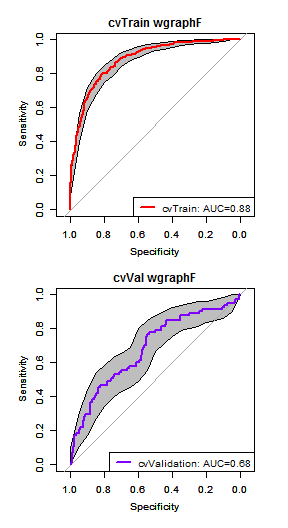<!-- -->
</div>
<div class="column-right23">

```r
# Do we significantly overtrain with graph features too?
roc.test(Tr_RF_nxG,val_RF_nxG,method="bootstrap",alternative="greater")
```

```
## 	Bootstrap test for two ROC curves
## data:  Tr_RF_nxG and val_RF_nxG
## D = 5.473005, boot.n = 2000, p-value = 0.00000002212338
## alternative hypothesis: true difference in AUC is greater than 0
## sample estimates:
##  AUC of roc1  AUC of roc2 
## 0.8835161006 0.6840188883
```

```r
#  compare the two ROC curves (DeLong) based on U-statistics theory 
roc.test(Tr_RF_nxG,val_RF_nxG,method="delong",alternative="greater")
```

```
## 	DeLong's test for two ROC curves
## data:  Tr_RF_nxG and val_RF_nxG
## D = 5.3431335, df = 349.76534, p-value = 0.00000008251275
## alternative hypothesis: true difference in AUC is greater than 0
## sample estimates:
##  AUC of roc1  AUC of roc2 
## 0.8835161006 0.6840188883
```
</div>

## Embedding statistically improve performance?
<div class="column-left13">
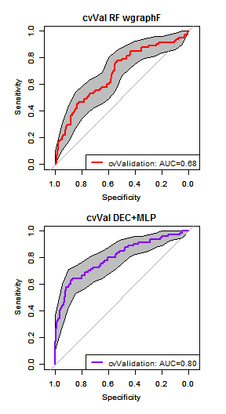<!-- -->
</div>
<div class="column-right23">

```r
# Do we significantly overtrain with graph features too?
roc.test(val_DECMLP,val_RF_nxG,method="bootstrap",alternative="greater")
```

```
## 	Bootstrap test for two ROC curves
## data:  val_DECMLP and val_RF_nxG
## D = 2.5366266, boot.n = 2000, p-value = 0.005596313
## alternative hypothesis: true difference in AUC is greater than 0
## sample estimates:
##  AUC of roc1  AUC of roc2 
## 0.8020139956 0.6840188883
```

```r
#  compare the two ROC curves (DeLong) based on U-statistics theory 
roc.test(val_DECMLP,val_RF_nxG,method="delong",alternative="greater")
```

```
## 	DeLong's test for two ROC curves
## data:  val_DECMLP and val_RF_nxG
## D = 2.4876751, df = 582.43227, p-value = 0.006568364
## alternative hypothesis: true difference in AUC is greater than 0
## sample estimates:
##  AUC of roc1  AUC of roc2 
## 0.8020139956 0.6840188883
```
</div>

## Performance on indep. held-out set?
<div class="column-left13">
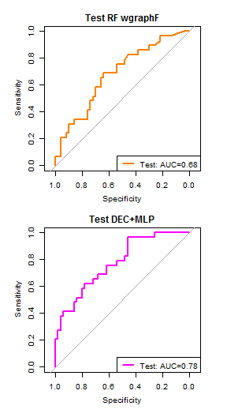<!-- -->
</div>
<div class="column-right23">

```r
#  compare the two ROC curves * same datasets (correlated):
roc.test(Te_RF_nxG,Te_DECMLP,method="bootstrap",alternative="less")
```

```
## 	Bootstrap test for two correlated ROC curves
## data:  Te_RF_nxG and Te_DECMLP
## D = -1.5509367, boot.n = 2000, p-value = 0.06045843
## alternative hypothesis: true difference in AUC is less than 0
## sample estimates:
##  AUC of roc1  AUC of roc2 
## 0.6813793103 0.7751724138
```

```r
#  compare the two ROC curves (DeLong) based on U-statistics theory
roc.test(Te_RF_nxG,Te_DECMLP,paired=TRUE,method="delong",alternative="less")
```

```
## 	DeLong's test for two correlated ROC curves
## data:  Te_RF_nxG and Te_DECMLP
## Z = -1.5801545, p-value = 0.05703574
## alternative hypothesis: true difference in AUC is less than 0
## sample estimates:
##  AUC of roc1  AUC of roc2 
## 0.6813793103 0.7751724138
```
</div>

## Conclusions
* The ROC and ROL areas can be interpreted as re-parametrized forms of the
Mann-Whitney U-statistic 
* Because the Mann-WhitneyU-distribution can be specified exactly, this distribution can be used to calculate the statistical significance of the ROC and ROL areas, and
gives results that are equivalent to a permutation test.
* A normal approximation provides an accurate estimate of the significance of the Areas given large samples
* Areas can be compared using a test based on the t-test or the paired t-test

